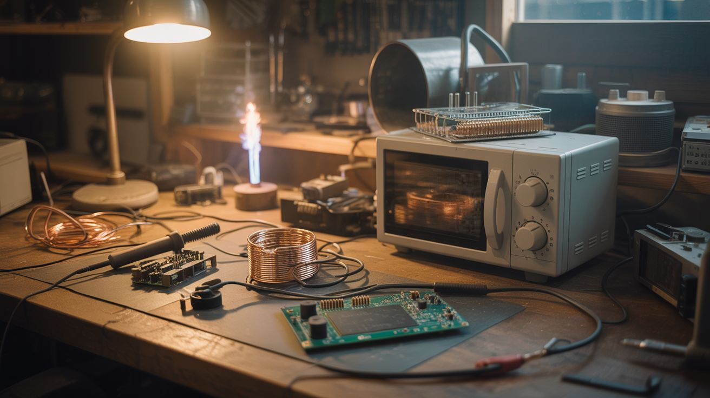
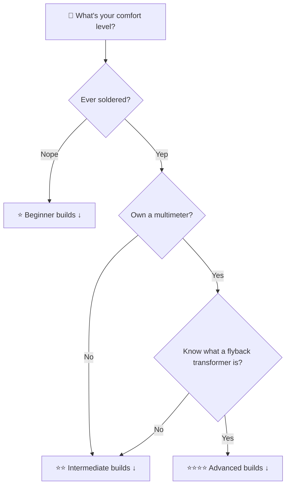

  <h1 align="center">Junkyard Genius</h1>
  
<strong>335 insane DIY builds from salvaged appliances, e-waste, chemicals, and junk.</strong>

  

    
    
    
    
  

  

    <a href="#start-here">Start Here</a> &bull;
    <a href="#whats-in-your-junk-pile">Find Builds by Junk</a> &bull;
    <a href="#categories">Browse Categories</a> &bull;
    <a href="#reference-docs">Reference</a> &bull;
    <a href="#safety">Safety</a>
  

  

    
  

---

Your microwave, fridge, old phones, dead laptops, busted printers, and that vacuum cleaner collecting dust in the garage? They're not trash. They're **ingredients**.

This repo is a cookbook for builders, makers, mad scientists, and anyone who looks at a pile of junk and sees potential. Every build includes rated difficulty, sourced ingredients, step-by-step instructions, and safety notes.

> **335 builds** &middot; **33 categories** &middot; **14 reference guides** &middot; **4 safety docs**
>
> From "I just need a battery and a magnet" to "I'm building a rail gun from a microwave and a prayer."
>
> *Some assembly required. Some disassembly required first.*

---

### Featured Build — [#312 Kinetic Sand Table](categories/art-and-installation/312-kinetic-sand-table.md)

> A CNC-controlled magnet hidden beneath a glass-topped table silently drags a steel ball through fine sand, drawing never-repeating geometric patterns. Spirals become stars become flowers become waves — and it runs forever.

**Dead printers + dead hard drives → something beautiful enough for a Michelin-star restaurant.** The commercial version costs $600–$1500. This one costs ~$80 in salvaged parts.

| Jaw Drop | Brain Melt | Wallet | Spicy | Clout | Time |
|---|---|---|---|---|---|
| ⭐⭐⭐⭐⭐ | ⭐⭐⭐⭐ | ⭐⭐ | ⭐ | ⭐⭐⭐⭐⭐ | ⭐⭐⭐⭐ |

---

## Start Here

New to the repo? Pick your comfort level and dive in.

### Beginner — Brain Melt ⭐

*No soldering iron? No problem. These builds use household items and basic tools.*

| Build | Category | Jaw Drop | Time |
|---|---|---|---|
| [#198 — Homopolar Motor](categories/weird-science/198-homopolar-motor.md) | Weird Science | ⭐⭐⭐⭐ | ⭐ |
| [#184 — Chain Fountain](categories/mechanical-and-kinetic/184-chain-fountain.md) | Mechanical | ⭐⭐⭐⭐ | ⭐ |
| [#175 — Camera Obscura Room](categories/light-and-visual/175-camera-obscura-room.md) | Light & Visual | ⭐⭐⭐⭐⭐ | ⭐ |
| [#042 — Grape Plasma](categories/mad-scientist/042-grape-plasma.md) | Mad Scientist | ⭐⭐⭐⭐ | ⭐ |
| [#240 — Garden Hose Didgeridoo](categories/junk-instruments/240-garden-hose-didgeridoo.md) | Junk Instruments | ⭐⭐⭐ | ⭐ |
| [#106 — Gallium Melting Spoon](categories/pyro-and-chemistry/106-gallium-melting-spoon.md) | Pyro & Chemistry | ⭐⭐⭐⭐ | ⭐ |
| [#256 — Piezo Shock Pen](categories/pranks-and-party/256-shock-pen.md) | Pranks & Party | ⭐⭐⭐ | ⭐ |
| [#253 — Rocket Stove](categories/survival-off-grid/253-rocket-stove.md) | Survival | ⭐⭐⭐ | ⭐ |

### Intermediate — Brain Melt ⭐⭐ to ⭐⭐⭐

*Time to break out the soldering iron and start salvaging parts from dead appliances.*

| Build | Category | Jaw Drop | Time |
|---|---|---|---|
| [#002 — Lichtenberg Wood Burner](categories/fire-and-plasma/002-lichtenberg-wood-burner.md) | Fire & Plasma | ⭐⭐⭐⭐⭐ | ⭐ |
| [#041 — Cloud Chamber](categories/mad-scientist/041-cloud-chamber.md) | Mad Scientist | ⭐⭐⭐⭐⭐ | ⭐ |
| [#107 — Bismuth Crystal Garden](categories/pyro-and-chemistry/107-bismuth-crystal-garden.md) | Pyro & Chemistry | ⭐⭐⭐⭐ | ⭐ |
| [#235 — Cigar Box Guitar](categories/junk-instruments/235-cigar-box-guitar.md) | Junk Instruments | ⭐⭐⭐⭐ | ⭐⭐ |
| [#009 — Rubens' Tube](categories/sound-and-music/009-rubens-tube.md) | Sound & Music | ⭐⭐⭐⭐⭐ | ⭐⭐ |
| [#260 — Toaster Reflow Oven](categories/kitchen-hacks/260-toaster-reflow-oven.md) | Kitchen Hacks | ⭐⭐⭐⭐ | ⭐⭐ |
| [#104 — Cold Spark Machine](categories/pyro-and-chemistry/104-cold-spark-machine.md) | Pyro & Chemistry | ⭐⭐⭐⭐⭐ | ⭐⭐ |
| [#242 — Sound-Reactive LED Jacket](categories/wearable-tech/242-led-jacket.md) | Wearable Tech | ⭐⭐⭐⭐⭐ | ⭐⭐⭐ |

### Advanced — Brain Melt ⭐⭐⭐⭐ to ⭐⭐⭐⭐⭐

*You know what a flyback transformer is. You have opinions about capacitor brands. Welcome home.*

| Build | Category | Jaw Drop | Time |
|---|---|---|---|
| [#033 — Musical Tesla Coil](categories/mad-scientist/033-musical-tesla-coil.md) | Mad Scientist | ⭐⭐⭐⭐⭐ | ⭐⭐⭐ |
| [#122 — LED Cube 8x8x8](categories/pi-and-arduino/122-led-cube-8x8x8.md) | Pi & Arduino | ⭐⭐⭐⭐⭐ | ⭐⭐⭐⭐ |
| [#266 — Galvo Laser Light Show](categories/laser-lab/266-laser-galvo-show.md) | Laser Lab | ⭐⭐⭐⭐⭐ | ⭐⭐⭐ |
| [#046 — Ferrofluid Mirror](categories/art-and-installation/046-ferrofluid-mirror.md) | Art & Installation | ⭐⭐⭐⭐⭐ | ⭐⭐⭐⭐ |
| [#245 — DIY HUD Glasses](categories/wearable-tech/245-hud-glasses.md) | Wearable Tech | ⭐⭐⭐⭐⭐ | ⭐⭐⭐⭐ |
| [#181 — Musical Marble Machine](categories/mechanical-and-kinetic/181-musical-marble-machine.md) | Mechanical | ⭐⭐⭐⭐⭐ | ⭐⭐⭐⭐⭐ |
| [#200 — DIY Electron Microscope](categories/weird-science/200-diy-electron-microscope.md) | Weird Science | ⭐⭐⭐⭐⭐ | ⭐⭐⭐⭐⭐ |

---

## What's In Your Junk Pile?

Find builds based on what you already have lying around. One person's e-waste is another person's electron microscope.

<strong>Find builds by what you already have</strong> (click to expand)

| You Have... | Start With |
|---|---|
| **Microwave** | [Plasma Tornado](categories/fire-and-plasma/001-plasma-tornado-lamp.md), [Spot Welder](categories/functional-machines/027-spot-welder.md), [Jacob's Ladder](categories/mad-scientist/034-jacobs-ladder.md), [Lichtenberg Burner](categories/fire-and-plasma/002-lichtenberg-wood-burner.md), [Chemical Reactor](categories/alchemist-cookbook/279-microwave-chemical-reactor.md) |
| **Fridge / Mini Fridge** | [Vacuum Chamber](categories/mad-scientist/039-vacuum-chamber.md), [Fermentation Chamber](categories/fridge-and-cooling/092-fermentation-chamber.md), [Freeze Dryer](categories/fridge-and-cooling/094-diy-freeze-dryer.md), [Cloud Chamber](categories/mad-scientist/041-cloud-chamber.md) |
| **Washing Machine** | [Electric Go-Kart](categories/functional-machines/024-electric-go-kart.md), [Steel Tongue Drum](categories/junk-instruments/239-steel-tongue-drum.md), [Scrap Sculpture](categories/art-and-installation/045-scrap-metal-sculpture.md) |
| **Dryer** | [Planetarium](categories/art-and-installation/047-dryer-drum-planetarium.md), [Desktop Foundry](categories/fire-and-plasma/005-desktop-foundry.md) |
| **Oven / Toaster Oven** | [Reflow Oven](categories/kitchen-hacks/260-toaster-reflow-oven.md), [Powder Coating Oven](categories/functional-machines/028-powder-coating-oven.md) |
| **Vacuum Cleaner** | [Hovercraft](categories/vacuum-cleaner/075-vacuum-hovercraft.md), [Wall-Climbing Robot](categories/vacuum-cleaner/076-wall-climbing-robot.md), [Wind Tunnel](categories/vacuum-cleaner/325-benchtop-wind-tunnel.md), [Air Hockey Table](categories/vacuum-cleaner/326-air-hockey-table.md), [Pneumatic Launcher](categories/vacuum-cleaner/299-pneumatic-launcher.md) |
| **Old Printer** | [CNC Machine](categories/printer-and-scanner/069-printer-stepper-cnc.md), [Kinetic Sand Table](categories/art-and-installation/312-kinetic-sand-table.md), [Robotic Arm](categories/pi-and-arduino/129-printer-robot-arm.md), [MIDI Stepper Organ](categories/pi-and-arduino/135-midi-stepper-organ.md) |
| **Old Laptop** | [External Monitor](categories/computer-and-phone/061-laptop-screen-monitor.md), [Powerwall Cells](categories/power-and-energy/052-diy-powerwall.md), [Smart Mirror](categories/pi-and-arduino/123-smart-mirror.md) |
| **Old Phone/Tablet** | [Sensor Network](categories/computer-and-phone/064-phone-sensor-network.md), [Macro Photography](categories/computer-and-phone/063-phone-macro-photography.md), [Earthquake Detector](categories/python-projects/146-earthquake-detector.md) |
| **CRT TV** | [Plasma Speaker](categories/sound-and-music/008-plasma-speaker.md), [Tesla Coil](categories/mad-scientist/033-musical-tesla-coil.md), [CRT Art](categories/art-and-installation/048-crt-electromagnetic-art.md) |
| **Dead Drone** | [Gimbal Stabilizer](categories/drone-salvage/201-camera-gimbal-stabilizer.md), [Star Tracker](categories/drone-salvage/203-gimbal-motor-star-tracker.md), [Wind Turbine](categories/drone-salvage/204-drone-motor-wind-turbine.md), [FPV RC Boat](categories/drone-salvage/208-fpv-rc-boat.md) |
| **Old Car Parts** | [Alternator Welder](categories/junkyard-auto/219-alternator-welder.md), [Ignition Coil Tesla Coil](categories/junkyard-auto/220-ignition-coil-tesla-coil.md), [Starter Motor Go-Kart](categories/junkyard-auto/221-starter-motor-go-kart.md) |
| **Kitchen Appliances** | [Toaster Reflow Oven](categories/kitchen-hacks/260-toaster-reflow-oven.md), [Coffee Maker Distiller](categories/kitchen-hacks/262-coffee-maker-distiller.md), [Stand Mixer Pottery Wheel](categories/kitchen-hacks/261-stand-mixer-pottery-wheel.md) |
| **Electric Scooter** | [Go-Kart](categories/functional-machines/024-electric-go-kart.md), [Lathe](categories/functional-machines/025-scooter-motor-lathe.md), [E-Skateboard](categories/scooter-and-motor/088-electric-skateboard.md), [Pottery Wheel](categories/scooter-and-motor/292-motor-powered-pottery-wheel.md) |
| **Humidifier** | [Fog Machine](categories/humidifier-and-water/084-ultrasonic-fog-machine.md), [Nebula Lamp](categories/humidifier-and-water/087-nebula-lamp.md), [Mist Cooler](categories/humidifier-and-water/297-mist-cooling-system.md), [Water Collector](categories/humidifier-and-water/296-fog-harp-water-collector.md) |
| **Laser Pointers / DVD Drives** | [Laser Harp](categories/laser-lab/267-laser-harp.md), [Galvo Light Show](categories/laser-lab/266-laser-galvo-show.md), [Laser Communicator](categories/laser-lab/265-laser-communicator.md), [Blu-Ray Laser Cutter](categories/laser-lab/269-blu-ray-laser-cutter.md) |
| **Musical Junk** (buckets, cans, hoses) | [Cigar Box Guitar](categories/junk-instruments/235-cigar-box-guitar.md), [PVC Pipe Organ](categories/junk-instruments/236-pvc-pipe-organ.md), [Steel Tongue Drum](categories/junk-instruments/239-steel-tongue-drum.md) |
| **Old Clothes / Wearables** | [LED Jacket](categories/wearable-tech/242-led-jacket.md), [LED Matrix Backpack](categories/wearable-tech/322-led-matrix-backpack-display.md), [EEG Headband](categories/wearable-tech/321-diy-eeg-headband.md), [LED Mask](categories/wearable-tech/244-led-mask.md) |
| **Household Chemicals** | [Crystal Garden](categories/household-chemistry/213-bleach-crystal-garden.md), [Vinegar Rocket](categories/household-chemistry/215-baking-soda-vinegar-rocket.md), [Electrolysis Rust Eraser](categories/household-chemistry/212-electrolysis-rust-eraser.md) |
| **Chemicals Only** | [Colored Fire](categories/pyro-and-chemistry/101-colored-fire.md), [Bismuth Crystals](categories/pyro-and-chemistry/107-bismuth-crystal-garden.md), [Luminol Crime Scene](categories/pyro-and-chemistry/109-luminol-crime-scene.md) |
| **Raspberry Pi** | [Fireworks Sequencer](categories/pi-and-arduino/121-fireworks-sequencer.md), [Pi-hole](categories/pi-and-arduino/139-pi-hole-ad-blocker.md), [Pirate Radio](categories/pi-and-arduino/134-pirate-radio.md) |
| **Nothing Yet** | [Homopolar Motor](categories/weird-science/198-homopolar-motor.md) (battery + magnet + wire), [Crystal Radio](categories/survival-off-grid/317-crystal-radio.md) (wire + razor blade + earpiece), [Grape Plasma](categories/mad-scientist/042-grape-plasma.md) (just grapes + microwave), [Rocket Stove](categories/survival-off-grid/253-rocket-stove.md) (tin cans + twigs), [Smoke Ring Cannon](categories/pranks-and-party/319-vortex-smoke-ring-cannon.md) (bucket + rubber sheet + fog) |

---

## Ratings

Every build is rated on 6 scales. Calibrate your ambition accordingly.

| Rating | ⭐ | ⭐⭐ | ⭐⭐⭐ | ⭐⭐⭐⭐ | ⭐⭐⭐⭐⭐ |
|---|---|---|---|---|---|
| **Jaw Drop** | Cool | Impressive | Wild | Unreal | Life-changing |
| **Brain Melt** | Easy peasy | Some googling | Real project | Advanced | PhD energy |
| **Wallet Damage** | Free / trash | Under $20 | $20–50 | $50–150 | $150+ |
| **Spicy Level** | Chill | Mildly sketchy | Respect it | One wrong move... | Call next of kin |
| **Clout Potential** | Cool hobby | Friends impressed | Party trick | Local news | 10M TikTok views |
| **Time to Build** | 1 hour | Afternoon | Weekend | Week+ | Month saga |

---

## Categories

| # | | Category | Builds | Vibe |
|---|---|---|---|---|
| 1 | 🔥 | [Fire & Plasma](categories/fire-and-plasma/) | 8 | Arcs, torches, foundries, plasma tornadoes, 2D pyro boards |
| 2 | 🔊 | [Sound & Music](categories/sound-and-music/) | 8 | Plasma speakers, ultrasonic levitators, Rubens' tubes, Tesla coil guitar |
| 3 | 💡 | [Light & Visual](categories/light-and-visual/) | 19 | Lasers, holograms, optics, infinity mirrors |
| 4 | 🔧 | [Functional Machines](categories/functional-machines/) | 9 | Go-karts, welders, vacuum formers, belt grinders |
| 5 | ⚡ | [Mad Scientist](categories/mad-scientist/) | 10 | Tesla coils, rail guns, cloud chambers, mass spectrometers |
| 6 | 🎨 | [Art & Installation](categories/art-and-installation/) | 8 | Ferrofluid mirrors, kinetic sand tables, Chladni plates, planetariums |
| 7 | 🔋 | [Power & Energy](categories/power-and-energy/) | 8 | Generators, powerwalls, solar forges, capacitor banks |
| 8 | 💻 | [Computer & Phone Parts](categories/computer-and-phone/) | 13 | HDD speakers, laptop monitors, phone sensors |
| 9 | 🖨️ | [Printer & Scanner](categories/printer-and-scanner/) | 8 | CNC machines, laser engravers, scanner light painting, thermal printer art |
| 10 | 🌀 | [Vacuum Cleaner](categories/vacuum-cleaner/) | 8 | Hovercrafts, wall-climbing robots, wind tunnels, air hockey tables |
| 11 | 🔨 | [Power Tools Remixed](categories/power-tools-remixed/) | 8 | Drill press, CNC spindle, power hammer, drill lathe, belt sander |
| 12 | 💧 | [Humidifier & Water](categories/humidifier-and-water/) | 7 | Fog machines, nebula lamps, ultrasonic cleaners, mist cooling |
| 13 | ⚙️ | [Scooter & Motor](categories/scooter-and-motor/) | 7 | E-skateboards, camera sliders, pottery wheels, turntables |
| 14 | ❄️ | [Fridge & Cooling](categories/fridge-and-cooling/) | 9 | Freeze dryers, fermentation chambers, Peltier coolers, ice cream makers |
| 15 | 🧪 | [Pyro & Chemistry](categories/pyro-and-chemistry/) | 20 | Colored fire, thermite, bismuth crystals, luminol, smoke bombs |
| 16 | 🤖 | [Raspberry Pi & Arduino](categories/pi-and-arduino/) | 20 | LED cubes, drones, smart mirrors, fireworks sequencers |
| 17 | 🐍 | [Python Projects](categories/python-projects/) | 15 | Face tracking, photo booth, generative art, deepfake mirror |
| 18 | ⚗️ | [Chemical + Electronic](categories/chemical-electronic/) | 15 | Electroplating, anodizing, PCB etching, neon signs |
| 19 | 🏗️ | [Mechanical & Kinetic](categories/mechanical-and-kinetic/) | 11 | Marble machines, Stirling engines, trebuchets, pendulum waves |
| 20 | 🏢 | [Big Builds](categories/big-builds/) | 8 | Weather balloons, ham radio, observatories, giant Tesla coils |
| 21 | 🔬 | [Weird Science](categories/weird-science/) | 8 | Kirlian photography, Van de Graaff, spectroscopes, Foucault pendulums |
| 22 | 💀 | [Unholy Combos](categories/unholy-combos/) | 8 | Cross-category mashups nobody asked for (but everyone needed) |
| 23 | 🚁 | [Drone Salvage](categories/drone-salvage/) | 8 | FPV racers, gimbal stabilizers, brushless motor hacks |
| 24 | 🧹 | [Household Chemistry](categories/household-chemistry/) | 16 | Crystal gardens, vinegar rockets, elephant toothpaste, smoke bombs, copper plating |
| 25 | 🚗 | [Junkyard Auto](categories/junkyard-auto/) | 8 | Alternator generators, ignition coil Teslas, spark plug lighters |
| 26 | 💥 | [Alchemist Cookbook](categories/alchemist-cookbook/) | 13 | Microwave + chemicals + capacitors = controlled chaos |
| 27 | 🎸 | [Junk Instruments](categories/junk-instruments/) | 7 | Cigar box guitars, PVC pipe organs, steel tongue drums |
| 28 | 👕 | [Wearable Tech](categories/wearable-tech/) | 8 | LED jackets, EEG headbands, HUD glasses, LED backpack displays |
| 29 | ⛺ | [Survival & Off-Grid](categories/survival-off-grid/) | 8 | Solar stills, crystal radios, Faraday flashlights, biogas generators |
| 30 | 👻 | [Pranks & Party](categories/pranks-and-party/) | 8 | Smoke ring cannons, confetti launchers, invisible speakers, insult cameras |
| 31 | 🍴 | [Kitchen Hacks](categories/kitchen-hacks/) | 8 | Toaster reflow ovens, microwave kilns, rice cooker electroplating |
| 32 | 🎯 | [Laser Lab](categories/laser-lab/) | 7 | Laser harps, galvo light shows, Blu-ray cutters, laser microscopes |
| 33 | 👁️ | [Visual Showstoppers](categories/visual-showstoppers/) | 9 | Cloud chamber tables, fire organs, ferrofluid walls, infinity rooms, flip-dot displays |

---

## Reference Docs

Before you start ripping apart appliances, read these. Seriously. The teardown guide alone will save you hours of "which wire is which" frustration.

| Guide | What's Inside |
|---|---|
| [Appliance Teardown Guide](reference/appliance-teardown-guide.md) | 13 appliances — what parts to salvage, teardown safety, tools needed |
| [Chemicals Guide](reference/chemicals.md) | 30+ chemicals — where to buy, cost, safety, which builds use them |
| [Electronics & Microcontrollers](reference/electronics-and-microcontrollers.md) | Pi vs Arduino vs ESP32, sensors, actuators, displays, power |
| [Android Apps](reference/android-apps.md) | Sensor apps, controllers, and cameras for phone-based builds |
| [Python Libraries](reference/python-libraries.md) | 18 key packages for software-enhanced builds |
| [Sourcing Guide](reference/sourcing-guide.md) | Where to find free junk — bulk trash days, Craigslist, ReStore, e-waste recyclers |
| [Tools Needed](reference/tools-needed.md) | The minimum toolbox — tiered by budget from $0 to $300+ |
| [One Appliance, Five Builds](reference/one-appliance-five-builds.md) | Quick-start pages: "You scored a dead microwave — now what?" |
| [Skill Trees](reference/skill-trees.md) | Progression paths — beginner to advanced by interest area |
| [Filming Guide](reference/filming-guide.md) | How to film your builds for TikTok/YouTube |
| [Seasonal Builds](reference/seasonal-builds.md) | Builds organized by holiday — Halloween, 4th of July, Christmas, summer |
| [Ingredient Index](reference/ingredient-index.md) | Reverse lookup — every component mapped to every build that uses it |
| [Difficulty & Ratings Guide](reference/difficulty-guide.md) | The 6-scale rating system explained — what each star level means, required safety gear per danger tier |
| [Glossary](reference/glossary.md) | 60+ technical terms decoded — MOT, flyback, thermite, Peltier, and every acronym in the repo |

---

## Safety

**Read these before your first build.** Especially if it has a Spicy Level above ⭐⭐. We're not your mom, but she'd want you to read them.

| Doc | Covers |
|---|---|
| [General Safety](safety/README.md) | Universal rules, Spicy Level explained, emergency contacts, legal considerations |
| [High Voltage Safety](safety/high-voltage.md) | Capacitor discharge, one-hand rule, insulation, shock first aid |
| [Chemical Safety](safety/chemicals.md) | PPE, storage, disposal, dangerous combinations, chemical first aid |
| [Fire & Pyro Safety](safety/fire-and-pyro.md) | Extinguisher types, burn treatment, ventilation, safe distances |

---

<strong>Most Dangerous Builds (Spicy ⭐⭐⭐⭐⭐)</strong> — These builds can kill you if you're careless. Not in a funny way.

Read the safety docs first. Respect the process. Tell someone where you are and what you're doing.

| Build | What Makes It Spicy |
|---|---|
| [#002 — Lichtenberg Wood Burner](categories/fire-and-plasma/002-lichtenberg-wood-burner.md) | Lethal voltage from MOT — multiple deaths reported from this exact build |
| [#004 — Thermic Lance](categories/fire-and-plasma/004-thermic-lance.md) | Cuts through steel, concrete, anything — burns at 4000°F+ |
| [#020 — Fresnel Solar Forge](categories/light-and-visual/020-fresnel-lens-solar-forge.md) | Focuses sunlight hot enough to melt metal — instant blindness risk |
| [#034 — Jacob's Ladder](categories/mad-scientist/034-jacobs-ladder.md) | Exposed high-voltage arc — MOT is lethal |
| [#036 — Rail Gun](categories/mad-scientist/036-rail-gun.md) | Capacitor bank + projectile = extreme danger on both ends |
| [#055 — Levitating Plasma Speaker](categories/unholy-combos/055-levitating-plasma-speaker.md) | Combines HV, magnets, and plasma in one build |
| [#105 — Thermite Flower Pot Forge](categories/pyro-and-chemistry/105-thermite-flower-pot.md) | 4000°F+ molten iron from a chemical reaction |
| [#275 — Capacitor Bank Plasma Igniter](categories/alchemist-cookbook/275-capacitor-bank-plasma-igniter.md) | MOT capacitor bank — stores lethal energy |
| [#277 — EMP Cannon](categories/alchemist-cookbook/277-electromagnetic-pulse-cannon.md) | Capacitor bank + coil = localized EMP. Legal gray area. |
| [#278 — Thermite Sparkler Bombs](categories/alchemist-cookbook/278-thermite-sparkler-bombs.md) | 4000°F+ thermite ignited by sparkler fuse |
| [#284 — Thermite Forge Foundry](categories/unholy-combos/284-thermite-forge-foundry.md) | 4500°F+ thermite casting molten iron into sand molds |
| [#291 — Capacitor Bank Flash Charger](categories/power-and-energy/291-capacitor-bank-flash-charger.md) | High-energy capacitor bank — lethal discharge potential |
| [#302 — Giant Outdoor Tesla Coil](categories/big-builds/302-giant-outdoor-tesla-coil.md) | 6-10 foot arcs, lethal voltage, outdoor-only build |

---

## Contributing

Got a build idea? Found a mistake? Want to add safety info?

See [CONTRIBUTING.md](CONTRIBUTING.md) for the template, rating system, and submission process.

We're especially looking for:
- Builds from parts we haven't covered yet
- Better safety notes on existing builds
- Photos/videos of completed builds (link them in a PR!)
- Corrections to any ingredients or steps

---

## Disclaimer

These builds involve electricity, fire, chemicals, high voltage, and mechanical hazards. **You are responsible for your own safety.** This repo is for educational and entertainment purposes. Always research thoroughly, wear appropriate PPE, and know your limits. Some builds may require permits or licenses in your jurisdiction.

The golden rule: **If you're not sure, don't.** No build is worth a trip to the ER.

---

  Built from junk, powered by curiosity. Star the repo if you dig it.

