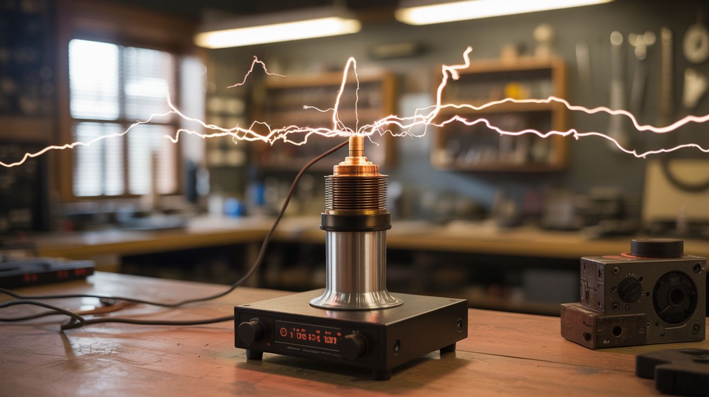
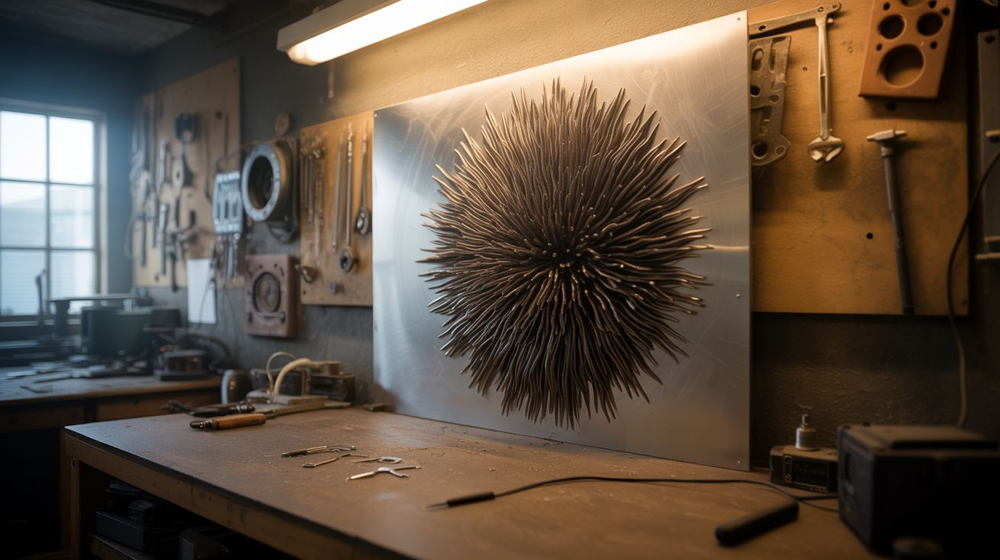

  <h1 align="center">Junkyard Genius</h1>
  
<strong>335 insane DIY builds from salvaged appliances, e-waste, chemicals, and junk.</strong>

  

    
    
    
    
  

  

    
  

Your microwave, fridge, old phones, dead laptops, busted printers, and that vacuum cleaner collecting dust in the garage? They're not trash. They're **ingredients**.

Every build is rated on 6 scales, includes sourced ingredients, step-by-step instructions, and safety notes. From "I just need a battery and a magnet" to "I'm building a rail gun from a microwave and a prayer."

| Jaw Drop | Brain Melt | Wallet | Spicy | Clout | Time |
|---|---|---|---|---|---|
| How cool is it? | How hard is it? | How much $? | How dangerous? | Internet fame? | How long? |

   
  <a href="https://rbrents3000.github.io/junkyard-genius/quiz/"><strong>🎯 Take the Build Finder Quiz</strong></a> — answer 6 questions, get personalized recommendations

  <a href="https://rbrents3000.github.io/junkyard-genius/browse/"><strong>🔍 Browse All Builds</strong></a> — search, filter, and sort every project
    

---

## Start Here

Pick your comfort level and dive in.

| | | |
|---|---|---|
| 🟢 **[Total Newbie ↓](#total-newbie--brain-melt-)** | No tools, no experience, just curiosity | Grapes + microwave = plasma |
| 🔵 **[Tinkerer ↓](#tinkerer--brain-melt-)** | Basic hand tools, comfortable taking things apart | Dead appliances → cool projects |
| 🟡 **[Builder ↓](#builder--brain-melt-)** | Own a soldering iron, can read a circuit diagram | Salvaged parts → real machines |
| 🟠 **[Hacker ↓](#hacker--brain-melt-)** | Comfortable with microcontrollers, power electronics, chemistry | Arduino + e-waste → jaw-dropping builds |
| 🔴 **[Mad Scientist ↓](#mad-scientist--brain-melt-)** | You know what a flyback transformer is and you've been shocked by one | Tesla coils, rail guns, electron microscopes |

### Total Newbie — Brain Melt ⭐

*No tools needed. Seriously. These builds use stuff already in your house.*

| Build | Category | Jaw Drop | Time |
|---|---|---|---|
| [#042 — Grape Plasma](categories/mad-scientist/042-grape-plasma.md) | Mad Scientist | ⭐⭐⭐⭐ | ⭐ |
| [#198 — Homopolar Motor](categories/weird-science/198-homopolar-motor.md) | Weird Science | ⭐⭐⭐⭐ | ⭐ |
| [#184 — Chain Fountain](categories/mechanical-and-kinetic/184-chain-fountain.md) | Mechanical | ⭐⭐⭐⭐ | ⭐ |
| [#240 — Garden Hose Didgeridoo](categories/junk-instruments/240-garden-hose-didgeridoo.md) | Junk Instruments | ⭐⭐⭐ | ⭐ |
| [#253 — Rocket Stove](categories/survival-off-grid/253-rocket-stove.md) | Survival | ⭐⭐⭐ | ⭐ |

### Tinkerer — Brain Melt ⭐⭐

*You own a screwdriver and you're not afraid to void a warranty.*

| Build | Category | Jaw Drop | Time |
|---|---|---|---|
| [#175 — Camera Obscura Room](categories/light-and-visual/175-camera-obscura-room.md) | Light & Visual | ⭐⭐⭐⭐⭐ | ⭐ |
| [#106 — Gallium Melting Spoon](categories/pyro-and-chemistry/106-gallium-melting-spoon.md) | Pyro & Chemistry | ⭐⭐⭐⭐ | ⭐ |
| [#256 — Piezo Shock Pen](categories/pranks-and-party/256-shock-pen.md) | Pranks & Party | ⭐⭐⭐ | ⭐ |
| [#107 — Bismuth Crystal Garden](categories/pyro-and-chemistry/107-bismuth-crystal-garden.md) | Pyro & Chemistry | ⭐⭐⭐⭐ | ⭐ |
| [#235 — Cigar Box Guitar](categories/junk-instruments/235-cigar-box-guitar.md) | Junk Instruments | ⭐⭐⭐⭐ | ⭐⭐ |

### Builder — Brain Melt ⭐⭐⭐

*Time to break out the soldering iron and start salvaging parts from dead appliances.*

| Build | Category | Jaw Drop | Time |
|---|---|---|---|
| [#041 — Cloud Chamber](categories/mad-scientist/041-cloud-chamber.md) | Mad Scientist | ⭐⭐⭐⭐⭐ | ⭐ |
| [#009 — Rubens' Tube](categories/sound-and-music/009-rubens-tube.md) | Sound & Music | ⭐⭐⭐⭐⭐ | ⭐⭐ |
| [#260 — Toaster Reflow Oven](categories/kitchen-hacks/260-toaster-reflow-oven.md) | Kitchen Hacks | ⭐⭐⭐⭐ | ⭐⭐ |
| [#104 — Cold Spark Machine](categories/pyro-and-chemistry/104-cold-spark-machine.md) | Pyro & Chemistry | ⭐⭐⭐⭐⭐ | ⭐⭐ |
| [#242 — Sound-Reactive LED Jacket](categories/wearable-tech/242-led-jacket.md) | Wearable Tech | ⭐⭐⭐⭐⭐ | ⭐⭐⭐ |

### Hacker — Brain Melt ⭐⭐⭐⭐

*You've bricked at least one Arduino. You own a multimeter and you actually use it.*

| Build | Category | Jaw Drop | Time |
|---|---|---|---|
| [#002 — Lichtenberg Wood Burner](categories/fire-and-plasma/002-lichtenberg-wood-burner.md) | Fire & Plasma | ⭐⭐⭐⭐⭐ | ⭐ |
| [#033 — Musical Tesla Coil](categories/mad-scientist/033-musical-tesla-coil.md) | Mad Scientist | ⭐⭐⭐⭐⭐ | ⭐⭐⭐ |
| [#122 — LED Cube 8x8x8](categories/pi-and-arduino/122-led-cube-8x8x8.md) | Pi & Arduino | ⭐⭐⭐⭐⭐ | ⭐⭐⭐⭐ |
| [#266 — Galvo Laser Light Show](categories/laser-lab/266-laser-galvo-show.md) | Laser Lab | ⭐⭐⭐⭐⭐ | ⭐⭐⭐ |
| [#046 — Ferrofluid Mirror](categories/art-and-installation/046-ferrofluid-mirror.md) | Art & Installation | ⭐⭐⭐⭐⭐ | ⭐⭐⭐⭐ |

### Mad Scientist — Brain Melt ⭐⭐⭐⭐⭐

*You know what a flyback transformer is. You have opinions about capacitor brands. Welcome home.*

| Build | Category | Jaw Drop | Time |
|---|---|---|---|
| [#245 — DIY HUD Glasses](categories/wearable-tech/245-hud-glasses.md) | Wearable Tech | ⭐⭐⭐⭐⭐ | ⭐⭐⭐⭐ |
| [#181 — Musical Marble Machine](categories/mechanical-and-kinetic/181-musical-marble-machine.md) | Mechanical | ⭐⭐⭐⭐⭐ | ⭐⭐⭐⭐⭐ |
| [#200 — DIY Electron Microscope](categories/weird-science/200-diy-electron-microscope.md) | Weird Science | ⭐⭐⭐⭐⭐ | ⭐⭐⭐⭐⭐ |
| [#036 — Rail Gun](categories/mad-scientist/036-rail-gun.md) | Mad Scientist | ⭐⭐⭐⭐⭐ | ⭐⭐⭐⭐ |
| [#302 — Giant Outdoor Tesla Coil](categories/big-builds/302-giant-outdoor-tesla-coil.md) | Big Builds | ⭐⭐⭐⭐⭐ | ⭐⭐⭐⭐⭐ |

---

### Crowd Favorites

<table>
<tr>
<td width="33%" align="center">
 
<strong><a href="categories/art-and-installation/312-kinetic-sand-table.md">#312 — Kinetic Sand Table</a></strong> 
Dead printers → never-repeating geometric art. Commercial: $1500. This: ~$80.
</td>
<td width="33%" align="center">
 
<strong><a href="categories/mad-scientist/033-musical-tesla-coil.md">#033 — Musical Tesla Coil</a></strong> 
Lightning bolts that play music. Built from a dead TV and scrapped electronics.
</td>
<td width="33%" align="center">
 
<strong><a href="categories/sound-and-music/009-rubens-tube.md">#009 — Rubens' Tube</a></strong> 
Fire dances to music. Standing waves in a propane tube visualized by flames.
</td>
</tr>
<tr>
<td width="33%" align="center">
 
<strong><a href="categories/visual-showstoppers/333-ferrofluid-wall.md">#333 — Ferrofluid Wall</a></strong> 
Alien liquid metal dances to music on your wall. Commercial: $3000+. This: ~$150.
</td>
<td width="33%" align="center">
 
<strong><a href="categories/fire-and-plasma/002-lichtenberg-wood-burner.md">#002 — Lichtenberg Wood Burner</a></strong> 
Lightning scar art burned into wood with a microwave transformer. Spicy ⭐⭐⭐⭐⭐.
</td>
<td width="33%" align="center">
 
<strong><a href="categories/mechanical-and-kinetic/181-musical-marble-machine.md">#181 — Musical Marble Machine</a></strong> 
Marbles trigger tuned chimes as they roll through a hand-built mechanical instrument.
</td>
</tr>
</table>

---

## What's In Your Junk Pile?

Find builds based on what you already have lying around. One person's e-waste is another person's electron microscope.

<strong>Find builds by what you already have</strong> (click to expand)

<table>
<tr><th>You Have...</th><th>Start With</th></tr>
<tr><td><strong>Microwave</strong></td><td><a href="categories/fire-and-plasma/001-plasma-tornado-lamp.md">Plasma Tornado</a>, <a href="categories/functional-machines/027-spot-welder.md">Spot Welder</a>, <a href="categories/mad-scientist/034-jacobs-ladder.md">Jacob's Ladder</a>, <a href="categories/fire-and-plasma/002-lichtenberg-wood-burner.md">Lichtenberg Burner</a>, <a href="categories/alchemist-cookbook/279-microwave-chemical-reactor.md">Chemical Reactor</a></td></tr>
<tr><td><strong>Fridge / Mini Fridge</strong></td><td><a href="categories/mad-scientist/039-vacuum-chamber.md">Vacuum Chamber</a>, <a href="categories/fridge-and-cooling/092-fermentation-chamber.md">Fermentation Chamber</a>, <a href="categories/fridge-and-cooling/094-diy-freeze-dryer.md">Freeze Dryer</a>, <a href="categories/mad-scientist/041-cloud-chamber.md">Cloud Chamber</a></td></tr>
<tr><td><strong>Washing Machine</strong></td><td><a href="categories/functional-machines/024-electric-go-kart.md">Electric Go-Kart</a>, <a href="categories/junk-instruments/239-steel-tongue-drum.md">Steel Tongue Drum</a>, <a href="categories/art-and-installation/045-scrap-metal-sculpture.md">Scrap Sculpture</a></td></tr>
<tr><td><strong>Dryer</strong></td><td><a href="categories/art-and-installation/047-dryer-drum-planetarium.md">Planetarium</a>, <a href="categories/fire-and-plasma/005-desktop-foundry.md">Desktop Foundry</a></td></tr>
<tr><td><strong>Oven / Toaster Oven</strong></td><td><a href="categories/kitchen-hacks/260-toaster-reflow-oven.md">Reflow Oven</a>, <a href="categories/functional-machines/028-powder-coating-oven.md">Powder Coating Oven</a></td></tr>
<tr><td><strong>Vacuum Cleaner</strong></td><td><a href="categories/vacuum-cleaner/075-vacuum-hovercraft.md">Hovercraft</a>, <a href="categories/vacuum-cleaner/076-wall-climbing-robot.md">Wall-Climbing Robot</a>, <a href="categories/vacuum-cleaner/325-benchtop-wind-tunnel.md">Wind Tunnel</a>, <a href="categories/vacuum-cleaner/326-air-hockey-table.md">Air Hockey Table</a>, <a href="categories/vacuum-cleaner/299-pneumatic-launcher.md">Pneumatic Launcher</a></td></tr>
<tr><td><strong>Old Printer</strong></td><td><a href="categories/printer-and-scanner/069-printer-stepper-cnc.md">CNC Machine</a>, <a href="categories/art-and-installation/312-kinetic-sand-table.md">Kinetic Sand Table</a>, <a href="categories/pi-and-arduino/129-printer-robot-arm.md">Robotic Arm</a>, <a href="categories/pi-and-arduino/135-midi-stepper-organ.md">MIDI Stepper Organ</a></td></tr>
<tr><td><strong>Old Laptop</strong></td><td><a href="categories/computer-and-phone/061-laptop-screen-monitor.md">External Monitor</a>, <a href="categories/power-and-energy/052-diy-powerwall.md">Powerwall Cells</a>, <a href="categories/pi-and-arduino/123-smart-mirror.md">Smart Mirror</a></td></tr>
<tr><td><strong>Old Phone/Tablet</strong></td><td><a href="categories/computer-and-phone/064-phone-sensor-network.md">Sensor Network</a>, <a href="categories/computer-and-phone/063-phone-macro-photography.md">Macro Photography</a>, <a href="categories/python-projects/146-earthquake-detector.md">Earthquake Detector</a></td></tr>
<tr><td><strong>CRT TV</strong></td><td><a href="categories/sound-and-music/008-plasma-speaker.md">Plasma Speaker</a>, <a href="categories/mad-scientist/033-musical-tesla-coil.md">Tesla Coil</a>, <a href="categories/art-and-installation/048-crt-electromagnetic-art.md">CRT Art</a>, <a href="categories/visual-showstoppers/335-crt-electron-art-array.md">CRT Electron Art Array</a></td></tr>
<tr><td><strong>Dead Drone</strong></td><td><a href="categories/drone-salvage/201-camera-gimbal-stabilizer.md">Gimbal Stabilizer</a>, <a href="categories/drone-salvage/203-gimbal-motor-star-tracker.md">Star Tracker</a>, <a href="categories/drone-salvage/204-drone-motor-wind-turbine.md">Wind Turbine</a>, <a href="categories/drone-salvage/208-fpv-rc-boat.md">FPV RC Boat</a></td></tr>
<tr><td><strong>Old Car Parts</strong></td><td><a href="categories/junkyard-auto/219-alternator-welder.md">Alternator Welder</a>, <a href="categories/junkyard-auto/220-ignition-coil-tesla-coil.md">Ignition Coil Tesla Coil</a>, <a href="categories/junkyard-auto/221-starter-motor-go-kart.md">Starter Motor Go-Kart</a></td></tr>
<tr><td><strong>Kitchen Appliances</strong></td><td><a href="categories/kitchen-hacks/260-toaster-reflow-oven.md">Toaster Reflow Oven</a>, <a href="categories/kitchen-hacks/262-coffee-maker-distiller.md">Coffee Maker Distiller</a>, <a href="categories/kitchen-hacks/261-stand-mixer-pottery-wheel.md">Stand Mixer Pottery Wheel</a></td></tr>
<tr><td><strong>Electric Scooter</strong></td><td><a href="categories/functional-machines/024-electric-go-kart.md">Go-Kart</a>, <a href="categories/functional-machines/025-scooter-motor-lathe.md">Lathe</a>, <a href="categories/scooter-and-motor/088-electric-skateboard.md">E-Skateboard</a>, <a href="categories/scooter-and-motor/292-motor-powered-pottery-wheel.md">Pottery Wheel</a></td></tr>
<tr><td><strong>Humidifier</strong></td><td><a href="categories/humidifier-and-water/084-ultrasonic-fog-machine.md">Fog Machine</a>, <a href="categories/humidifier-and-water/087-nebula-lamp.md">Nebula Lamp</a>, <a href="categories/humidifier-and-water/297-mist-cooling-system.md">Mist Cooler</a>, <a href="categories/humidifier-and-water/296-fog-harp-water-collector.md">Water Collector</a></td></tr>
<tr><td><strong>Laser Pointers / DVD Drives</strong></td><td><a href="categories/laser-lab/267-laser-harp.md">Laser Harp</a>, <a href="categories/laser-lab/266-laser-galvo-show.md">Galvo Light Show</a>, <a href="categories/laser-lab/265-laser-communicator.md">Laser Communicator</a>, <a href="categories/laser-lab/269-blu-ray-laser-cutter.md">Blu-Ray Laser Cutter</a></td></tr>
<tr><td><strong>Musical Junk</strong> (buckets, cans, hoses)</td><td><a href="categories/junk-instruments/235-cigar-box-guitar.md">Cigar Box Guitar</a>, <a href="categories/junk-instruments/236-pvc-pipe-organ.md">PVC Pipe Organ</a>, <a href="categories/junk-instruments/239-steel-tongue-drum.md">Steel Tongue Drum</a></td></tr>
<tr><td><strong>Old Clothes / Wearables</strong></td><td><a href="categories/wearable-tech/242-led-jacket.md">LED Jacket</a>, <a href="categories/wearable-tech/322-led-matrix-backpack-display.md">LED Matrix Backpack</a>, <a href="categories/wearable-tech/321-diy-eeg-headband.md">EEG Headband</a>, <a href="categories/wearable-tech/244-led-mask.md">LED Mask</a></td></tr>
<tr><td><strong>Household Chemicals</strong></td><td><a href="categories/household-chemistry/213-bleach-crystal-garden.md">Crystal Garden</a>, <a href="categories/household-chemistry/215-baking-soda-vinegar-rocket.md">Vinegar Rocket</a>, <a href="categories/household-chemistry/212-electrolysis-rust-eraser.md">Electrolysis Rust Eraser</a></td></tr>
<tr><td><strong>Chemicals Only</strong></td><td><a href="categories/pyro-and-chemistry/101-colored-fire.md">Colored Fire</a>, <a href="categories/pyro-and-chemistry/107-bismuth-crystal-garden.md">Bismuth Crystals</a>, <a href="categories/pyro-and-chemistry/109-luminol-crime-scene.md">Luminol Crime Scene</a></td></tr>
<tr><td><strong>Raspberry Pi</strong></td><td><a href="categories/pi-and-arduino/121-fireworks-sequencer.md">Fireworks Sequencer</a>, <a href="categories/pi-and-arduino/139-pi-hole-ad-blocker.md">Pi-hole</a>, <a href="categories/pi-and-arduino/134-pirate-radio.md">Pirate Radio</a></td></tr>
<tr><td><strong>Nothing Yet</strong></td><td><a href="categories/weird-science/198-homopolar-motor.md">Homopolar Motor</a> (battery + magnet + wire), <a href="categories/survival-off-grid/317-crystal-radio.md">Crystal Radio</a> (wire + razor blade + earpiece), <a href="categories/mad-scientist/042-grape-plasma.md">Grape Plasma</a> (just grapes + microwave), <a href="categories/survival-off-grid/253-rocket-stove.md">Rocket Stove</a> (tin cans + twigs), <a href="categories/pranks-and-party/319-vortex-smoke-ring-cannon.md">Smoke Ring Cannon</a> (bucket + rubber sheet + fog)</td></tr>
</table>

---

## Categories

### 🔥 Fire, Plasma & Chemistry — 64 builds

| | Category | Builds | Vibe |
|---|---|---|---|
| 🔥 | [Fire & Plasma](categories/fire-and-plasma/) | 8 | Arcs, torches, foundries, plasma tornadoes |
| 🧪 | [Pyro & Chemistry](categories/pyro-and-chemistry/) | 20 | Colored fire, thermite, bismuth crystals, luminol |
| ⚗️ | [Chemical + Electronic](categories/chemical-electronic/) | 15 | Electroplating, anodizing, PCB etching, neon signs |
| 🧹 | [Household Chemistry](categories/household-chemistry/) | 16 | Crystal gardens, vinegar rockets, elephant toothpaste |
| 💥 | [Alchemist Cookbook](categories/alchemist-cookbook/) | 13 | Microwave + chemicals + capacitors = controlled chaos |

### ⚡ Electronics & Code — 45 builds

| | Category | Builds | Vibe |
|---|---|---|---|
| 🤖 | [Raspberry Pi & Arduino](categories/pi-and-arduino/) | 20 | LED cubes, drones, smart mirrors, fireworks sequencers |
| 🐍 | [Python Projects](categories/python-projects/) | 15 | Face tracking, photo booth, generative art, deepfake mirror |
| ⚡ | [Mad Scientist](categories/mad-scientist/) | 10 | Tesla coils, rail guns, cloud chambers, mass spectrometers |

### 💡 Light, Sound & Visual — 43 builds

| | Category | Builds | Vibe |
|---|---|---|---|
| 💡 | [Light & Visual](categories/light-and-visual/) | 19 | Lasers, holograms, optics, infinity mirrors |
| 🔊 | [Sound & Music](categories/sound-and-music/) | 8 | Plasma speakers, Rubens' tubes, Tesla coil guitar |
| 🎸 | [Junk Instruments](categories/junk-instruments/) | 7 | Cigar box guitars, PVC pipe organs, steel tongue drums |
| 👁️ | [Visual Showstoppers](categories/visual-showstoppers/) | 9 | Fire organs, ferrofluid walls, infinity rooms, flip-dot displays |

### 🔧 Machines & Mechanical — 53 builds

| | Category | Builds | Vibe |
|---|---|---|---|
| 🔧 | [Functional Machines](categories/functional-machines/) | 9 | Go-karts, welders, vacuum formers, belt grinders |
| 🏗️ | [Mechanical & Kinetic](categories/mechanical-and-kinetic/) | 11 | Marble machines, Stirling engines, trebuchets |
| 🔨 | [Power Tools Remixed](categories/power-tools-remixed/) | 8 | Drill press, CNC spindle, power hammer, belt sander |
| 🔋 | [Power & Energy](categories/power-and-energy/) | 8 | Generators, powerwalls, solar forges, capacitor banks |
| 🏢 | [Big Builds](categories/big-builds/) | 8 | Weather balloons, ham radio, observatories, giant Tesla coils |
| ⚙️ | [Scooter & Motor](categories/scooter-and-motor/) | 7 | E-skateboards, camera sliders, pottery wheels |

### ♻️ Salvage by Appliance — 72 builds

| | Category | Builds | Vibe |
|---|---|---|---|
| 💻 | [Computer & Phone Parts](categories/computer-and-phone/) | 13 | HDD speakers, laptop monitors, phone sensors |
| 🖨️ | [Printer & Scanner](categories/printer-and-scanner/) | 8 | CNC machines, laser engravers, scanner light painting |
| 🌀 | [Vacuum Cleaner](categories/vacuum-cleaner/) | 8 | Hovercrafts, wall-climbing robots, wind tunnels |
| 💧 | [Humidifier & Water](categories/humidifier-and-water/) | 7 | Fog machines, nebula lamps, ultrasonic cleaners |
| ❄️ | [Fridge & Cooling](categories/fridge-and-cooling/) | 9 | Freeze dryers, fermentation chambers, Peltier coolers |
| 🚁 | [Drone Salvage](categories/drone-salvage/) | 8 | FPV racers, gimbal stabilizers, brushless motor hacks |
| 🚗 | [Junkyard Auto](categories/junkyard-auto/) | 8 | Alternator generators, ignition coil Teslas |
| 🍴 | [Kitchen Hacks](categories/kitchen-hacks/) | 8 | Toaster reflow ovens, microwave kilns |
| 🎯 | [Laser Lab](categories/laser-lab/) | 7 | Laser harps, galvo light shows, Blu-ray cutters |

### 🎨 Art, Wearables & Fun — 50 builds

| | Category | Builds | Vibe |
|---|---|---|---|
| 🎨 | [Art & Installation](categories/art-and-installation/) | 8 | Ferrofluid mirrors, kinetic sand tables, planetariums |
| 👕 | [Wearable Tech](categories/wearable-tech/) | 8 | LED jackets, EEG headbands, HUD glasses |
| 👻 | [Pranks & Party](categories/pranks-and-party/) | 8 | Smoke ring cannons, confetti launchers, insult cameras |
| ⛺ | [Survival & Off-Grid](categories/survival-off-grid/) | 8 | Solar stills, crystal radios, biogas generators |
| 🔬 | [Weird Science](categories/weird-science/) | 8 | Kirlian photography, Van de Graaff, spectroscopes |
| 💀 | [Unholy Combos](categories/unholy-combos/) | 8 | Cross-category mashups nobody asked for |

---

## Reference & Safety

<strong>📚 14 Reference Guides</strong> (click to expand)

<strong>Start here:</strong>

<ul>
<li><a href="reference/appliance-teardown-guide.md">Appliance Teardown Guide</a> — 13 appliances: what to salvage, teardown safety, tools needed</li>
<li><a href="reference/tools-needed.md">Tools Needed</a> — the minimum toolbox, tiered from $0 to $300+</li>
<li><a href="reference/sourcing-guide.md">Sourcing Guide</a> — where to find free junk: bulk trash days, Craigslist, ReStore, e-waste recyclers</li>
<li><a href="reference/one-appliance-five-builds.md">One Appliance, Five Builds</a> — "You scored a dead microwave — now what?"</li>
</ul>

<strong>Go deeper:</strong>

<ul>
<li><a href="reference/electronics-and-microcontrollers.md">Electronics &amp; Microcontrollers</a> — Pi vs Arduino vs ESP32, sensors, power</li>
<li><a href="reference/chemicals.md">Chemicals Guide</a> — 30+ chemicals: where to buy, cost, safety, which builds use them</li>
<li><a href="reference/skill-trees.md">Skill Trees</a> — progression paths from beginner to advanced</li>
<li><a href="reference/ingredient-index.md">Ingredient Index</a> — reverse lookup: every component → every build</li>
<li><a href="reference/difficulty-guide.md">Difficulty &amp; Ratings Guide</a> — the 6-scale rating system explained</li>
<li><a href="reference/glossary.md">Glossary</a> — 60+ technical terms decoded</li>
</ul>

<strong>Extras:</strong>

<ul>
<li><a href="reference/filming-guide.md">Filming Guide</a> — how to film for TikTok/YouTube</li>
<li><a href="reference/seasonal-builds.md">Seasonal Builds</a> — builds by holiday</li>
<li><a href="reference/python-libraries.md">Python Libraries</a> — 18 key packages for software builds</li>
<li><a href="reference/android-apps.md">Android Apps</a> — sensor apps, controllers, cameras</li>
</ul>

<strong>⚠️ Safety Docs — Read before your first build</strong>

We're not your mom, but she'd want you to read these. Especially anything above Spicy ⭐⭐.

<ul>
<li><a href="safety/README.md">General Safety</a> — universal rules, emergency contacts, legal considerations</li>
<li><a href="safety/high-voltage.md">High Voltage Safety</a> — capacitor discharge, one-hand rule, shock first aid</li>
<li><a href="safety/chemicals.md">Chemical Safety</a> — PPE, storage, disposal, dangerous combinations</li>
<li><a href="safety/fire-and-pyro.md">Fire &amp; Pyro Safety</a> — extinguisher types, burn treatment, safe distances</li>
</ul>

<strong>💀 Most Dangerous Builds (Spicy ⭐⭐⭐⭐⭐)</strong> — can kill you if you're careless. Not in a funny way.

Read the safety docs first. Respect the process. Tell someone where you are and what you're doing.

<table>
<tr><th>Build</th><th>What Makes It Spicy</th></tr>
<tr><td><a href="categories/fire-and-plasma/002-lichtenberg-wood-burner.md">#002 — Lichtenberg Wood Burner</a></td><td>Lethal voltage from MOT — multiple deaths reported from this exact build</td></tr>
<tr><td><a href="categories/fire-and-plasma/004-thermic-lance.md">#004 — Thermic Lance</a></td><td>Cuts through steel, concrete, anything — burns at 4000°F+</td></tr>
<tr><td><a href="categories/light-and-visual/020-fresnel-lens-solar-forge.md">#020 — Fresnel Solar Forge</a></td><td>Focuses sunlight hot enough to melt metal — instant blindness risk</td></tr>
<tr><td><a href="categories/mad-scientist/034-jacobs-ladder.md">#034 — Jacob's Ladder</a></td><td>Exposed high-voltage arc — MOT is lethal</td></tr>
<tr><td><a href="categories/mad-scientist/036-rail-gun.md">#036 — Rail Gun</a></td><td>Capacitor bank + projectile = extreme danger on both ends</td></tr>
<tr><td><a href="categories/unholy-combos/055-levitating-plasma-speaker.md">#055 — Levitating Plasma Speaker</a></td><td>Combines HV, magnets, and plasma in one build</td></tr>
<tr><td><a href="categories/pyro-and-chemistry/105-thermite-flower-pot.md">#105 — Thermite Flower Pot Forge</a></td><td>4000°F+ molten iron from a chemical reaction</td></tr>
<tr><td><a href="categories/alchemist-cookbook/275-capacitor-bank-plasma-igniter.md">#275 — Capacitor Bank Plasma Igniter</a></td><td>MOT capacitor bank — stores lethal energy</td></tr>
<tr><td><a href="categories/alchemist-cookbook/277-electromagnetic-pulse-cannon.md">#277 — EMP Cannon</a></td><td>Capacitor bank + coil = localized EMP. Legal gray area.</td></tr>
<tr><td><a href="categories/alchemist-cookbook/278-thermite-sparkler-bombs.md">#278 — Thermite Sparkler Bombs</a></td><td>4000°F+ thermite ignited by sparkler fuse</td></tr>
<tr><td><a href="categories/unholy-combos/284-thermite-forge-foundry.md">#284 — Thermite Forge Foundry</a></td><td>4500°F+ thermite casting molten iron into sand molds</td></tr>
<tr><td><a href="categories/power-and-energy/291-capacitor-bank-flash-charger.md">#291 — Capacitor Bank Flash Charger</a></td><td>High-energy capacitor bank — lethal discharge potential</td></tr>
<tr><td><a href="categories/big-builds/302-giant-outdoor-tesla-coil.md">#302 — Giant Outdoor Tesla Coil</a></td><td>6-10 foot arcs, lethal voltage, outdoor-only build</td></tr>
</table>

---

## Contributing

Got a build idea? Found a mistake? Want to add safety info?

See [CONTRIBUTING.md](CONTRIBUTING.md) for the template, rating system, and submission process.

We're especially looking for:
- Builds from parts we haven't covered yet
- Better safety notes on existing builds
- Photos/videos of completed builds (link them in a PR!)
- Corrections to any ingredients or steps

---

## Disclaimer

These builds involve electricity, fire, chemicals, high voltage, and mechanical hazards. **You are responsible for your own safety.** This repo is for educational and entertainment purposes. Always research thoroughly, wear appropriate PPE, and know your limits. Some builds may require permits or licenses in your jurisdiction.

The golden rule: **If you're not sure, don't.** No build is worth a trip to the ER.

---

  Built from junk, powered by curiosity. Star the repo if you dig it.

