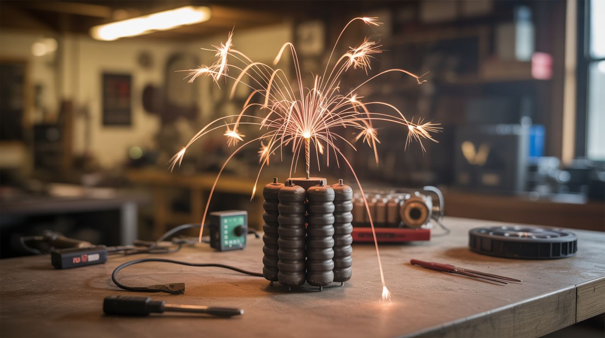

# #227 — MOT-Ignited Firework Mortar

  

> Microwave capacitor bank + nichrome igniter + Raspberry Pi timing = a programmable professional fireworks show from salvaged parts.

## Ratings

     

## 🧪 What Is It?

Professional fireworks shows use electric igniters (e-matches) wired to a sequencing controller that fires shells in precise timed patterns. The igniters are nichrome wire elements that glow white-hot when current passes through them, lighting the lift charge in the mortar tube. Commercial firing systems cost hundreds to thousands of dollars. But a microwave oven capacitor provides the stored energy to fire nichrome igniters, a Raspberry Pi or Arduino handles the timing and sequencing, and relay boards switch each channel on command. Wire up a rack of mortar tubes, load consumer firework shells, connect each to a nichrome igniter, and the Pi fires them in choreographed sequences — synced to music if you want. The microwave capacitor isn't strictly necessary (a car battery works fine for nichrome), but the capacitor bank approach gives you instantaneous current delivery for reliable, near-simultaneous multi-shell ignition that batteries can't match. The result is a backyard fireworks show that looks like a $10,000 professional display.

<strong>🧰 Ingredients</strong>

- [ ] Microwave oven capacitor — 2100V, ~1µF (or use a car battery for simpler setup) *(dead microwave)*
- [ ] Nichrome wire — 28-30 gauge, for igniters *(online, ~$5 for 25 feet)*
- [ ] Raspberry Pi or Arduino — for sequencing and timing *(~$10-35)*
- [ ] Relay board — 8-channel or 16-channel, 5V coil *(electronics supplier, ~$8-15)*
- [ ] Mortar tubes — HDPE or fiberglass, sized for your shells *(fireworks supplier)*
- [ ] Consumer firework shells — aerial shells or reloadable artillery shells *(fireworks store, where legal)*
- [ ] Mortar rack — wood or metal frame to hold tubes upright *(build from lumber)*
- [ ] Battery — 12V car battery for nichrome ignition, or 2x AA for Pi power *(existing or junkyard)*
- [ ] Long wire runs — 18-22 gauge, 50+ feet per channel, for safe standoff distance *(hardware store)*
- [ ] Safety key switch — to arm/disarm the system *(electronics supplier, ~$5)*

## 🔨 Build Steps

1. **Build the nichrome igniters.** Cut 2-inch lengths of 28-30 gauge nichrome wire. Solder each piece to a pair of lead wires (22 gauge, 50+ feet long). Dip the nichrome in a slurry of potassium nitrate and water, let dry. The KNO3 coating makes the igniter self-sustaining once lit — it flares instead of just glowing. Test one igniter with a 12V battery to confirm it fires instantly.
2. **Build the mortar rack.** Construct a sturdy rack from 2x4 lumber that holds the mortar tubes upright at a slight outward angle (2-3 degrees off vertical prevents shells from falling back into the rack). The rack must not tip over when shells launch — bolt it to a heavy base plate or stake it to the ground.
3. **Wire the relay board.** Connect each relay channel's output to one igniter circuit. The relay's normally-open contacts switch 12V battery power to each nichrome igniter. The relay coils are driven by the Pi/Arduino GPIO pins. Each channel = one mortar tube = one shell. Label everything.
4. **Program the sequence.** Write a Python script (Pi) or Arduino sketch that fires each relay in a timed sequence. Start simple: fire one shell every 3 seconds. Then get creative — rapid-fire finales, alternating left-right patterns, synchronized pauses. If syncing to music, use timestamps matched to the beat.
5. **Install the safety system.** Wire a key switch in series with the 12V power bus that feeds all igniters. The system should be completely inert until the key is turned. Add an LED indicator that shows when the system is armed. The key stays with the operator at all times.
6. **Load the mortars.** Insert one firework shell per mortar tube, fuse end down. Thread the nichrome igniter down alongside the shell so the nichrome tip contacts the shell's lift charge fuse. This is the most critical step — if the igniter isn't touching the fuse, the shell won't fire.
7. **Run wire to the firing position.** Unspool all igniter wires back to the control station, which should be at least 100 feet from the mortar rack (further is better). Connect all wires to the relay board. Verify continuity on each channel with a multimeter set to resistance — a good igniter reads 1-5 ohms.
8. **Arm and fire.** Clear the area around the mortars (minimum 100-foot safety radius for consumer shells). Turn the safety key to arm the system. Start the sequencing script. Watch the show. The Pi fires each relay in order, each igniter glows and lights its shell's fuse, and shells launch in your programmed sequence.

## ⚠️ Safety Notes

> **Spicy Level 5 build.** Read the [Safety Guide](../../safety/README.md) and [Chemical Safety](../../safety/chemicals.md), [Fire & Pyro Safety](../../safety/fire-and-pyro.md) before starting.

- Fireworks are explosive devices. Observe all local laws regarding fireworks use. Maintain minimum safety distances (100 feet for consumer shells, more for larger shells). Never stand over a loaded mortar tube. Never attempt to re-approach a misfired shell for at least 15 minutes. Keep a fire extinguisher and a water bucket at the control station.
- If using microwave capacitors for the ignition power source instead of a battery, the capacitor stores lethal energy at 2100V. A microwave capacitor can kill you. Discharge capacitors with a high-wattage resistor before handling. Keep both terminals shorted with a wire when not in use. If you're not experienced with high-voltage capacitors, use a 12V car battery instead — it works just as well for nichrome igniters and won't kill you.
- The nichrome igniters are pyrotechnic devices once coated with KNO3. Store them away from heat sources. Never connect igniters to power until all shells are loaded and personnel are clear. The safety key switch should be the last thing turned on and the first thing turned off.

## 🔗 See Also

- [Fireworks Sequencer](../pi-and-arduino/121-fireworks-sequencer.md)
- [Electromagnetic Firework Launcher](229-electromagnetic-firework-launcher.md)

**References:**
- [Appliance Teardown Guide](../../reference/appliance-teardown-guide.md)
- [Technical Glossary](../../reference/glossary.md)
- [Chemicals Reference](../../reference/chemicals.md)
- [Electronics & Microcontrollers Guide](../../reference/electronics-and-microcontrollers.md)
