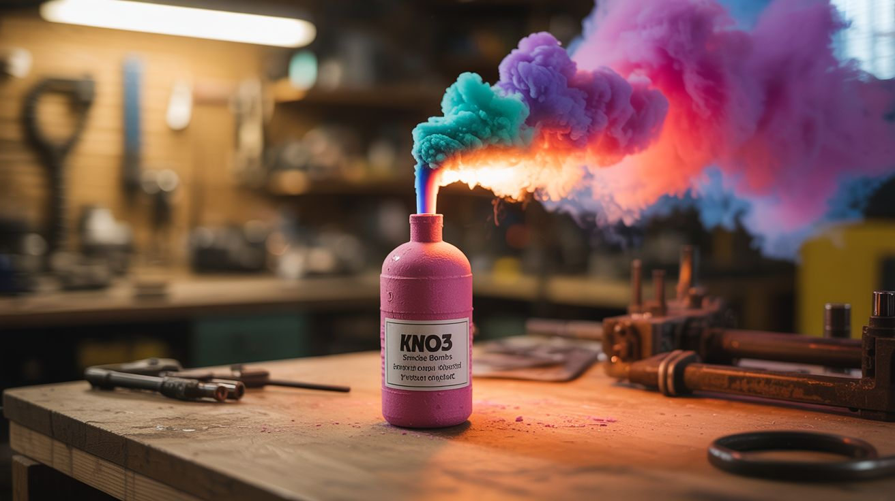

# #228 — Chemical-Trigger Color Bombs

  

> KNO3 smoke bombs + metal salt colorants + permanganate/glycerin auto-ignition = no-fuse colored smoke that lights itself on contact.

## Ratings

| Jaw Drop Rating | Brain Melt Level | Wallet Damage | Spicy Level | Clout Potential | Time to Build |
|---|---|---|---|---|---|
| ⭐⭐⭐⭐⭐ | ⭐⭐ | ⭐⭐ | ⭐⭐⭐⭐ | ⭐⭐⭐⭐⭐ | ⭐⭐ |

## What Is It?

Standard smoke bombs use KNO3 (potassium nitrate) as the oxidizer and sugar as the fuel, with organic dyes mixed in for color. They work great but need a fuse or a lighter to start. Potassium permanganate (KMnO4) and glycerin have a different trick: when glycerin is dripped onto permanganate crystals, a vigorous exothermic reaction begins after a 30-60 second delay — the mixture smolders, then bursts into purple flame with no external ignition source. Combine these two chemistries and you get self-igniting colored smoke devices. Pack a KNO3/sugar/dye smoke composition into a container with a permanganate/glycerin trigger layer, and you have a smoke bomb that activates when you mix the chemicals — no fuse, no lighter, no electronics. The delay gives you time to step back. The colors come from organic dyes in the smoke mix: red, blue, green, yellow, purple. This is the chemistry version of a magic trick — you pour a liquid onto a powder, walk away, and a cloud of colored smoke erupts from the ground a minute later.

## Ingredients

- [ ] Potassium nitrate (KNO3) — stump remover brand is fine *(hardware store or online)*
- [ ] Granulated sugar — regular table sugar *(grocery store)*
- [ ] Organic powder dyes — for smoke color (red, blue, yellow, green) *(online, candle/soap supply)*
- [ ] Potassium permanganate (KMnO4) — water treatment crystals *(hardware store, pool supply, online)*
- [ ] Glycerin — food-grade or pharmaceutical *(pharmacy, soap supply store)*
- [ ] Tin cans or cardboard tubes — for smoke bomb casings *(recycling bin)*
- [ ] Aluminum foil — for wrapping and sealing *(grocery store)*
- [ ] Dropper bottle — for applying glycerin precisely *(pharmacy, ~$2)*
- [ ] Mixing bowls and spoons — dedicated, not for food use *(dollar store)*

## Build Steps

1. **Make the smoke composition.** Mix KNO3 and sugar at a 3:2 ratio by weight (60g KNO3, 40g sugar). This is the fuel-oxidizer base. You can either melt it together over low heat (more dangerous but produces a denser, slower-burning product) or keep it as a dry mixture (safer, burns faster and rougher). For beginners, use the dry mix method.
2. **Add color dyes.** Mix in organic powder dye at about 10-20% of the total weight. More dye = more vivid smoke color but slower burn. Different dyes produce different colors: disperse red, disperse blue, and solvent yellow are common smoke dye choices. Mix each color separately if making a multi-color set.
3. **Pack the smoke composition.** Spoon the colored smoke mix into tin cans or cardboard tubes, packing it firmly but not crushing it. Leave about 1 inch of space at the top — this is where the trigger layer goes. The can should be about 2/3 full of smoke composition.
4. **Create the trigger layer.** Spread a thin layer (about 1/4 inch) of potassium permanganate crystals on top of the smoke composition. The permanganate acts as both the auto-ignition reagent and an additional oxidizer that helps the smoke composition catch.
5. **Prepare the glycerin delivery.** Fill a dropper bottle with glycerin. When you're ready to ignite, you'll squeeze glycerin onto the permanganate layer. The glycerin soaks into the permanganate crystals and begins an exothermic oxidation reaction. After 30-60 seconds (depending on temperature and crystal size), the mixture reaches ignition temperature and flares up, lighting the smoke composition below.
6. **Seal and store (until ready to use).** Cover the open end of each smoke bomb with aluminum foil, crimped loosely. This keeps moisture out and the permanganate dry. Store in a cool, dry place. Do NOT put glycerin in contact with the permanganate until you are outdoors, in position, and ready for ignition.
7. **Deploy.** Place the smoke bombs in your desired positions outdoors. Remove the foil covers. Squeeze 5-10 drops of glycerin onto the permanganate layer of each unit. Step back at least 15 feet. Within 30-60 seconds, each unit will begin smoking as the permanganate/glycerin reaction ignites the smoke composition. Thick colored smoke billows up.
8. **Time multiple units.** For a multi-color display, drip glycerin onto each unit in rapid succession, then retreat. They'll ignite at slightly different times (the delay is not precision-controlled), creating a rolling, multi-colored smoke effect. For more synchronized ignition, use warmer glycerin or finer permanganate crystals — both speed up the reaction.

## Safety Notes

- Potassium permanganate is a strong oxidizer that stains everything it touches a deep brown/purple. Wear gloves. It also reacts with many organic materials, not just glycerin. Keep it away from paper, wood shavings, and other combustibles. Store it in its original container, sealed, away from heat.
- The permanganate/glycerin reaction produces intense heat and flame. Once glycerin is applied, the reaction cannot be stopped. Do not attempt to smother or douse it with water until the reaction completes — water can splatter hot permanganate. Stand clear and let it burn out.
- Smoke bombs produce thick, opaque smoke that can obscure vision and irritate lungs. Use outdoors only, in open areas with wind to disperse the smoke. Never use in enclosed spaces, near roadways, or near anyone with respiratory conditions.

## See Also

- [Smoke Bomb Array](../pyro-and-chemistry/103-smoke-bomb-array.md)
- [Permanganate Auto-Ignition](../pyro-and-chemistry/115-permanganate-auto-ignition.md)

**References:**
- [Appliance Teardown Guide](../../reference/appliance-teardown-guide.md)
- [Technical Glossary](../../reference/glossary.md)
- [Chemicals Reference](../../reference/chemicals.md)
