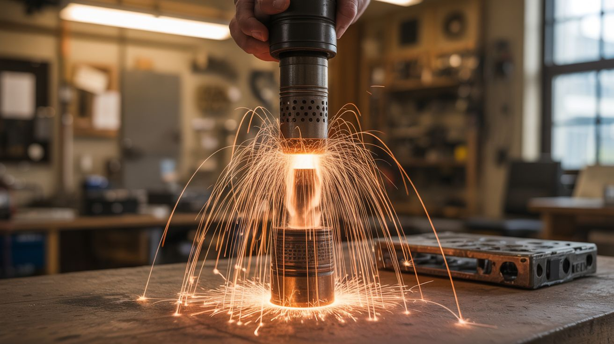

# #230 — Thermite Cold Spark Fountain

  

> Thermite burns at 4,000 degrees while titanium cold sparks shower out at safe-to-touch temperatures right next to it. Fire and ice, simultaneously. The visual contrast is insane.

## Ratings

     

## 🧪 What Is It?

Thermite is iron oxide + aluminum powder. When ignited, it undergoes an aluminothermic reaction at roughly 4,000°F, producing molten iron and aluminum oxide in a blinding white-hot cascade. It melts through steel. It's terrifying. Cold spark machines, meanwhile, use titanium powder heated by a resistance element and ejected upward by a small fan. The titanium particles burn at only 150-200°F — spectacular bright sparks that are literally safe to touch with your bare hand. They're used at concerts, weddings, and indoor events because they can't start fires. Put both of these next to each other, firing simultaneously, and you get the most extreme visual contrast in pyrotechnics: a white-hot molten metal reaction next to a shower of brilliant sparks you could catch in your palm. One is the hottest thing a hobbyist can create. The other is stage-safe. The audience's brain short-circuits trying to process both at once.

<strong>🧰 Ingredients</strong>

- [ ] Iron oxide (Fe2O3) — red iron oxide powder *(online, pigment supplier, or make from steel wool + vinegar + hydrogen peroxide)*
- [ ] Aluminum powder — 200 mesh or finer *(online, pyrotechnic supplier)*
- [ ] Titanium powder — 150-300 mesh, for cold sparks *(online, pyrotechnic/metal supplier, ~$15)*
- [ ] Cold spark machine heating element — nichrome wire coil in a ceramic tube *(build from nichrome wire + ceramic tube, or salvage from a commercial unit)*
- [ ] Small fan — 40-60mm PC fan, to loft the titanium particles *(salvage from PC)*
- [ ] Clay flower pot or steel crucible — for the thermite reaction *(garden store or metalworking supply)*
- [ ] Magnesium ribbon — for thermite ignition *(online, pyrotechnic supplier)*
- [ ] 12V power supply — for the cold spark heater and fan *(existing)*
- [ ] Fire-safe base — steel plate, concrete blocks, or sand bed *(hardware store)*
- [ ] Remote ignition — long fuse, nichrome igniter, or electrical trigger *(build or purchase)*

## 🔨 Build Steps

1. **Build the cold spark machine.** Coil nichrome wire (28 gauge, ~6 inches) tightly inside a small ceramic tube to create a heating element. When powered, this coil glows red-hot. Titanium powder fed into contact with the hot nichrome ignites into brilliant but cool-burning sparks. Mount a small PC fan below the heating element to blow the sparks upward in a fountain pattern.
2. **Build the titanium feed system.** Create a simple hopper (a small funnel or tube) that gravity-feeds titanium powder onto the heating element at a controlled rate. A pinch valve or a vibrating feed tube controls the flow rate. More powder = denser spark fountain. Too much powder smothers the element. Start with a slow trickle and adjust.
3. **Test the cold spark fountain.** Power the nichrome heater with 12V (use a variac or PWM to adjust temperature), start the fan, and begin feeding titanium powder. Brilliant white/gold sparks should shoot upward 3-6 feet. Touch a spark that lands on your hand — it should feel barely warm. If sparks are too hot, the heating element is too hot or the titanium particles are too large. Adjust accordingly.
4. **Prepare the thermite.** Mix iron oxide and aluminum powder at a ratio of approximately 8:3 by weight (iron oxide : aluminum). Mix gently — never grind or crush the mixture. Thermite is not impact-sensitive but there's no reason to test that. Load the mixture into a clay flower pot or steel crucible. A typical demonstration uses 100-200g of thermite.
5. **Set up the thermite ignition.** Thermite requires a very hot ignition source — a match or lighter won't do it. Insert a 6-inch strip of magnesium ribbon into the top of the thermite mixture. The magnesium ribbon is your fuse — light the end, it burns at 5,400°F along its length, and ignites the thermite when the flame reaches the powder. For remote ignition, attach a nichrome igniter to the end of the magnesium ribbon and trigger it electrically from a safe distance.
6. **Position both devices.** Place the thermite crucible and the cold spark machine about 4-6 feet apart on a fire-safe surface (steel plate on concrete or sand). The cold spark fountain should be upwind of the thermite so the safe sparks blow toward the audience while the thermite faces the other direction. Never put the cold spark machine downwind of the thermite — radiant heat and molten splatter travel.
7. **Ignite simultaneously.** Light the cold spark machine first (it starts instantly). Then trigger the thermite ignition. The cold spark fountain produces a beautiful shower of bright, touchable sparks. Seconds later, the thermite erupts in a blinding white-hot reaction, spraying molten iron. The contrast — one gentle and harmless, the other violent and destructive — is the entire point.
8. **Let the thermite burn to completion.** Thermite reactions last 10-30 seconds depending on the quantity. Do not attempt to extinguish thermite with water (steam explosion), sand (it burns through it), or anything else. It's self-oxidizing — it carries its own oxygen supply and cannot be smothered. Let it finish and cool for at least 30 minutes before approaching.

## ⚠️ Safety Notes

> **Spicy Level 5 build.** Read the [Safety Guide](../../safety/README.md) and [Chemical Safety](../../safety/chemicals.md), [Fire & Pyro Safety](../../safety/fire-and-pyro.md) before starting.

- Thermite produces molten iron at 4,000°F that burns through steel, concrete, and virtually everything else. The reaction sprays molten droplets several feet in all directions. Use a steel plate or thick sand bed underneath. Clear a 15-foot radius of all combustible materials. Wear a full-face shield, leather gloves, and long sleeves. Never lean over a thermite reaction. Never attempt thermite on surfaces you care about.
- Despite the cold sparks being safe to touch, the audience must understand which side is which. Mark the thermite zone clearly and keep all people behind the cold spark side. A confused spectator walking toward the "pretty sparks" on the wrong side could walk into molten iron splatter.
- Thermite cannot be extinguished. Once ignited, it will burn to completion regardless of what you do. Using water on burning thermite causes a violent steam explosion that sprays molten metal. Have an exit route planned in case the reaction behaves unexpectedly (crucible failure, tip-over).

## 🔗 See Also

- [Thermite Flower Pot](../pyro-and-chemistry/105-thermite-flower-pot.md)
- [Cold Spark Machine](../pyro-and-chemistry/104-cold-spark-machine.md)

**References:**
- [Appliance Teardown Guide](../../reference/appliance-teardown-guide.md)
- [Technical Glossary](../../reference/glossary.md)
- [Chemicals Reference](../../reference/chemicals.md)
