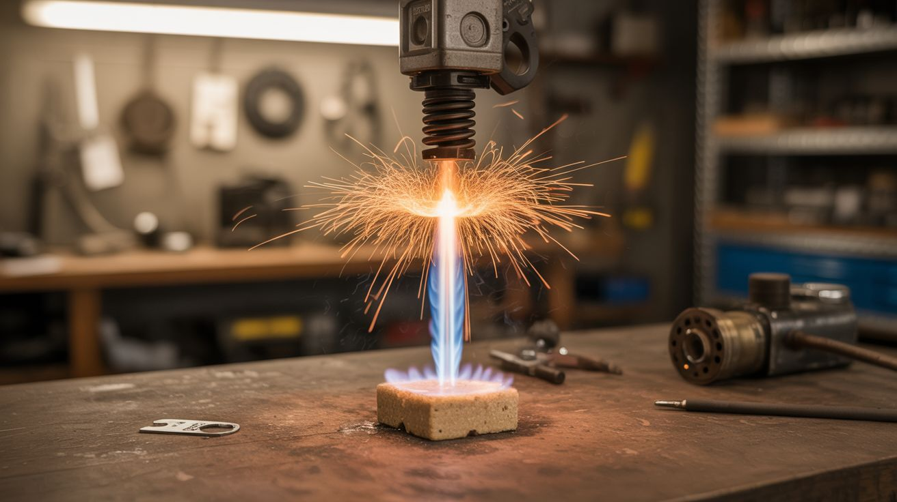

# #231 — Ignition Coil KNO3 Flame Jet

  

> Car ignition coil sparks into a KNO3/sugar fuel grain = a self-oxidizing flame jet that burns underwater. Because regular fire is for amateurs.

## Ratings

     

## 🧪 What Is It?

Potassium nitrate (KNO3) and sugar, when melted together and hardened, form a solid propellant grain known as "rocket candy" or R-candy. It's the same stuff amateur rocketeers have used for decades. The KNO3 provides oxygen, the sugar provides fuel, and once ignited, the mixture burns vigorously at 1,500-2,000°F — and because it carries its own oxidizer, it doesn't need atmospheric oxygen. It burns in a sealed container. It burns in a vacuum. It burns underwater. Normally you'd light it with a fuse or a match, but a car ignition coil provides a 40kV spark that ignites it instantly and reliably from a safe distance. Pack the R-candy into a steel nozzle tube, wire the ignition coil to a spark plug or spark gap at the base of the fuel grain, and hit the switch. A jet of white-hot flame erupts from the nozzle. Submerge the whole thing in a bucket of water and fire it again — the flame blasts through the water in a roiling column of steam and fire. That's the demo that breaks people's brains: fire, underwater, burning as if the water isn't there.

<strong>🧰 Ingredients</strong>

- [ ] Potassium nitrate (KNO3) — stump remover grade *(hardware store)*
- [ ] Granulated sugar — regular table sugar *(grocery store)*
- [ ] Car ignition coil — standard canister type *(junkyard)*
- [ ] Spark plug — or build a spark gap from two bolts *(junkyard or hardware store)*
- [ ] 12V car battery — to drive the ignition coil *(junkyard or existing)*
- [ ] Steel tube — 3/4" to 1" diameter, 6-8 inches long, with one end narrowed to a nozzle *(hardware store, plumbing supply)*
- [ ] Momentary switch — for remote ignition *(electronics supplier)*
- [ ] Wire — 16-18 gauge, long run for safe standoff *(hardware store)*
- [ ] Water bucket or trough — for the underwater demonstration *(existing)*
- [ ] Heat-resistant gloves and safety goggles *(hardware store)*

## 🔨 Build Steps

1. **Cook the R-candy fuel.** Mix KNO3 and sugar at a 65:35 ratio by weight in a non-stick pot. Heat over low heat (electric stove preferred — no open flame near this mixture), stirring constantly. The sugar melts first, then the KNO3 dissolves into the liquid sugar, forming a caramel-colored syrup. When the mixture is smooth and free of lumps, it's ready. Do not overheat — if it starts smoking, remove from heat immediately.
2. **Cast the fuel grain.** Pour the hot R-candy mixture into a steel tube that will serve as the combustion chamber. The tube should have a constricted nozzle at one end (a reducer fitting or a drilled-out cap) to direct the exhaust into a jet. Leave 1 inch of space at the closed end for the igniter. Let the mixture cool and harden completely — at least 2 hours.
3. **Install the igniter.** Mount a spark plug or a pair of bolts (acting as a spark gap) into the closed end of the steel tube, with the spark gap tips embedded in or touching the surface of the hardened fuel grain. The spark needs to contact the fuel directly to ignite it.
4. **Wire the ignition coil.** Connect the ignition coil's primary winding to the 12V battery through a momentary switch and a long wire run (20+ feet for safety). Connect the coil's high-voltage secondary output to the spark plug or spark gap at the base of the fuel grain. When the switch is pressed, the coil generates a continuous stream of high-voltage sparks at the fuel surface.
5. **Test ignition in open air.** Place the loaded tube on a fire-safe surface (concrete, steel plate, or dirt), nozzle pointed away from everything. Stand at the end of your wire run, press the switch. The spark should ignite the fuel grain within 1-2 seconds. A jet of white-hot flame erupts from the nozzle, burning for 5-15 seconds depending on the fuel grain size. The flame is intense — 1,500-2,000°F — and self-sustaining once lit.
6. **Prepare the underwater demo.** Fill a metal bucket or trough with water. Submerge the loaded tube (nozzle pointing up) so the entire fuel grain is underwater. Route the ignition wires up and out of the water — the high-voltage spark will jump through a thin layer of water to reach the fuel, but the wire connections should be above the waterline for reliability.
7. **Fire underwater.** Press the ignition switch. The spark ignites the fuel grain despite being submerged. The R-candy burns furiously underwater because the KNO3 provides all the oxygen the reaction needs. A violent column of steam, fire, and boiling water erupts from the bucket. The visual is unforgettable — fire and water coexisting in a churning column of chaos.
8. **Cleanup.** Let the tube cool completely before handling. The residue is mostly potassium carbonate (potash) — a water-soluble, non-toxic salt. Rinse the tube out. The bucket water will be cloudy with dissolved combustion products — dump it on grass (it's actually a decent fertilizer).

## ⚠️ Safety Notes

> **Spicy Level 5 build.** Read the [Safety Guide](../../docs/safety/README.md) and [Chemical Safety](../../docs/safety/chemicals.md), [Fire & Pyro Safety](../../docs/safety/fire-and-pyro.md) before starting.

- R-candy is a legitimate solid propellant. Once ignited, it cannot be extinguished by conventional means — it supplies its own oxygen. Do not attempt to smother it, stamp it out, or pour water on it to extinguish it (water doesn't work; that's the whole point of this build). Let it burn to completion. Keep all combustible materials well clear.
- The flame jet is 1,500-2,000°F and can cause severe burns instantly. Never point the nozzle toward people, structures, or anything flammable. Maintain a 15-foot safety radius around the combustion tube. The underwater demo produces boiling water and steam that can scald — stand back.
- Never scale up the fuel grain beyond small demonstration quantities (50-100g). Larger fuel grains burn longer and hotter, and if the tube fails (cracks, welds blow out), you have a CATO (catastrophic failure) that sprays burning propellant. Use thick-wall steel tubing and inspect for defects before every use.

## 🔗 See Also

- [Ignition Coil Tesla Coil](../junkyard-auto/220-ignition-coil-tesla-coil.md)
- [Colored Fire](../pyro-and-chemistry/101-colored-fire.md)

**References:**
- [Appliance Teardown Guide](../../docs/reference/appliance-teardown-guide.md)
- [Technical Glossary](../../docs/reference/glossary.md)
- [Chemicals Reference](../../docs/reference/chemicals.md)
