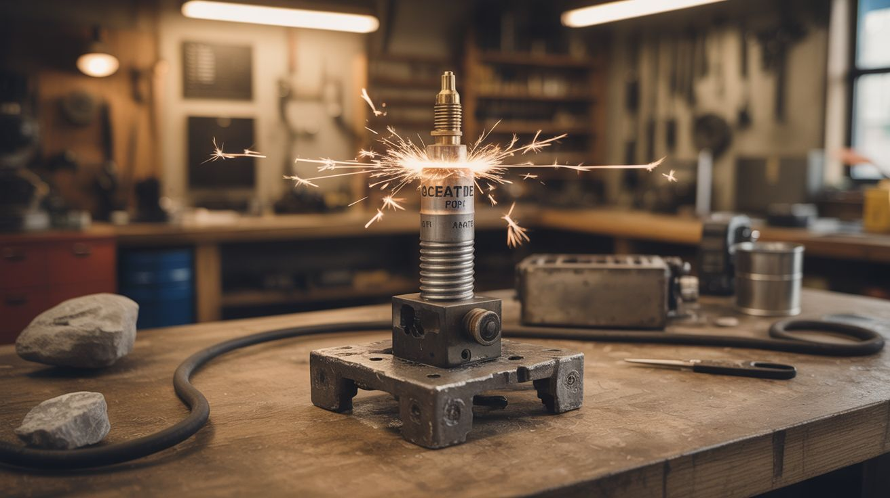

# #232 — Carbide Spark Plug Repeater

  

> Calcium carbide + water makes acetylene. A spark plug on a timer fires it. Refueled by rocks and water. A repeating cannon that runs on geology.

## Ratings

     

## 🧪 What Is It?

Calcium carbide is a gray, rocky mineral. Add water and it produces acetylene gas — the same gas used in welding torches, one of the most energetic fuel gases known. The classic calcium carbide cannon (#116) is a single-shot affair: load carbide, add water, wait, click a piezo igniter, BANG, reload. This build automates the entire cycle. A solenoid valve drips water onto a carbide reservoir at timed intervals, producing a measured charge of acetylene. A car spark plug, driven by an ignition coil and triggered by a 555 timer or Arduino, fires at the end of each gas-buildup cycle. The result is a repeating cannon that fires every 15-30 seconds, automatically, until it runs out of carbide or water. Load a hopper with carbide rocks and a reservoir with water, flip the switch, and walk away. It keeps banging like clockwork. Powered by rocks, water, and a car battery. No propane tanks, no compressed gas, no fuel you can't find on the ground.

<strong>🧰 Ingredients</strong>

- [ ] Calcium carbide — chunks or granules *(welding supply, online, or cave/mining supply)*
- [ ] Car spark plug — standard 14mm *(junkyard or auto parts store)*
- [ ] Car ignition coil — standard canister type *(junkyard)*
- [ ] 12V car battery *(junkyard or existing)*
- [ ] Steel combustion chamber — thick-wall steel pipe, 3-4 inch diameter, 12-18 inches long, with welded or bolted end cap *(hardware store, fabricate)*
- [ ] 12V solenoid valve — normally closed, for water drip control *(electronics supplier, ~$8)*
- [ ] Water reservoir — any elevated container (bucket, bottle) *(existing)*
- [ ] Carbide hopper — funnel or tube that gravity-feeds carbide into the chamber *(fabricate from steel or PVC)*
- [ ] 555 timer circuit or Arduino — for cycle timing *(electronics supplier)*
- [ ] MOSFET or relay — to fire the ignition coil *(electronics supplier)*
- [ ] Ear protection — this is very loud, repeatedly *(hardware store)*

## 🔨 Build Steps

1. **Build the combustion chamber.** Use thick-wall steel pipe (schedule 40 or heavier), 3-4 inch diameter, 12-18 inches long. Weld or bolt a steel end cap on one end. Drill and tap a 14mm hole for the spark plug in the end cap. Drill a 1/4" hole in the side near the closed end for the water inlet. Drill another hole for the carbide feed tube. The open end is the barrel/exhaust.
2. **Install the spark plug.** Thread the spark plug into the tapped hole in the end cap. The spark gap should protrude into the interior of the chamber. Connect ignition wire from the spark plug to the ignition coil's high-voltage output.
3. **Build the carbide feed system.** Mount a hopper (a funnel or angled tube) above the chamber that feeds carbide chunks into the chamber through a port in the side or top. A simple gate valve or sliding plate lets you control how much carbide enters per cycle. For automatic feeding, use a small servo or solenoid to open and close the gate on a timer.
4. **Install the water drip system.** Mount a water reservoir (bottle or bucket) above the chamber. Connect it via tubing to the solenoid valve, which connects to the water inlet port on the chamber. When the solenoid opens, water drips into the chamber and contacts the carbide, producing acetylene gas. The solenoid duration controls how much water enters, which controls how much gas is generated.
5. **Build the timing circuit.** Use a 555 timer or Arduino to create a repeating cycle: (a) open the water solenoid for 2-3 seconds, (b) wait 15-20 seconds for acetylene to build up, (c) fire the ignition coil for a 1-second burst of sparks, (d) wait 5 seconds for combustion products to clear, (e) repeat. Adjust the timing for your chamber size — more gas buildup = louder bang but higher pressure.
6. **Wire the ignition system.** Connect the ignition coil primary to the 12V battery through a MOSFET controlled by the timer circuit. When the timer signals "fire," the MOSFET switches on and the coil generates a stream of high-voltage sparks at the spark plug. The spark ignites the acetylene/air mixture in the chamber.
7. **Test manually first.** Before enabling the automatic cycle, test each subsystem: verify the water drip produces gas (you'll smell the garlic-like acetylene odor), verify the spark plug fires, verify manual ignition produces a satisfying bang. Then enable the timer and let it cycle.
8. **Deploy.** Point the barrel in a safe direction (across an open field, away from structures and people). Load the carbide hopper, fill the water reservoir, connect the battery, and flip the power switch. The system begins its cycle: drip, wait, BANG, pause, drip, wait, BANG. Each detonation produces a deep, resonant boom and a visible flame jet from the barrel.
9. **Monitor and maintain.** The spent calcium hydroxide slurry accumulates in the chamber and eventually needs to be flushed out (it's a caustic white paste). Every 10-15 cycles, stop the system, drain the slurry, and reload carbide. The spark plug will foul over time — clean or replace it when misfires begin.

## ⚠️ Safety Notes

> **Spicy Level 5 build.** Read the [Safety Guide](../../docs/safety/README.md) and [Chemical Safety](../../docs/safety/chemicals.md), [Fire & Pyro Safety](../../docs/safety/fire-and-pyro.md) before starting.

- Acetylene is explosive in air at concentrations from 2.5% to 81% — one of the widest explosive ranges of any fuel gas. Never use this device indoors or in any enclosed space. A gas leak + any ignition source = detonation. The system must be outdoors with natural ventilation.
- This device produces repeated detonations comparable in volume to gunshots. Use ear protection. Alert neighbors. Be aware of local noise ordinances. The repeating nature means it doesn't sound accidental — expect attention.
- Calcium carbide reacts with any moisture, including humidity. Store it sealed and dry. The reaction produces calcium hydroxide (slaked lime), which is caustic — avoid skin and eye contact. Wear gloves when handling spent slurry. The acetylene gas itself is an asphyxiant in high concentrations and has an anesthetic effect — don't breathe it.

## 🔗 See Also

- [Calcium Carbide Cannon](../pyro-and-chemistry/116-calcium-carbide-cannon.md)
- [Spark Plug Cannon](../junkyard-auto/223-spark-plug-cannon.md)

**References:**

- [Chemicals Reference](../../docs/reference/chemicals.md)
- [Electronics & Microcontrollers Guide](../../docs/reference/electronics-and-microcontrollers.md)
