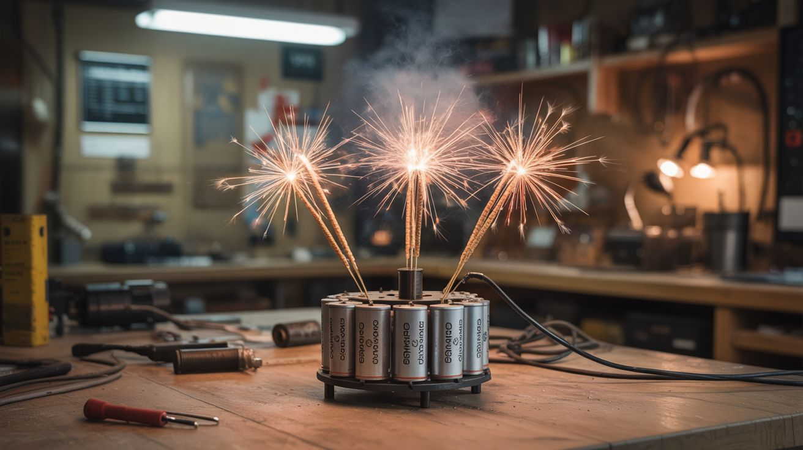

# #234 — Microwave Firework Star Mine

  

> MOT capacitor bank powers a coil gun that launches metal-salt color stars with nichrome ignition. Three categories detonate in one glorious burst.

## Ratings

     

## 🧪 What Is It?

A star mine in fireworks terminology is a ground-based device that launches a spread of burning color stars into the air in a fan pattern — like a shotgun blast of fire. Professional star mines use black powder lift charges. This build replaces the lift charge with an electromagnetic coil gun powered by a microwave oven transformer's capacitor bank, and replaces commercial pyrotechnic stars with handmade metal-salt color stars ignited by nichrome wire elements. It's a collision of three worlds: microwave salvage (capacitor bank for energy storage), junkyard auto (the electromagnetic launch concept shares DNA with ignition coil builds), and pyrotechnic chemistry (metal salt color stars are the foundation of all colored fireworks). The coil gun launches a payload canister containing a cluster of burning color stars, which spread out at altitude into a spray of red, green, blue, and gold burning embers. One device. Three disciplines. Zero subtlety.

<strong>🧰 Ingredients</strong>

- [ ] Microwave oven capacitor — 2100V ~1µF, or large electrolytic caps (400V, 1000µF+) *(dead microwave or electronics supplier)*
- [ ] Magnet wire — 12-14 gauge enameled copper for the launch coil *(electronics supplier, ~$15)*
- [ ] SCR or IGBT — high-current switch for capacitor discharge *(electronics supplier, ~$10)*
- [ ] Launch tube — PVC or fiberglass, 2-3 inch diameter *(hardware store)*
- [ ] Steel payload canister — thin steel cup that fits inside the launch tube, holds the color stars *(fabricate from steel or tin can)*
- [ ] Metal salt compounds — strontium nitrate (red), barium nitrate (green), copper sulfate (blue), iron filings (gold) *(online, pyrotechnic supplier)*
- [ ] Potassium nitrate (KNO3) + fuel (charcoal, sulfur, or dextrin) — for star composition *(hardware store, online)*
- [ ] Nichrome wire — 28-30 gauge, for igniting the stars *(online, ~$5)*
- [ ] Arduino or 555 timer — for ignition timing *(electronics supplier)*
- [ ] 12V battery — for nichrome ignition circuit *(existing or junkyard)*
- [ ] Charging circuit — rectifier + resistor for capacitor charging *(build from components)*
- [ ] Safety discharge resistor — high-wattage, for emergency cap drain *(electronics supplier)*

## 🔨 Build Steps

1. **Make the color stars.** Prepare separate batches of pyrotechnic star composition: mix each metal salt (strontium for red, barium for green, copper for blue) with KNO3 as oxidizer and a fuel (charcoal or dextrin) as binder. The ratio is roughly 50% metal salt, 30% KNO3, 15% fuel, 5% dextrin binder. Add water to make a dough, roll into pea-sized balls, and let dry for 48 hours. Each ball is one "star" — a self-contained colored fire pellet.
2. **Build the coil gun launcher.** Wind 50-80 turns of 12-14 gauge magnet wire around the PVC launch tube, centered along its length. The tube diameter should be slightly larger than the steel payload canister. The coil, when pulsed with capacitor current, generates a magnetic field that yanks the steel canister upward through the tube.
3. **Build the capacitor bank.** Wire capacitors for adequate energy storage. If using a microwave capacitor (2100V, 1µF), the stored energy is about 2.2 joules — enough for a modest launch. For more power, use a bank of large electrolytic caps in series/parallel (target 400V, 5000-10,000µF for 40-80 joules). More energy = higher launch = wider star spread.
4. **Build the charging circuit.** Rectify and current-limit a transformer output to charge the capacitor bank. A MOT secondary through a voltage divider and bridge rectifier works. Monitor voltage with a panel meter. Never exceed the capacitor's rated voltage. Charging takes 10-30 seconds per shot.
5. **Prepare the payload canister.** Cut a short section of thin-wall steel can (a soup can works) to fit inside the launch tube. Load it with 10-20 dried color stars. The canister must be ferromagnetic (test with a magnet) and light enough to be launched by the coil's magnetic pulse.
6. **Install the star ignition system.** Weave nichrome wire through the cluster of stars inside the canister. Connect the nichrome to a separate 12V circuit controlled by the Arduino. When triggered, the nichrome glows and ignites the stars inside the canister. The stars must be burning before launch so they're visible as they spread through the air.
7. **Wire the launch sequence.** Program the Arduino to execute: (a) verify capacitor bank is charged, (b) fire the nichrome igniters to light the stars, (c) wait 1-2 seconds for the stars to catch, (d) fire the SCR to dump the capacitor bank through the coil, launching the canister.
8. **Test with inert loads.** Before loading live pyrotechnic stars, test the coil gun with a steel slug of the same weight as a loaded canister. Verify the launch height is sufficient (20-50 feet minimum for a visible star spread). Adjust capacitor voltage and coil parameters as needed.
9. **Live fire.** Load the canister with color stars and nichrome igniter. Place it in the launch tube. Charge the capacitor bank. Clear the area (100+ foot radius). Arm the system and execute the launch sequence. The nichrome lights the stars, then the coil gun silently launches the canister skyward. At the apex, the burning stars separate from the canister and spread outward in a shower of colored fire — red, green, blue, and gold embers floating down.
10. **Refine the spread pattern.** The way stars separate from the canister determines the visual effect. A loose canister lets stars escape early for a narrow column. A tight canister with a burst charge (a small KNO3 pellet that pops at altitude) spreads stars in a wider fan. Experiment with canister design to get the pattern you want.

## ⚠️ Safety Notes

> **Spicy Level 5 build.** Read the [Safety Guide](../../docs/safety/README.md) and [Chemical Safety](../../docs/safety/chemicals.md), [Fire & Pyro Safety](../../docs/safety/fire-and-pyro.md) before starting.

- The capacitor bank stores potentially lethal energy at high voltage. Follow the same safety protocols as the [Electromagnetic Firework Launcher](229-electromagnetic-firework-launcher.md): always discharge before handling, install bleeder resistors, use a safety key switch, and treat the charged bank as a lethal hazard. A 400V capacitor bank at 10,000µF stores 800 joules — enough to cause cardiac arrest.
- Metal-salt pyrotechnic stars are flammable, difficult to extinguish once burning, and produce toxic metal oxide fumes. Make and handle stars outdoors. Wear a respirator when mixing dry metal salt powders. Never inhale the fumes from burning stars — barium and strontium compounds are toxic.
- This build combines high-voltage electronics, electromagnetic launch systems, and pyrotechnics. Each discipline has its own safety requirements, and the combination multiplies the risk. Do not attempt this build without prior experience in all three areas. Build and master simpler projects from each category first.

## 🔗 See Also

- [Electromagnetic Firework Launcher](229-electromagnetic-firework-launcher.md)
- [Colored Fire](../pyro-and-chemistry/101-colored-fire.md)

**References:**
- [Appliance Teardown Guide](../../docs/reference/appliance-teardown-guide.md)
- [Technical Glossary](../../docs/reference/glossary.md)
- [Chemicals Reference](../../docs/reference/chemicals.md)
- [Electronics & Microcontrollers Guide](../../docs/reference/electronics-and-microcontrollers.md)
