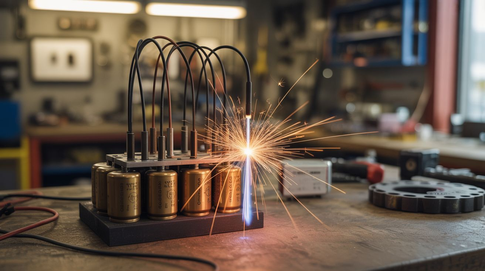

# #275 — Capacitor Bank Plasma Igniter

  

> MOT capacitors wired in a bank discharge through a spark gap to create a plasma arc hot enough to ignite anything you point it at.

## Ratings

     

## 🧪 What Is It?

Every microwave oven you haul out of a dumpster has a gift inside: a Microwave Oven Transformer (MOT) capacitor rated at around 2100V and 1µF. One of these alone stores enough energy to ruin your day. Wire three or four of them in parallel and you’ve got a capacitor bank that can dump a terrifying amount of energy in microseconds. Route that discharge through a carefully constructed spark gap — two tungsten electrodes separated by a few millimeters of air — and the air itself ionizes into plasma. The resulting arc is a screaming, blue-white channel of superheated gas north of 20,000°F. That’s hotter than the surface of the sun.

The practical application here is ignition. This isn’t a lighter — it’s an igniter. The plasma arc will light thermite, fireworks fuse, pyrotechnic compositions, or anything else you’d normally struggle to ignite with a match. The beauty of a capacitor discharge is its speed and reliability. There’s no sputtering, no wind sensitivity, no “is it lit yet?” anxiety. The arc fires, the target ignites, end of story. Professional pyrotechnicians use similar (though more refined) systems for show ignition.

Building one requires respecting the energy involved. A charged MOT capacitor is genuinely lethal — this isn’t a “might give you a tingle” situation. You’ll need a proper charging circuit with current limiting, a discharge resistor for safe handling, and a trigger mechanism that keeps your fingers far from the business end. But once it’s built and enclosed in a proper housing with a safety interlock, you’ve got a reusable ignition system that makes every other fire-starting method look like rubbing two sticks together.

<strong>🧰 Ingredients</strong>

- [ ] MOT capacitors — 2100V, ~1µF, quantity 3-4 *(dead microwaves, free from junkyards)*
- [ ] Tungsten electrodes — 1/8" TIG welding rods work perfectly *(welding supply, ~$8 for a pack)*
- [ ] MOT or NST — for charging the capacitor bank *(dead microwave or neon sign, free-$20)*
- [ ] High-voltage diode — microwave rectifier diode for half-wave charging *(dead microwave or online, ~$3)*
- [ ] Bleeder resistor — 10MΩ, 2W, wired across each capacitor for safe discharge *(electronics store, ~$2)*
- [ ] Momentary pushbutton — rated for high voltage, or use a relay trigger *(~$5)*
- [ ] Heavy-gauge wire — 10-12 AWG silicone insulated for the discharge path *(hardware store, ~$5)*
- [ ] Enclosure — thick plastic project box or wooden box with insulated interior *(~$10)*
- [ ] Safety key switch — arms the charging circuit *(electronics supplier, ~$5)*
- [ ] Discharge stick — insulated rod with a high-wattage resistor for manual safe discharge *(DIY from parts above)*

## 🔨 Build Steps

1. **Harvest and test the capacitors.** Pull MOT capacitors from dead microwaves. Test each one with a multimeter on capacitance mode to verify it’s still within spec (0.8-1.2µF is typical). Discharge each capacitor by shorting the terminals through a 10kΩ 10W resistor before handling. Never assume a capacitor is discharged.

2. **Wire the capacitor bank.** Connect 3-4 capacitors in parallel — positive to positive, negative to negative. This keeps the voltage at 2100V but multiplies the capacitance (and stored energy). Mount the capacitors to a non-conductive board with zip ties or brackets. Solder a 10MΩ bleeder resistor across each capacitor so they self-discharge over time when not in use.

3. **Build the charging circuit.** Use a MOT or neon sign transformer to step up mains voltage. Wire the HV diode in series with the transformer output to create a half-wave rectifier — this charges the capacitor bank on each positive half-cycle. Add a current-limiting resistor (1kΩ 50W) in the charging path to prevent inrush damage. The bank should charge to full voltage in 3-5 seconds.

4. **Construct the spark gap.** Mount two tungsten TIG rods in an insulating block (ceramic, HDPE, or phenolic) with adjustable spacing. Start with a 3mm gap. The electrodes should be pointed and aligned. Wider gaps produce longer, louder arcs but require more voltage to break down. Attach heavy-gauge leads from the capacitor bank to each electrode.

5. **Build the trigger mechanism.** Wire a momentary pushbutton or relay between the capacitor bank and the spark gap. When triggered, the stored energy dumps through the gap in microseconds. Use a relay if you want remote triggering — much safer. The trigger circuit should be completely separate from the charging circuit.

6. **Install the safety interlock.** Wire a key switch in series with the mains input to the charging transformer. System is completely dead unless the key is turned. Add an LED indicator and a voltmeter (through a resistive divider) to show charge status. You want to know exactly when this thing is armed.

7. **Enclose everything.** Mount all components in a sturdy enclosure with the spark gap electrodes protruding from one end. Label the enclosure with high-voltage warnings. Route the trigger button on a long cable so the operator can stand back. Leave ventilation holes — ozone and nitrogen oxides are byproducts of plasma arcs.

8. **Test fire.** Charge the bank with the key switch, verify voltage on the meter, stand back, and hit the trigger. The arc should crack like a gunshot and produce a brilliant blue-white plasma channel. To use as an igniter, position your target material (fuse, thermite, etc.) in the spark gap before triggering.

## ⚠️ Safety Notes

> **Spicy Level 5 build.** Read the [Safety Guide](../../docs/safety/README.md) and [Chemical Safety](../../docs/safety/chemicals.md), [Fire & Pyro Safety](../../docs/safety/fire-and-pyro.md) before starting.

- MOT capacitors store lethal energy. A 2100V capacitor charged to full voltage can deliver a fatal shock. Always discharge capacitors through a resistor before touching anything. Never work on this project alone. Keep one hand in your pocket when working near charged components.
- The plasma arc produces intense UV light, ozone, and nitrogen oxides. Do not stare directly at the arc. Use this outdoors or in extremely well-ventilated areas. Prolonged ozone exposure causes respiratory damage.
- This device ignites things. That is its entire purpose. Have a fire extinguisher within arm’s reach. Clear the area of flammable materials. Never point the spark gap at anything you don’t want to catch fire.
- Check local regulations regarding pyrotechnic ignition devices before building or using this.

## 🔗 See Also

- [MOT-Ignited Firework Mortar](227-mot-ignited-firework-mortar.md)
- [Electromagnetic Firework Launcher](229-electromagnetic-firework-launcher.md)

**References:**

- [Appliance Teardown Guide](../../docs/reference/appliance-teardown-guide.md)
- [Technical Glossary](../../docs/reference/glossary.md)
- [Chemicals Reference](../../docs/reference/chemicals.md)
