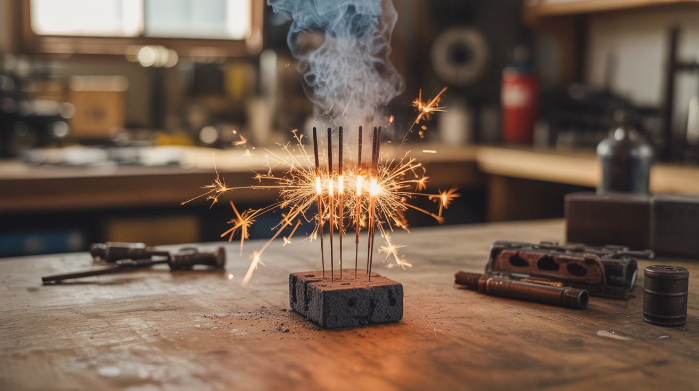

# #278 — Thermite Sparkler Bombs

  

> Iron oxide plus aluminum powder packed around sparklers. Light the sparkler, walk away, wait for 2,500°C of molten iron fury. Simple, terrifying, unforgettable.

## Ratings

     

## 🧪 What Is It?

Thermite is one of the simplest and most dramatic chemical reactions in existence. Mix iron oxide (rust) with aluminum powder in a roughly 3:1 ratio by weight, apply enough heat to start the reaction, and stand way back. The aluminum rips the oxygen atoms away from the iron in a violently exothermic reaction that produces molten elemental iron and aluminum oxide at temperatures exceeding 2,500°C (4,500°F). That’s hot enough to melt through steel plate, car engine blocks, and pretty much anything else unfortunate enough to be underneath it. The reaction, once started, cannot be stopped by any conventional means — water makes it worse, CO2 extinguishers are useless, and smothering it does nothing because the reaction carries its own oxygen supply.

The challenge with thermite has always been ignition. A match won’t do it. A lighter won’t do it. Even a propane torch struggles. Thermite needs a very high-temperature ignition source — traditionally a magnesium ribbon or strip. But sparklers are essentially magnesium-iron fuel rods that burn at roughly 1,000-1,600°C, which is enough to push thermite over its ignition threshold of about 1,500°C. By bundling sparklers into the center of a thermite charge, you get a timed fuse: light the sparkler, and when it burns down to where it contacts the thermite powder, ignition occurs. The sparkler gives you 30-60 seconds of walk-away time depending on length.

The ingredients are shockingly accessible. Iron oxide is literally rust — you can make it by soaking steel wool in vinegar and water for a few days, then drying and grinding the residue. Aluminum powder is sold as a paint pigment and by pyrotechnics suppliers. And sparklers are sold everywhere during summer and New Year’s. Total cost is under ten bucks. Total entertainment value is immeasurable.

<strong>🧰 Ingredients</strong>

- [ ] Iron oxide (Fe2O3) — red iron oxide powder, fine mesh *(art supply as pigment, or DIY from rusted steel wool, ~$5)*
- [ ] Aluminum powder — 200 mesh or finer, dark gray (not flake/silver paint) *(pyrotechnics supplier or online, ~$8)*
- [ ] Sparklers — standard 10-inch steel wire sparklers *(dollar store or seasonal aisle, ~$1)*
- [ ] Clay flower pot — small terracotta pot for a container/crucible *(garden store, ~$2)*
- [ ] Sand bucket — for a safe firing surface *(hardware store, ~$3)*
- [ ] Digital scale — for measuring the ratio accurately *(kitchen scale works, ~$10 or existing)*
- [ ] Mixing container — paper cup or cardboard tube, disposable *(free)*

## 🔨 Build Steps

1. **Prepare the iron oxide.** If buying pre-made, ensure it’s Fe2O3 (red/rust-colored), not Fe3O4 (black iron oxide — it works but is less reactive). If making your own, stuff a jar with fine steel wool, cover with a 50/50 mix of vinegar and water, and leave uncovered for 5-7 days. The steel wool will convert to rust. Strain, dry completely in the sun or a low oven, and grind to a fine powder with a mortar and pestle. You need the powder to be fine and uniform.

2. **Measure and mix.** The stoichiometric ratio is 3 parts iron oxide to 1 part aluminum powder by weight. Measure carefully on a scale — 75g iron oxide to 25g aluminum powder is a good starting batch. Mix gently by rolling the two powders together in a paper bag or by spooning back and forth between paper cups. Do NOT use any metal tools, mortar and pestle, or blender for mixing — friction or sparks could ignite the mixture.

3. **Prepare the container.** Place a terracotta flower pot (hole-side up) on top of a bucket filled with dry sand. The pot serves as the crucible — the thermite will burn through it eventually, and the molten iron will drip into the sand below. The sand catches the molten metal safely. Set this up outdoors on concrete or bare dirt, far from anything flammable.

4. **Load the charge.** Pour the mixed thermite powder into the terracotta pot. Don’t pack it — just let it settle naturally. You want a loose bed of powder about 2-3 inches deep.

5. **Insert the sparkler fuse.** Push 2-3 sparklers into the center of the thermite charge so they stand upright. Push them deep enough that the bottom 2 inches of sparkler are buried in the powder. Bundle the sparklers together with a twist of wire at the top so they stay upright. The sparklers need to burn down to the thermite to ignite it, so longer sparklers give you more walk-away time.

6. **Ignite and retreat.** Light the sparklers at the top with a lighter. You have 30-60 seconds before they burn down to the thermite. Walk at least 30 feet away. When the sparklers reach the thermite, the reaction starts — you’ll see an intense white glow, sparks, and molten iron dripping through the pot into the sand. The reaction lasts 10-30 seconds depending on the amount of thermite. Do not approach until everything has cooled for at least 15 minutes.

## ⚠️ Safety Notes

- Thermite burns at 2,500°C and produces molten iron. There is no way to extinguish it once started. Do NOT use water — steam explosions will scatter molten metal. The only safe approach is to let it burn out completely.
- Perform this outdoors on non-flammable surfaces (concrete, bare dirt, sand) with nothing flammable within 15 feet in any direction. Molten iron spatter can travel surprisingly far.
- Wear long sleeves, long pants, closed shoes, and safety glasses at minimum. Stay at least 30 feet away during the reaction. Do not look directly at the reaction without welding-shade eye protection — it’s bright enough to cause eye damage.
- Aluminum powder is a fine particulate that can form explosive dust clouds in enclosed spaces. Mix outdoors and avoid generating airborne dust. Store aluminum powder in sealed containers away from oxidizers and moisture.
- Check all applicable local, state, and federal laws before making or using thermite. In many jurisdictions, thermite itself is legal to possess but its use may be regulated.

## 🔗 See Also

- [Thermite Cold Spark Fountain](230-thermite-cold-spark-fountain.md)
- [Chemical Trigger Color Bombs](228-chemical-trigger-color-bombs.md)

**References:**
- [Appliance Teardown Guide](../../reference/appliance-teardown-guide.md)
- [Technical Glossary](../../reference/glossary.md)
- [Chemicals Reference](../../reference/chemicals.md)
