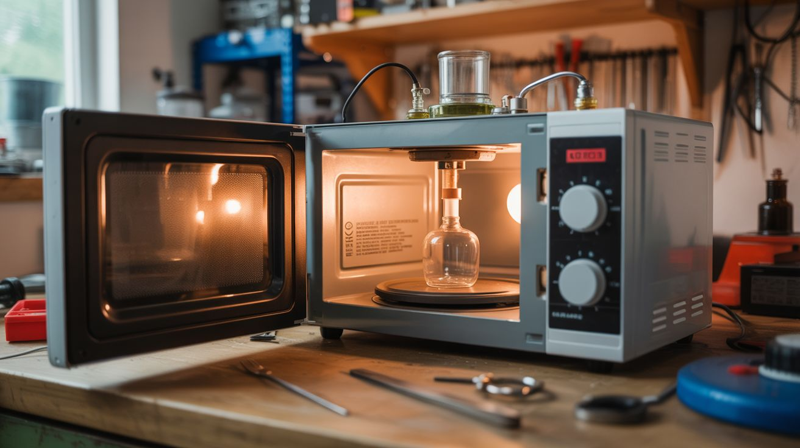

# #279 — Microwave Chemical Reactor

  

> Rip the guts out of a microwave, build a custom reaction chamber with borosilicate glassware, and run chemical syntheses in minutes that would take hours on a hot plate.

## Ratings

     

## 🧪 What Is It?

Microwave-assisted chemistry is a real field used in research labs worldwide. The principle is simple: microwaves heat polar molecules directly and volumetrically — the energy goes straight into the reaction mixture instead of slowly conducting through a glass wall from an external heat source. This means reactions that take hours on a hot plate can complete in minutes under microwave irradiation. Pharmaceutical companies use dedicated microwave reactors that cost $10,000-$50,000. You’re going to build one from a dead microwave and some lab glass for about $30.

The core of any microwave is the magnetron — a vacuum tube that converts electrical energy into 2.45 GHz electromagnetic radiation. The magnetron, its waveguide, the high-voltage transformer, and the capacitor are the parts you need. The stock cavity (the cooking chamber) works fine as a reaction chamber, but you’ll modify it with ports for a reflux condenser, a thermocouple, and a stirring mechanism. The key upgrade over just microwaving stuff in a kitchen is control: you need to monitor temperature, control power levels, and have a way to contain pressure if the reaction generates gas.

The applications are surprisingly broad. You can do rapid esterification reactions (making esters — fragrant compounds used in perfumes and flavorings), biodiesel synthesis from waste cooking oil, extraction of essential oils from plant material, and various organic chemistry transformations. University chemistry departments have published thousands of papers on microwave-assisted synthesis. You’re replicating that capability for the cost of a thrift store microwave and a few pieces of glassware. The speed advantage is genuinely dramatic — a reaction that takes 4 hours of refluxing on a hot plate often completes in 5-10 minutes under microwave irradiation.

<strong>🧰 Ingredients</strong>

- [ ] Microwave oven — 700W+ with working magnetron *(thrift store or junkyard, ~$5-15)*
- [ ] Borosilicate round-bottom flask — 250mL or 500mL *(lab supply online, ~$8)*
- [ ] Reflux condenser — Graham or Liebig style, 300mm *(lab supply online, ~$12)*
- [ ] Rubber stoppers with holes — to fit flask and condenser *(lab supply, ~$3)*
- [ ] Thermocouple — K-type with digital readout *(online, ~$10)*
- [ ] Magnetic stir bar — PTFE coated, 1-inch *(lab supply, ~$3)*
- [ ] Silicone tubing — 1/4" ID for condenser water circulation *(hardware store, ~$5)*
- [ ] Variac or lamp dimmer — for magnetron power control *(~$10-20)*
- [ ] Drill and hole saw — for cutting ports in the microwave cavity *(existing tools)*
- [ ] High-temp silicone sealant — for sealing port penetrations *(hardware store, ~$5)*
- [ ] Safety goggles and nitrile gloves — non-negotiable *(~$5)*

## 🔨 Build Steps

1. **Gut and assess the microwave.** Remove the outer casing to access the magnetron, transformer, capacitor, and control board. Identify the waveguide — the rectangular metal duct that channels microwave energy from the magnetron into the cavity. You want to keep the magnetron, waveguide, transformer, capacitor, and cavity intact. The turntable motor can go. Discharge the capacitor with a resistor before touching anything inside.

2. **Cut ports in the cavity.** Using a hole saw, cut a 1.5-inch hole in the top of the cavity for the reflux condenser neck to pass through. Cut a small 1/4-inch hole nearby for the thermocouple probe. All holes should be as small as possible — microwave leakage through oversized holes is a real concern. Line each hole with copper tape or aluminum foil to create a waveguide-below-cutoff seal that blocks microwave radiation while allowing the glass and probe to pass through.

3. **Set up the glassware.** Place the round-bottom flask inside the cavity, supported by a ring stand or ceramic block so it sits at the center of the cavity (the microwave field is strongest at the center). Drop a magnetic stir bar into the flask. Thread the reflux condenser through the top port and connect it to the flask with a rubber stopper or ground glass joint. The condenser prevents volatile solvents from escaping by cooling and condensing vapors back into the flask.

4. **Install the cooling loop.** Connect silicone tubing from a cold water source (faucet or a bucket with an aquarium pump) through the condenser jacket and out to a drain or return bucket. Cold water flowing through the condenser jacket is what makes reflux work — without it, your solvents boil off into the lab.

5. **Wire the power control.** Connect a variac or lamp dimmer in series with the mains power to the microwave transformer. This gives you variable power control instead of the stock on/off cycling that consumer microwaves use. Start at low power (30-40%) for temperature-sensitive reactions. Full power is reserved for rapid heating steps.

6. **Install the temperature probe.** Thread the K-type thermocouple through its port so the tip is immersed in the reaction mixture inside the flask. Seal the port with high-temp silicone. The thermocouple readout sits outside the cavity and gives you real-time temperature monitoring. Never trust timing alone — temperature is the variable that matters.

7. **Check for microwave leakage.** Before running any reactions, power on the magnetron with a beaker of water inside as a load. Use a microwave leakage detector (or a neon bulb on a stick as a crude detector) to check all ports and seams for escaping radiation. The FDA limit is 5 mW/cm² at 5cm distance. Seal any leaks with copper tape.

8. **Run your first reaction.** Start with something simple and safe — dissolving sugar in water, or extracting pigment from turmeric into ethanol. Load your reagents into the flask, start the condenser water flow, set power to 40%, and monitor the temperature. You’ll be shocked how fast things heat up compared to a hot plate.

## ⚠️ Safety Notes

> **Spicy Level 4 build.** Read the [Safety Guide](../../docs/safety/README.md) and [Chemical Safety](../../docs/safety/chemicals.md), [Fire & Pyro Safety](../../docs/safety/fire-and-pyro.md) before starting.

- Microwave radiation at 2.45 GHz cooks tissue. Ensure all cavity ports are properly shielded and check for leakage before every use. Never operate the magnetron with the cavity open or damaged.
- The magnetron requires lethal high voltage (2100V+) from the MOT/capacitor circuit. Discharge the capacitor before any maintenance. Follow all high-voltage safety protocols.
- Never microwave sealed containers — pressure buildup causes explosions. Always use open or vented glassware with a reflux condenser.
- Some chemical reactions produce toxic or flammable vapors. The reflux condenser contains most vapors, but work in a well-ventilated area or fume hood. Never microwave flammable solvents without a reflux condenser.
- Superheating is a real risk in microwave chemistry — liquids can exceed their boiling point without visibly boiling, then erupt violently when disturbed. Always include a stir bar and avoid sudden movements of the flask.

## 🔗 See Also

- [Capacitor Bank Plasma Igniter](275-capacitor-bank-plasma-igniter.md)
- [Electrolysis Rust Eraser](../household-chemistry/212-electrolysis-rust-eraser.md)

**References:**

- [Appliance Teardown Guide](../../docs/reference/appliance-teardown-guide.md)
- [Technical Glossary](../../docs/reference/glossary.md)
- [Chemicals Reference](../../docs/reference/chemicals.md)
