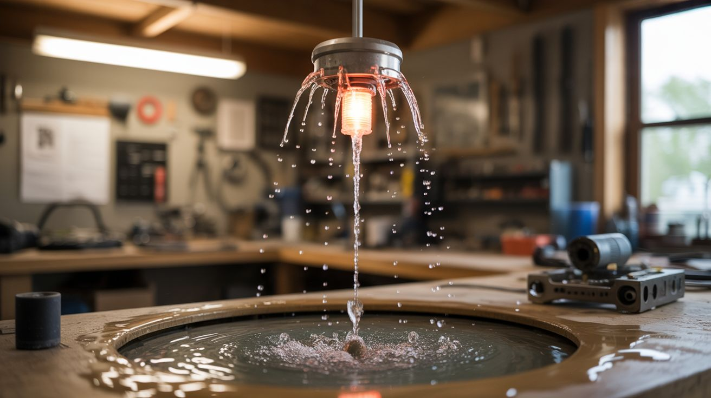

# #044 — Anti-Gravity Water Fountain

  

> A strobe light synchronized to falling water droplets makes them appear frozen in mid-air — or even flowing upward. Pure optical illusion, zero Photoshop.

## Ratings

| Jaw Drop Rating | Brain Melt Level | Wallet Damage | Spicy Level | Clout Potential | Time to Build |
|---|---|---|---|---|---|
| ⭐⭐⭐⭐⭐ | ⭐⭐⭐ | ⭐⭐ | ⭐ | ⭐⭐⭐⭐⭐ | ⭐⭐ |

## What Is It?

When a strobe light flashes at exactly the same rate that water droplets fall past a given point, each flash illuminates the next droplet in exactly the same position as the last one. Your brain interprets the successive images as a single droplet hanging motionless in space. Speed the strobe up slightly and the droplets appear to fall in slow motion. Slow it down slightly and they appear to rise — water flowing upward, defying gravity.

The effect requires three things: a consistent stream of individual droplets (not a continuous flow), a strobe light matched to the drip rate, and a dark enough room that the only illumination is the strobe. A small pump creates the water stream. A vibrating nozzle or speaker cone breaks the stream into uniform droplets. An adjustable-frequency strobe (LED driven by a 555 timer or Arduino) provides the light.

The visual effect is absolutely stunning in person and almost impossible to capture on regular camera video (the camera has its own frame rate that interferes). But live, it stops people in their tracks.

## Ingredients

- [ ] Small water pump — aquarium pump or fountain pump *(pet store, thrift store, ~$10)*
- [ ] Tubing — silicone or vinyl, matched to pump output *(hardware store)*
- [ ] Nozzle — small-diameter tube tip for consistent drip formation *(syringe tip, brass fitting)*
- [ ] Speaker or vibration motor — to break the water stream into droplets at a controlled frequency *(dead speaker, electronics bin)*
- [ ] Frequency generator — 555 timer circuit or Arduino, adjustable 10-100 Hz *(electronics supplier)*
- [ ] High-brightness LED — white, 3W-10W *(electronics supplier)*
- [ ] LED driver MOSFET — to pulse the LED at strobe frequency *(electronics supplier)*
- [ ] Catch basin — bowl or tray to collect water at the bottom *(kitchen)*
- [ ] Frame/stand — to hold the nozzle above the catch basin *(scrap wood or metal)*
- [ ] Dark room or enclosure — the effect requires minimal ambient light *(any room with blackout capability)*
- [ ] Potentiometer — for fine-tuning strobe frequency *(electronics supplier)*

## Build Steps

1. **Set up the water circuit.** Connect the pump to the nozzle via tubing. The pump sits in the catch basin, pulling water from the basin and pushing it up to the nozzle, creating a closed loop. The nozzle should be 12"-24" above the basin, pointing downward. Adjust pump flow until you get a thin, steady stream — not a spray, not a gush.
2. **Break the stream into droplets.** Attach a small speaker cone or vibration motor to the nozzle or tubing near the nozzle. Drive it with the frequency generator at 20-60 Hz. The vibration breaks the continuous water stream into individual uniform droplets at the driving frequency. Adjust frequency and amplitude until you see clean, evenly-spaced droplets.
3. **Build the strobe circuit.** Drive the high-brightness LED with the same frequency generator used for the vibration motor (or a synchronized second one). The LED should flash in brief, bright pulses. A MOSFET switches the LED — the 555 timer or Arduino outputs the pulse signal to the MOSFET gate. The duty cycle should be short (5-10%) for sharp "frozen" droplets. A longer duty cycle blurs them.
4. **Synchronize.** In a dark room, turn on the pump, the vibration, and the strobe. Slowly adjust the strobe frequency until the droplets appear to freeze. Use a potentiometer for fine tuning — the frequency match needs to be within 0.1 Hz for a stable freeze effect.
5. **Create the anti-gravity effect.** Once frozen, decrease the strobe frequency very slightly (0.5-1 Hz below the drip rate). The droplets now appear to drift upward. Increase the strobe slightly above the drip rate and they appear to fall in extreme slow motion. The effect is jaw-dropping.
6. **Refine the visual.** Multiple LEDs at different angles can eliminate shadow effects. Colored LEDs change the aesthetic completely. A UV LED with fluorescent dye in the water (tonic water contains quinine, which fluoresces blue under UV) creates an otherworldly look.
7. **Build an enclosure (optional).** A transparent acrylic box around the fountain contains splashes, controls ambient light, and creates a self-contained installation piece that works in any lighting condition.

## Safety Notes

- Water and electricity are in close proximity. Use low-voltage components (12V or less) for everything near the water. Keep the mains power supply (if any) well away from the water. Use GFCI protection on any outlet powering the system.
- Strobe lights at certain frequencies (typically 15-25 Hz) can trigger photosensitive epileptic seizures in susceptible individuals. Warn viewers before demonstrating. The standard operating range for this build (20-60 Hz) overlaps with the danger zone.
- The pump runs continuously. Ensure the catch basin holds enough water that the pump never runs dry — a dry pump burns out quickly.

## See Also

- [Kinetic Wind Sculpture](043-kinetic-wind-sculpture.md)
- [Ferrofluid Mirror](046-ferrofluid-mirror.md)

**References:**
- [Appliance Teardown Guide](../../reference/appliance-teardown-guide.md)
- [Technical Glossary](../../reference/glossary.md)
- [Electronics & Microcontrollers Guide](../../reference/electronics-and-microcontrollers.md)
