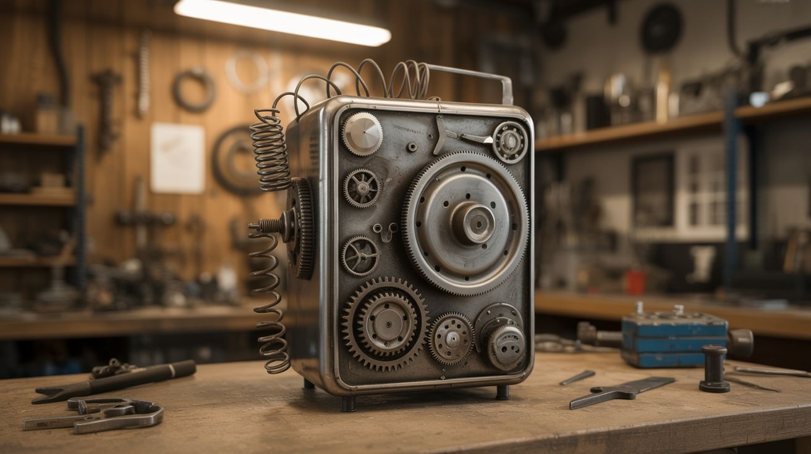

# #045 — Scrap Metal Sculpture

  

> Dead appliances become art. Gears, springs, brackets, and casings welded into sculptures that tell the story of their previous lives.

## Ratings

     

## 🧪 What Is It?

Scrap metal sculpture takes components from dead machines — the gears from a washing machine, the springs from a dryer, the brackets from a microwave, the rods from a printer — and welds them into figurative or abstract art. The best pieces are recognizable as art made from junk, where each component's industrial origin adds texture and narrative. A figure made from wrenches and bolts. An animal built from motorcycle chains and sprockets. An abstract form from twisted steel and circuit boards.

The materials are free. The only cost is welding consumables and finishing supplies. The only skill required beyond basic welding is an eye for form — seeing the sculpture inside the pile of parts, the way a stone carver sees the statue inside the rock. The difference is you're adding material, not removing it. You get to iterate, tack pieces on, step back, re-evaluate, and adjust.

<strong>🧰 Ingredients</strong>

- [ ] Scrap metal parts — gears, springs, rods, brackets, casings, bolts, nuts, chains, wire *(dead appliances, junkyard, workshop scrap pile)*
- [ ] Steel base plate — heavy enough that the sculpture doesn't tip *(scrap metal)*
- [ ] Welder — MIG is most forgiving for mixed metals and irregular joints *(workshop)*
- [ ] Angle grinder — for cutting, shaping, and smoothing welds *(workshop)*
- [ ] Wire brush and sandpaper — for surface prep *(hardware store)*
- [ ] Vice grips and clamps — for holding parts during tack welding *(workshop)*
- [ ] Clear coat or paint — for finishing *(hardware store)*
- [ ] Safety gear — welding helmet, gloves, jacket *(workshop)*

## 🔨 Build Steps

1. **Collect and sort your materials.** Disassemble 3-5 dead appliances and sort the components by type: flat pieces (brackets, panels), round pieces (shafts, rods, tubes), fasteners (bolts, nuts, screws), springs, gears, chains, and oddities. Lay everything out on a table so you can see your inventory.
2. **Choose a subject or concept.** Figurative sculptures (animals, people, robots) are crowd-pleasers. Abstract forms emphasize shape and texture. Functional art (lamp bases, bookends, coat racks) adds utility. Sketch a rough idea, but stay flexible — the materials will suggest directions you didn't plan.
3. **Build the armature.** Weld a basic skeleton or framework from the sturdiest pieces — thick rod, tubing, or angle iron. This internal structure carries the weight and defines the pose. For a standing figure, start with the legs and spine. For an abstract piece, start with the primary form.
4. **Start adding detail.** Tack-weld smaller pieces onto the armature. Step back frequently and view from multiple angles. Rotate the piece. Parts that look right from one angle may look wrong from another. Use vice grips to hold pieces in position while you decide before committing with a weld.
5. **Build up texture and density.** The magic of scrap metal sculpture is visual density — the accumulation of recognizable mechanical parts creating an emergent form. Pack areas with gears, springs, and small components. Leave other areas sparse for contrast. The eye needs both busy areas and breathing room.
6. **Strengthen structural joints.** Once the composition is finalized, go back and reinforce any load-bearing joints with full welds (not just tack welds). A large sculpture under its own weight will find every weak joint. Grind structural welds smooth if they're visible.
7. **Finish the surface.** Wire-brush the entire piece to remove scale and spatter. For a raw industrial look, apply clear coat to prevent rust while keeping the metal visible. For color, use spray paint or powder coat. For an intentional patina, apply a vinegar-and-salt solution and let it rust, then clear-coat to freeze the patina.
8. **Mount and display.** Weld the sculpture to a heavy base plate. For outdoor installation, ensure the base is weighted or staked to prevent tipping in wind. Indoor pieces can use a lighter base.

## ⚠️ Safety Notes

- Welding produces UV radiation, hot spatter, and toxic fumes (especially when welding galvanized or painted metals). Always wear a proper welding helmet, leather gloves, and a long-sleeve jacket. Weld in a ventilated area. If welding galvanized metal, use a respirator — zinc fumes cause metal fume fever, which feels like a severe flu.
- Scrap metal often has sharp edges, burrs, and hidden fasteners. Wear leather gloves when handling raw materials. Tetanus risk is real with rusty metal — keep your tetanus vaccination current.
- Large sculptures are top-heavy during construction. Clamp or secure the piece to the workbench while building to prevent it from falling over. A falling sculpture made of sharp metal parts is a serious hazard.

## 🔗 See Also

- [Kinetic Wind Sculpture](043-kinetic-wind-sculpture.md)
- [CRT Electromagnetic Art](048-crt-electromagnetic-art.md)

**References:**

- [Appliance Teardown Guide](../../docs/reference/appliance-teardown-guide.md)
- [Technical Glossary](../../docs/reference/glossary.md)
