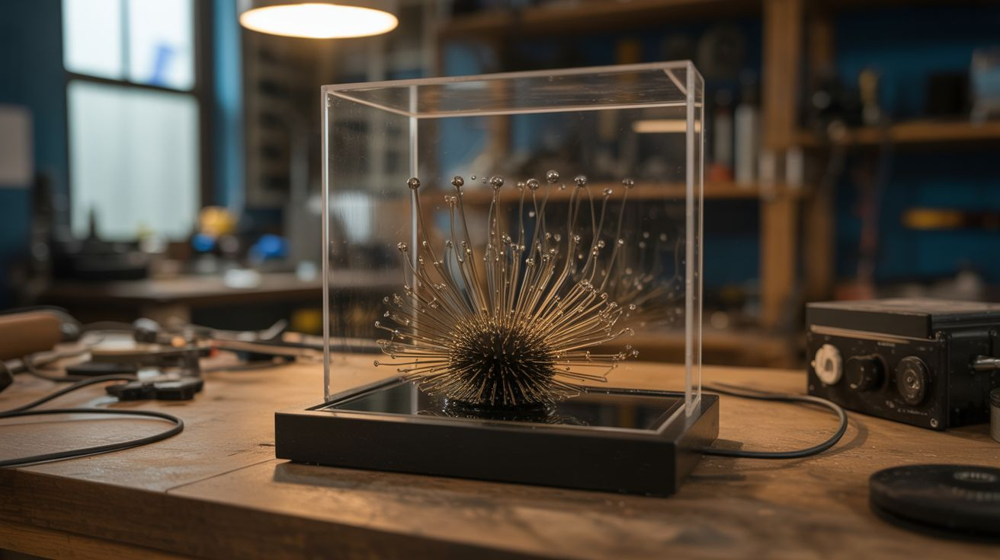

# #046 — Ferrofluid Mirror

  

> An array of electromagnets behind glass controls a pool of ferrofluid — a magnetic liquid that spikes, morphs, and dances like a living creature. The most hypnotic display you can build.

## Ratings

     

## 🧪 What Is It?

Ferrofluid is a colloidal suspension of nanoscale magnetic particles in a carrier oil. In the presence of a magnetic field, it forms dramatic spikes and ridges that follow the field lines — it looks like liquid alien metal. Place a thin layer of ferrofluid between two glass sheets, mount an array of individually controlled electromagnets behind it, and you've got a living display that can form patterns, ripple, spike, flow, and morph in response to programmed sequences or audio input.

Commercial ferrofluid displays (like the ones from Concept Zero or Ferroflow) sell for $300-$3000. Building your own is cheaper, fully customizable, and significantly more satisfying. The electromagnet array can be as simple as a grid of coils driven by an Arduino with MOSFET drivers, or as complex as a precision PCB with dozens of individually addressable coils.

The result looks like something from a science fiction film. Visitors can't stop watching it.

<strong>🧰 Ingredients</strong>

- [ ] Ferrofluid — 50-100ml, oil-based *(online supplier, ~$15-$30)*
- [ ] Glass sheets x2 — tempered glass, 8"x10" or larger, with silicone spacer to create a thin gap *(glass shop, hardware store)*
- [ ] Electromagnet coils — 12-24 coils wound on iron bolts (same as levitator build) *(hardware store, electronics supplier)*
- [ ] Iron bolt cores — 1/4" or 3/8" diameter, ~2" long *(hardware store)*
- [ ] Magnet wire — 24-28 AWG enameled copper *(electronics supplier)*
- [ ] Arduino or microcontroller *(electronics supplier, ~$10)*
- [ ] MOSFET driver board or individual MOSFETs — one per coil *(electronics supplier)*
- [ ] Power supply — 12V-24V, 5A+ (depends on coil count) *(old laptop charger, ATX PSU)*
- [ ] Frame — wood or acrylic, to hold the glass vertically with the coil array behind *(hardware store)*
- [ ] Silicone sealant — to seal the glass sandwich *(hardware store)*
- [ ] Audio input module (optional) — 3.5mm jack + analog envelope follower or FFT on the Arduino *(electronics supplier)*

## 🔨 Build Steps

1. **Prepare the glass cell.** Clean two glass sheets thoroughly — any dust or fingerprints on the inside faces will be trapped permanently. Apply a thin bead of silicone sealant around three edges, creating a ~2mm gap between the sheets. Leave the top edge open. Clamp and let the silicone cure for 24 hours.
2. **Fill with ferrofluid.** Tilt the glass cell and carefully pour ferrofluid through the open top edge. You want a thin layer — about 1-2mm deep when the cell is laid flat. Too much fluid and the response becomes sluggish. Too little and the patterns are thin and weak. Seal the top edge with silicone after filling.
3. **Wind the electromagnets.** Wrap 100-200 turns of magnet wire around each iron bolt. All coils should be identical for uniform behavior. Test each one by briefly connecting to power and bringing a small ferromagnetic object near — it should attract firmly. Label each coil's leads.
4. **Build the coil array.** Mount the electromagnets in a grid pattern on a flat board — spacing them 1.5"-2" apart center-to-center. The bolt heads (which become the pole faces) should all face the same direction, toward where the glass cell will sit. Secure with hot glue or brackets.
5. **Wire the driver electronics.** Each coil connects to its own MOSFET. The Arduino drives the MOSFET gates with PWM signals, allowing variable intensity per coil. A TLC5940 or PCA9685 PWM driver board lets you control 16+ channels from one Arduino. Map each coil to a channel.
6. **Program patterns.** Start simple: turn one coil on and watch the ferrofluid spike toward it. Then try sequential patterns — a wave sweeping across the array, a pulsing heartbeat, a random starfield. Each activated coil pulls the ferrofluid toward it, creating a spike or ridge. Multiple adjacent coils create ridges and complex topography.
7. **Add audio reactivity (optional).** Feed audio from a 3.5mm jack into the Arduino's analog input. Use an envelope follower (simple) or FFT library (complex) to extract amplitude or frequency data. Map bass frequencies to large, slow movements and treble to fast, sharp spikes across the coil array. Music-reactive ferrofluid is absolutely mesmerizing.
8. **Build the frame and display.** Mount the glass cell in a vertical frame with the coil array directly behind it. Backlight with LEDs for dramatic effect — the ferrofluid is opaque black, so backlighting creates silhouettes. Side lighting reveals the 3D texture of the spikes through the glass.
9. **Tune and refine.** Adjust PWM duty cycles for each coil to compensate for any variation in coil strength or distance from the glass. The ferrofluid response should look organic and fluid, not jerky. Slower transitions between patterns look more natural than instant switches.

## ⚠️ Safety Notes

- Ferrofluid stains everything it touches permanently. It is nearly impossible to remove from skin, clothing, and porous surfaces. Wear nitrile gloves when handling it. Work on a surface covered with disposable material. If it contacts skin, mineral oil helps dissolve it — water makes it worse.
- The glass cell is fragile and under no structural load, but if it breaks, ferrofluid goes everywhere. Use tempered glass, and consider building the frame with a catch tray below the display in case of leaks.
- The electromagnet array draws significant current when many coils are active simultaneously. Size the power supply and wiring accordingly. Coils that are left on continuously will heat up — use PWM to limit average current and prevent overheating.

## 🔗 See Also

- [Anti-Gravity Water Fountain](044-antigravity-water-fountain.md)
- [Singing Ferrofluid Tornado](../unholy-combos/053-singing-ferrofluid-tornado.md)

**References:**
- [Electronics & Microcontrollers Guide](../../reference/electronics-and-microcontrollers.md)
