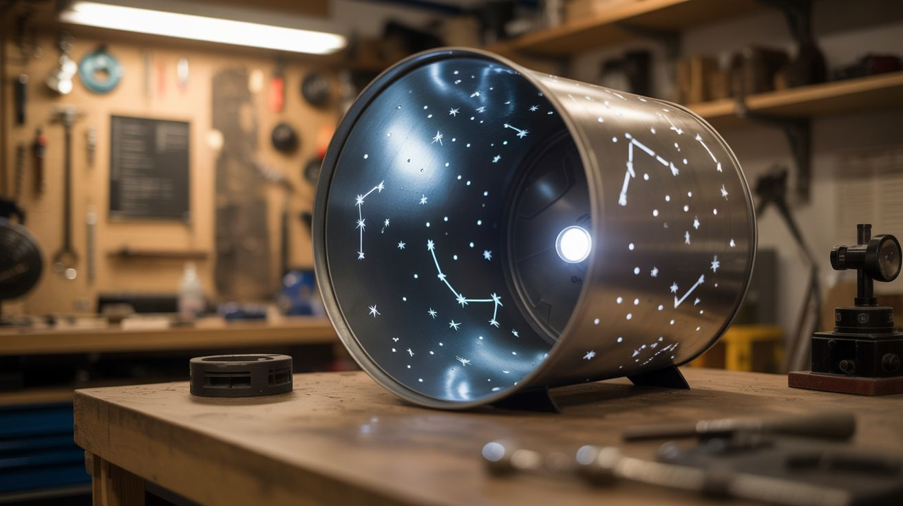

# #047 — Dryer Drum Planetarium

  

> Drill star patterns into a dryer drum, put a bright bulb inside, and turn any dark room into a planetarium. Constellations on the ceiling for the cost of a drill bit.

## Ratings

| Jaw Drop Rating | Brain Melt Level | Wallet Damage | Spicy Level | Clout Potential | Time to Build |
|---|---|---|---|---|---|
| ⭐⭐⭐⭐ | ⭐⭐ | ⭐ | ⭐ | ⭐⭐⭐⭐ | ⭐⭐ |

## What Is It?

A dryer drum is a perforated stainless steel cylinder about 27" in diameter — the perfect size and shape for a planetarium projector. Drill holes in the drum at positions corresponding to real star locations, place a bright point light source in the center, and the light shines through the holes and projects dots on the ceiling and walls of a dark room. Different hole sizes create different star brightnesses. The drum's natural curvature projects a full hemisphere of sky.

Real planetarium projectors cost tens of thousands of dollars and use fiber optic bundles to project individual stars. This one costs nothing if you have a dead dryer and a drill. The projections won't be optically perfect — the holes create diverging beams, so stars near the edges of the projection will be elongated — but the overall effect in a dark room is genuinely magical. Kids lose their minds over it.

## Ingredients

- [ ] Dryer drum — stainless steel, from a dead clothes dryer *(curbside, appliance recycler)*
- [ ] Star chart/template — printed constellation maps, scaled to the drum's surface *(online, printed)*
- [ ] Drill with various small bits — 1/16", 3/32", 1/8" for different star magnitudes *(workshop)*
- [ ] Center punch — for marking drill positions *(hardware store)*
- [ ] Bright point light source — a bare high-wattage LED, halogen bulb, or projector bulb *(electronics supplier, hardware store)*
- [ ] Light socket and wiring — to power the bulb inside the drum *(hardware store)*
- [ ] Stand/mount — to hold the drum at an angle or on a swivel *(scrap metal, hardware store)*
- [ ] Black spray paint — to paint the inside of the drum for better contrast *(hardware store)*
- [ ] Masking tape — for marking drill positions *(hardware store)*

## Build Steps

1. **Recover the drum.** Remove the dryer drum from a dead dryer. The drum lifts out after removing the front and back panels and disconnecting the belt. Clean it thoroughly — lint, detergent residue, and rust all need to go. Wire-brush or sand any rough spots.
2. **Cover existing holes.** Most dryer drums have perforations for airflow. Cover the inside of the drum with aluminum tape or thin sheet metal to block these holes. Only your drilled star holes should let light through.
3. **Paint the interior.** Spray the inside of the drum with flat black paint. This eliminates internal reflections that would wash out the projected stars. Let it dry completely.
4. **Map the constellations.** Print star charts for the visible constellations in your hemisphere. Wrap the charts around the outside of the drum, scaling them to fit the curved surface. Mark the major constellations first — Orion, Ursa Major, Cassiopeia, Leo, Scorpius — with a center punch through the paper into the drum.
5. **Drill the stars.** Use different drill bit sizes for different star brightnesses: 1/16" for dim stars, 3/32" for medium stars, and 1/8" for the brightest ones (Sirius, Betelgeuse, Vega, etc.). Drill slowly and cleanly — a rough hole projects a rough star. Deburr each hole inside and out with a countersink or larger drill bit.
6. **Install the light source.** Mount a bright, small light source at the center of the drum. A single high-wattage LED (20W-50W) on a small mount works well. The closer the light is to a true point source, the sharper the projected stars will be. A large frosted bulb creates softer, fuzzier projections.
7. **Build the mount.** The drum needs to sit at an angle corresponding to your latitude — tilt the drum so that Polaris (if you drilled it) projects onto the ceiling directly above the viewer's head. A simple cradle from angle iron with a pivot bolt allows angle adjustment.
8. **Set up and project.** Place the drum in the center of a dark room. The room should be as dark as possible — any ambient light washes out the star projections. Power on the light and watch constellations appear on the ceiling and walls. Rotate the drum slowly by hand to simulate the sky rotating through the night.

## Safety Notes

- The bulb inside the drum gets very hot, especially halogen or high-wattage LED bulbs. Ensure adequate ventilation holes in the mount (separate from the star holes) or use a bulb rated for enclosed fixtures. Do not touch the drum near the bulb after extended operation.
- Drilling stainless steel requires sharp bits, moderate speed, and cutting oil. Dull bits on stainless work-harden the material, making it progressively harder to drill. Use cobalt or carbide bits. Wear safety glasses — stainless steel chips are sharp.
- The dryer drum has sharp edges where it was originally attached to the dryer frame. File or tape these edges before handling the drum extensively.

## See Also

- [CRT Electromagnetic Art](048-crt-electromagnetic-art.md)
- [Scrap Metal Sculpture](045-scrap-metal-sculpture.md)
