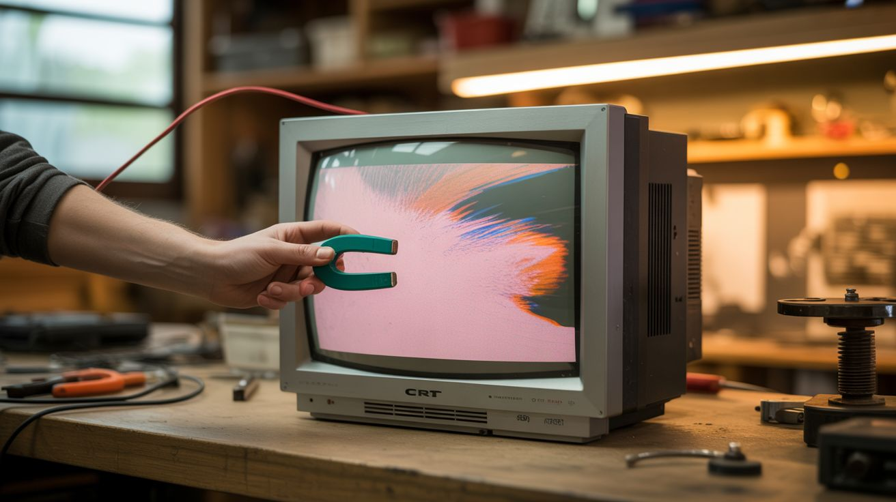

# #048 — CRT Electromagnetic Art

  

> Hold a magnet near an old CRT television and watch the image twist, smear, and bloom into abstract art. The simplest interactive installation you can build.

## Ratings

     

## 🧪 What Is It?

A CRT (cathode ray tube) television creates images by shooting a beam of electrons at a phosphor-coated screen. Magnetic fields bend the electron beam — that's actually how the image is steered in the first place (the deflection yoke is an electromagnet). When you bring an external magnet near the screen, you add your own magnetic field on top of the TV's deflection field, warping the electron beam and distorting the image.

Colors shift and separate. Straight lines bend into curves. The image blooms, stretches, and twists around the magnet. Moving the magnet creates flowing, organic distortions in real time. Different source images produce different art — a solid white screen shows pure geometric distortion, while video footage creates psychedelic color separations.

Nam June Paik pioneered this as an art form in the 1960s, creating "Magnet TV" — one of the earliest works of video art. The same technique works today with any CRT you can find at a thrift store. It requires no modification to the TV at all.

<strong>🧰 Ingredients</strong>

- [ ] CRT television or monitor — any size, must be functional (displays an image) *(thrift store, curbside, grandma's garage)*
- [ ] Strong magnets — neodymium magnets from dead hard drives are ideal *(e-waste)*
- [ ] Video source — DVD player, game console, or composite video signal generator *(thrift store, e-waste)*
- [ ] Video cables — whatever the CRT accepts (composite, S-video, coax) *(junk drawer)*
- [ ] Camera or phone — for documenting the art *(already own)*

## 🔨 Build Steps

1. **Acquire a working CRT.** The TV must actually power on and display an image. Test it before bringing it home. The larger the screen, the more dramatic the distortions — but even a 13" CRT produces beautiful effects. Color CRTs are essential — black-and-white tubes show shape distortion but miss the color separation effect entirely.
2. **Set up a video source.** Feed the CRT a signal. A solid color screen (use a DVD menu or a test pattern) shows the purest distortion effects. Video content with faces or recognizable imagery creates surreal, unsettling warps. Abstract video or screen savers provide a constantly changing canvas for the magnetic distortion.
3. **Start with gentle magnets.** Begin with a small magnet held 6-12 inches from the screen. Move it slowly and watch the image respond. The distortion follows the magnet's position, creating a warp zone that moves with your hand. Different edges of the magnet produce different effects depending on field orientation.
4. **Escalate to strong magnets.** Hard drive neodymium magnets are significantly more powerful. The distortion zone is larger and more dramatic. Colors separate more intensely — you'll see bands of red, green, and blue pulled apart from what should be a white area. The three electron beams (one per color) are affected slightly differently because they originate from different positions in the electron gun.
5. **Experiment with magnet placement.** Side placement creates horizontal distortion. Top/bottom creates vertical warping. A magnet placed flat against the screen creates a circular distortion zone. Two magnets on opposite sides of the screen create competing distortions. Moving magnets create flowing, liquid effects.
6. **Document the results.** Photograph or video the screen with a camera. Phone cameras work fine but may show moiré patterns from the CRT's phosphor mask. Shooting at a slight angle eliminates moiré. Long exposures capture the glow and color beautifully.
7. **Degauss when done (optional).** A strong magnet can magnetize the CRT's shadow mask, leaving color distortion even after the magnet is removed. Most CRTs have a built-in degaussing coil that fires when the TV is turned on — power-cycle the TV to degauss. For stubborn magnetization, use a handheld degaussing coil (from an old CRT monitor) waved slowly across the screen.

## ⚠️ Safety Notes

- CRT televisions contain high voltage internally — the flyback transformer charges the CRT anode to 20-30kV. Never open the case of a CRT while it's plugged in, and be aware that the anode can hold charge for days after unplugging. This build does not require opening the case — all interaction is external through the screen.
- Strong neodymium magnets can pinch fingers severely and will snap to the CRT's steel chassis if brought too close. Hard drive magnets are especially dangerous because they're powerful and flat — they slam together with finger-crushing force.
- Prolonged magnet exposure can permanently magnetize the shadow mask, causing color purity issues that degaussing won't fully fix. If you value the CRT for normal viewing, use magnets sparingly. If it's dedicated art, magnetize away.

## 🔗 See Also

- [Dryer Drum Planetarium](047-dryer-drum-planetarium.md)
- [Scrap Metal Sculpture](045-scrap-metal-sculpture.md)
