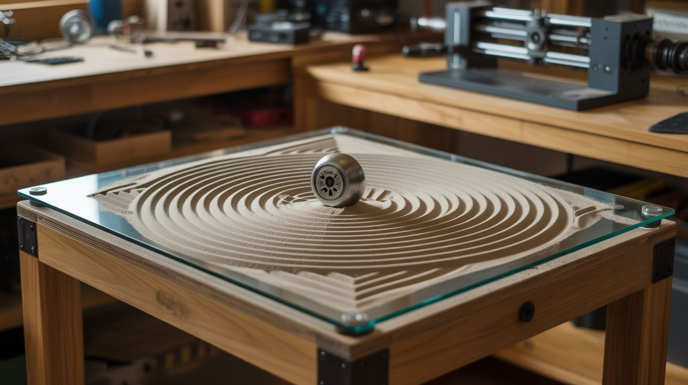

# #312 — Kinetic Sand Table

  

> A hidden magnet beneath glass drags a steel ball through sand, drawing infinite geometric patterns in silence. A Zen garden that draws itself.

## Ratings

     

## 🧪 What Is It?

A glass-topped table with a thin layer of fine white sand inside. Beneath the glass, a CNC gantry system moves a powerful magnet along programmed paths. Above the glass, a steel ball bearing follows the magnet, dragging through the sand and leaving a continuous trail. The patterns never repeat — spirals dissolve into starbursts, starbursts morph into fractals, fractals unwind into waves. The table runs silently and indefinitely.

Commercial versions of this concept (Sisyphus Industries, Sandsara) sell for $600-$1500. The engineering inside is straightforward: it's a 2-axis CNC that moves a magnet instead of a router bit. Every component can be salvaged from dead printers and hard drives. Two NEMA-17 steppers provide X/Y motion. A neodymium magnet from a dead hard drive couples through the glass to the ball above. An Arduino with a CNC shield runs polar coordinate patterns (theta/rho math) that produce the organic, spiraling geometry.

The result is one of the most elegant objects you can build from salvaged parts. It belongs on a coffee table, in a gallery, or on display at a restaurant. Guests can't stop watching. The ball moves slowly enough to be meditative, and the patterns it leaves behind are genuinely beautiful. When a new pattern starts, it draws over the previous one — the erasure is part of the art.

<strong>🧰 Ingredients</strong>

- [ ] 2× NEMA-17 stepper motors *(source: dead inkjet printers — nearly every printer has at least one, free)*
- [ ] GT2 timing belts + pulleys *(source: printer carriage assemblies — the belt and pulleys are already matched, free)*
- [ ] Smooth rods or linear rails *(source: printer guide rails — 8mm rods with linear bearings, free)*
- [ ] Neodymium magnets — at least 2 stacked, N42 or stronger *(source: hard drive voice coil magnets — every dead HDD has two, free)*
- [ ] Steel ball bearing — 16-20mm diameter, chrome steel *(source: skateboard bearings, bike hubs, or industrial surplus — free or ~$2)*
- [ ] Arduino Uno or Mega + CNC shield (GRBL) *(source: ~$10-15 new, or salvage from any Arduino project)*
- [ ] A4988 or DRV8825 stepper driver modules × 2 *(source: ~$3 new, or salvage from 3D printer boards)*
- [ ] 12V power supply, 2A+ *(source: dead laptop charger, router power brick — free)*
- [ ] Glass or clear acrylic sheet — sized to your table frame *(source: picture frame glass, thrift store, ~$5-15)*
- [ ] Fine white sand — play sand or craft sand, sifted *(source: hardware store, ~$5 for a 50lb bag)*
- [ ] Frame — wood, IKEA table hack, or custom build *(source: scrap lumber, thrift store side table, $0-20)*
- [ ] 3D-printed or fabricated magnet carriage *(source: print on any FDM printer, or build from scrap aluminum and hot glue)*
- [ ] Microcontroller code — polar coordinate pattern generator *(source: open-source Sisyphus/Sandify community, free)*

## 🔨 Build Steps

1. **Build the gantry frame.** This is a CoreXY or H-bot mechanism — the same motion system used in most 3D printers. Mount two smooth rods parallel to each other along the X axis. Mount two more along the Y axis, perpendicular. The magnet carriage rides on the Y rods, which themselves ride on the X rods. The two steppers stay stationary and drive the belts in a crossed pattern so that coordinated rotation of both motors produces X/Y motion. If you've ever built a 3D printer, you already know this mechanism.

2. **Salvage the motion components.** Strip two NEMA-17 steppers from dead printers. Harvest the GT2 belts and pulleys from the print head carriage — the belt loop and toothed pulleys are usually still in good shape. Pull the 8mm guide rods and linear bearings from the printer chassis. You need 4 rods total (2 per axis) and 4 linear bearings. If the printer only has 2 rods, you'll need parts from two printers.

3. **Build the magnet carriage.** Mount 2-3 stacked neodymium magnets (from hard drive voice coil assemblies) on a small plate that rides on the Y-axis bearings. The magnets should face upward, as close to the underside of the glass as possible. The gap between magnet and glass determines coupling strength — smaller gap = stronger pull on the ball = cleaner lines in sand. Aim for 3-5mm gap.

4. **Wire the electronics.** Arduino Uno + CNC shield + 2× stepper drivers. Wire Motor X to one stepper, Motor Y to the other. Connect the 12V power supply. Flash GRBL firmware to the Arduino. Test basic motion with a G-code sender — the carriage should move smoothly in X and Y with no binding or skipping.

5. **Build the table frame.** The gantry mounts underneath a flat surface. Build a shallow tray (1-2 inches deep) on top for the sand. The glass sits on top of the tray, with the sand between the glass and the tray bottom. The frame can be as simple as a plywood box or as refined as a hardwood picture frame — the aesthetics matter here since this is a display piece.

6. **Add the sand and ball.** Pour sifted sand into the tray to a depth of about 5-8mm. Place the glass on top. Drop the steel ball bearing onto the sand through the fill hole. Move the magnet carriage under the ball's position — the ball should snap to attention and follow the magnet when you move it. If the coupling is weak, reduce the gap or add more magnets.

7. **Program the patterns.** Use Sandify (sandify.org) — an open-source web app that generates polar coordinate patterns as G-code or theta/rho files. It produces spirographs, Fibonacci spirals, star patterns, parametric curves, and geometric tessellations. Export the pattern, convert to G-code if needed, and feed it to the Arduino via serial or SD card. The ball traces the pattern in sand.

8. **Tune the motion.** Set the feed rate slow — 2000-4000mm/min is typical. Too fast and the ball skips or the lines get messy. Too slow and watching paint dry is more exciting. Adjust stepper current so the motors don't overheat during continuous operation. Add pattern playlists so the table cycles through multiple designs automatically.

9. **Finishing touches.** Add LED strips underneath the sand tray for dramatic uplighting — the ball's trail glows through the sand. Build a clean enclosure that hides the electronics and gantry completely. The final product should look like a piece of furniture, not a science project. The only visible elements are the glass surface, the sand, and the silently moving ball.

## ⚠️ Safety Notes

> [!WARNING]
> **Zero danger during operation.** No high voltage, no fire, no chemicals. The ball and sand are inert. The strongest magnets in the build are the hard drive magnets under the table — keep credit cards, pacemakers, and mechanical watches away from the underside.
- **Pinch hazard during assembly.** The CoreXY belt system has moving parts that can pinch fingers. Keep hands clear of the gantry when the motors are energized. Add a safety cover over the belt runs.
- **Glass handling.** Tempered glass is strongly recommended — if standard glass breaks over the mechanism, you'll have shards mixed with fine sand. Tempered glass breaks into small, relatively safe cubes.

## 🔗 See Also

- [Ferrofluid Mirror](046-ferrofluid-mirror.md) — another mesmerizing display piece using magnetic forces
- [Anti-Gravity Water Fountain](044-antigravity-water-fountain.md) — stroboscopic illusion art
- [Pen Plotter](../printer-and-scanner/072-pen-plotter.md) — same CNC motion concept, different output
- [Printer Stepper CNC](../printer-and-scanner/069-printer-stepper-cnc.md) — the CNC foundation this build is based on

**References:**
- [Appliance Teardown Guide](../../reference/appliance-teardown-guide.md)
- [Technical Glossary](../../reference/glossary.md)
- [Electronics & Microcontrollers Guide](../../reference/electronics-and-microcontrollers.md)
