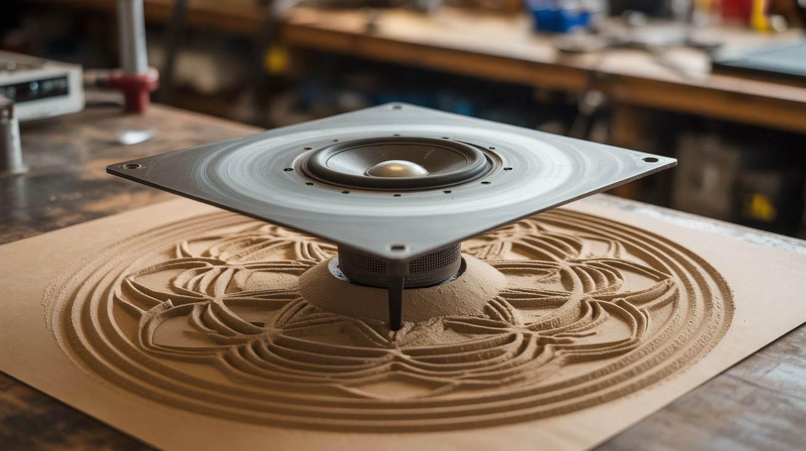

# #313 — Chladni Plate Sand Visualizer

  

> Sprinkle sand on a metal plate, drive it with a speaker, watch geometric mandala patterns form from pure physics.

## Ratings

     

## 🧪 What Is It?

A metal plate (cookie sheet, aluminum sheet, or square steel plate) is vibrated by a speaker or exciter mounted underneath. Sand sprinkled on top migrates to the nodal lines — the places where the plate isn't vibrating — revealing standing wave patterns as intricate geometric shapes. Different frequencies produce different patterns. Low frequencies create simple shapes with just a few lines. High frequencies create impossibly detailed mandalas with dozens of symmetrical cells. This phenomenon is called Chladni patterns, after the physicist Ernst Chladni who discovered them in 1787 by drawing a violin bow across the edge of a metal plate. It looks like sorcery.

The physics is elegant: every vibrating plate has regions of maximum displacement (antinodes) and regions of zero displacement (nodes). Sand bounces off the antinodes and settles into the nodes, tracing out the exact geometry of the standing wave. Change the frequency and the entire pattern dissolves and reorganizes into a completely different shape in under a second. The simplest possible ingredients — a cookie sheet, a speaker pulled from a dead soundbar, and some table salt — produce the most otherworldly visual result of any build in this collection. Vary frequency with a free signal generator app on your phone, sweeping slowly upward and pausing at each resonance to let the pattern fully form.

Square plates produce the most symmetrical, photogenic patterns because the geometry supports clean orthogonal modes. Circular plates create concentric ring patterns. Odd shapes create asymmetric patterns that are still beautiful but less orderly. Thicker plates require more power to drive but produce sharper, more defined nodal lines.

<strong>🧰 Ingredients</strong>

- [ ] Metal plate — cookie sheet, salvaged sheet metal, or square steel plate, ~12"x12" preferred *(kitchen, scrap yard, or hardware store, ~$0-10)*
- [ ] Speaker or exciter — 4-6" woofer or tactile transducer *(dead soundbar, Bluetooth speaker, or car audio — free from e-waste)*
- [ ] Amplifier board — any small amp that can drive a speaker *(old stereo, car amp, or powered speaker board — free from e-waste)*
- [ ] Bolt + nut + washer — to attach plate center to speaker cone *(hardware store, ~$0.50)*
- [ ] Signal generator app — free on any phone *(already own)*
- [ ] 3.5mm audio cable — to connect phone to amplifier *(junk drawer, free)*
- [ ] Sand or salt — fine grain for detailed patterns *(kitchen, free)*
- [ ] Clamp or bracket — to secure the speaker to a stable base *(workshop, free)*

## 🔨 Build Steps

1. **Prepare the plate.** If using a cookie sheet, cut it into a square if possible — square plates produce the most symmetrical patterns. File or sand any sharp edges. Drill a small hole dead center of the plate for the mounting bolt.

2. **Attach the plate to the speaker.** Push a bolt through the center of the speaker cone (you may need to carefully punch or drill a small hole through the dust cap) and through the hole in the plate. Tighten with a nut and washer on top. The plate should be rigidly coupled to the speaker cone — any looseness kills the pattern quality. The bolt transfers the speaker's vibration directly to the plate's center.

3. **Mount the speaker securely.** Clamp or bolt the speaker frame to a stable, heavy base — a thick piece of wood, a cinder block, or a weighted box. The speaker frame must not move; only the cone (and therefore the plate) should vibrate. If the whole assembly walks across the table, the base is too light.

4. **Connect the amplifier.** Wire the speaker to the amplifier output. Connect your phone to the amplifier input via a 3.5mm cable. Turn the volume to minimum before powering on.

5. **Sprinkle a thin, even layer of sand.** Cover the plate surface with a uniform layer of fine sand or table salt. Too much sand and the patterns take forever to form. Too little and the lines are hard to see. A light dusting is ideal — you should still be able to see the plate surface through the sand.

6. **Start sweeping frequencies.** Open a signal generator app on your phone. Set it to produce a sine wave. Start at around 200 Hz. Slowly turn up the amplifier volume until you see the sand begin to move. Sweep the frequency upward slowly. At each resonant frequency of the plate, the sand will rapidly migrate into a distinct geometric pattern.

7. **Document each pattern.** Pause at each resonance and let the pattern fully form (10-20 seconds). Photograph from directly above. Label each photo with its frequency. You'll build a catalog of patterns unique to your specific plate — its shape, size, thickness, and material determine the exact mode shapes.

8. **Experiment with different plates.** Try circular plates, rectangular plates, different thicknesses, and different materials (aluminum vs. steel vs. brass). Each produces its own family of patterns. Brass plates resonate more cleanly and produce the sharpest nodal lines.

## ⚠️ Safety Notes

- The amplifier can get loud at high volume, especially at resonant frequencies where the plate rings efficiently. Wear hearing protection if you're sweeping through frequencies for extended periods.
- Vibration can walk the entire assembly off a table if the base isn't heavy or clamped down. Secure the speaker mount before cranking up the power.
- Fine sand gets everywhere. Do this on a surface you can sweep easily, or outdoors.

## 🔗 See Also

- [Kinetic Sand Table](312-kinetic-sand-table.md)
- [Non-Newtonian Speaker](../pyro-and-chemistry/112-non-newtonian-speaker.md)
