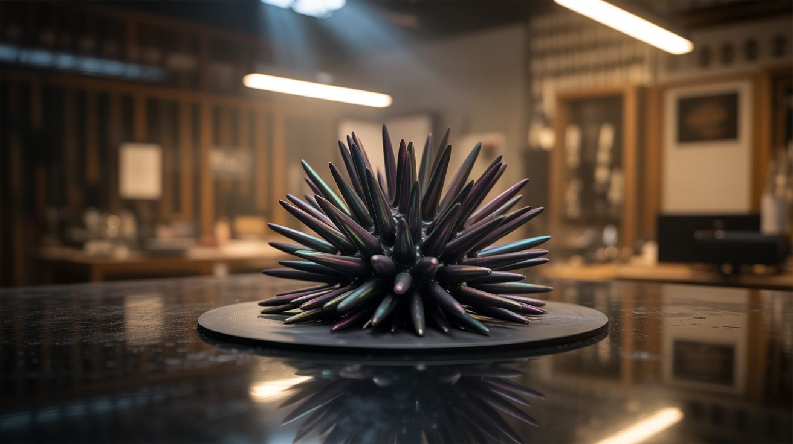

# 🎨 Art & Installation

  

  

> Turning dumpster finds into gallery pieces that make people forget the parts came from a curb.

Kinetic sculptures that dance in the wind. Fountains that freeze water in mid-air. Ferrofluid that morphs like a living creature behind glass. Planetariums built from dryer drums. CRT televisions turned into abstract light shows. Welded sculptures from the guts of dead appliances.

Art made from salvage carries a story that gallery art can't match. Every component had a previous life, and the contrast between what it was and what it's become is part of the piece. These builds sit at the intersection of engineering and aesthetics — they work because the physics is sound, and they're beautiful because the design is intentional.

---

## Builds

<a class="cat-card" href="043-kinetic-wind-sculpture.md">
#043Kinetic Wind Sculpture

Jaw

Brain

Wallet

Spicy

Clout

Time

</a>
<a class="cat-card" href="044-antigravity-water-fountain.md">
#044Anti-Gravity Water Fountain

Jaw

Brain

Wallet

Spicy

Clout

Time

</a>
<a class="cat-card" href="045-scrap-metal-sculpture.md">
#045Scrap Metal Sculpture

Jaw

Brain

Wallet

Spicy

Clout

Time

</a>
<a class="cat-card" href="046-ferrofluid-mirror.md">
#046Ferrofluid Mirror

Jaw

Brain

Wallet

Spicy

Clout

Time

</a>
<a class="cat-card" href="047-dryer-drum-planetarium.md">
#047Dryer Drum Planetarium

Jaw

Brain

Wallet

Spicy

Clout

Time

</a>
<a class="cat-card" href="048-crt-electromagnetic-art.md">
#048CRT Electromagnetic Art

Jaw

Brain

Wallet

Spicy

Clout

Time

</a>
<a class="cat-card" href="312-kinetic-sand-table.md">
#312Kinetic Sand Table

Jaw

Brain

Wallet

Spicy

Clout

Time

</a>
<a class="cat-card" href="313-chladni-plate-sand-visualizer.md">
#313Chladni Plate Sand Visualizer

Jaw

Brain

Wallet

Spicy

Clout

Time

</a>

---

### Suggested Build Order

Start with accessible art pieces and build toward complex kinetic installations:

1. **[#048 — CRT Electromagnetic Art](048-crt-electromagnetic-art.md)** — Magnets warp a CRT display. Instant art.
2. **[#045 — Scrap Metal Sculpture](045-scrap-metal-sculpture.md)** — Welding and fabrication fundamentals.
3. **[#047 — Dryer Drum Planetarium](047-dryer-drum-planetarium.md)** — Drill holes, add light. Instant cosmos.
4. **[#313 — Chladni Plate Sand Visualizer](313-chladni-plate-sand-visualizer.md)** — Sound makes geometric sand art.
5. **[#043 — Kinetic Wind Sculpture](043-kinetic-wind-sculpture.md)** — Wind-powered motion art.
6. **[#044 — Anti-Gravity Water Fountain](044-antigravity-water-fountain.md)** — Stroboscopic water illusion.
7. **[#046 — Ferrofluid Mirror](046-ferrofluid-mirror.md)** — Programmable magnetic liquid display.
8. **[#312 — Kinetic Sand Table](312-kinetic-sand-table.md)** — CNC-driven sand patterns. The crown jewel.

### Related Categories

- [Light & Visual](../light-and-visual/) — Optics, LEDs, and visual phenomena
- [Mechanical & Kinetic](../mechanical-and-kinetic/) — Moving parts and motion physics
- [Sound & Music](../sound-and-music/) — When art responds to sound

---

## 📚 Reference Guides

- [Tools Needed](../../reference/tools-needed.md)
- [Sourcing Guide](../../reference/sourcing-guide.md)
- [Difficulty & Ratings Guide](../../reference/difficulty-guide.md)
