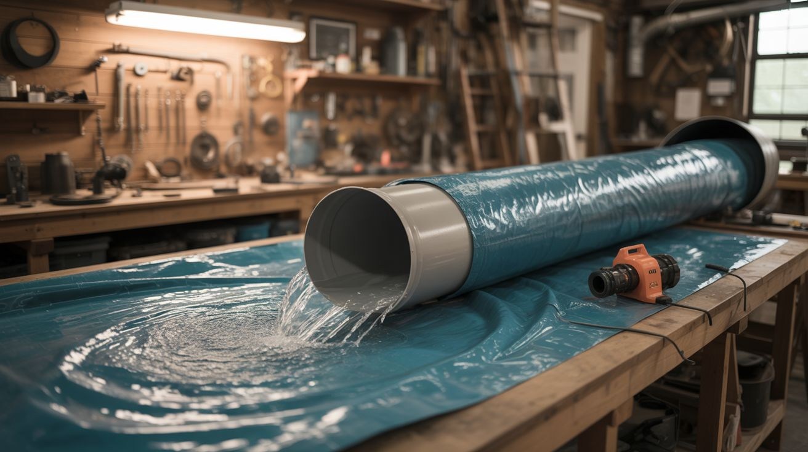

# #191 — Backyard Water Slide

  

> 100 feet of tarp, PVC, and a recirculating pump — because water parks charge too much and your yard is just sitting there.

## Ratings

     

## 🧪 What Is It?

A full-length backyard water slide built from heavy-duty tarp material, PVC pipe framing for the raised launch section, and a submersible pump that recirculates water from the splash pool at the bottom back to the top. The tarp is lubricated with a continuous flow of water (and optionally dish soap), turning your yard into a 100-foot slip-and-slide that actually works for adults without shredding your ribcage on dry spots.

The key upgrade over a store-bought slip-and-slide is the raised launch ramp (3-5 feet high) and the recirculating water system. You're not running a garden hose — you're running a proper pump loop that keeps the entire surface flooded. Add a natural slope in your yard and you're dealing with genuinely dangerous speeds. Perfect.

<strong>🧰 Ingredients</strong>

- [ ] Heavy-duty polyethylene tarp, 10x100 feet minimum (6 mil or thicker) *(source: hardware store or farm supply — ~$30-50)*
- [ ] PVC pipe, 1.5-2 inch diameter, ~50 feet for the launch ramp frame *(source: hardware store — ~$20)*
- [ ] PVC fittings (elbows, tees, caps) *(source: hardware store)*
- [ ] Submersible utility pump, 1/3 HP or larger *(source: hardware store or sump pump from a renovation — ~$50-80)*
- [ ] Garden hose or flexible PVC pipe for the water return line *(source: hardware store)*
- [ ] Plastic kiddie pool or stock tank for the splash pool/reservoir *(source: farm supply or big box store — ~$20-40)*
- [ ] Pool noodles for edge bumpers *(source: dollar store)*
- [ ] Landscape staples for anchoring the tarp *(source: hardware store)*
- [ ] Dish soap (cheap, unscented) *(source: grocery store)*
- [ ] Hay bales or foam pads for the deceleration zone *(source: farm supply or gym surplus)*

## 🔨 Build Steps

1. **Survey your yard.** Find the longest, straightest slope you have. Even a gentle grade makes a massive difference. Mark the run from top to bottom — 60-100 feet is ideal. Note any rocks, roots, or sprinkler heads that need to be covered or avoided.

2. **Clear and pad the run.** Remove any sharp objects from the path. Lay a base layer of old cardboard or cheap landscape fabric under the tarp in areas with rough ground. A single pebble under the tarp becomes a bruise machine at slide speed.

3. **Build the launch ramp.** Construct a 3-5 foot elevated platform from PVC pipe and fittings. It doesn't need to hold static weight — it just needs to handle a running human's launch weight for one second. Use a triangular truss design for strength. Cover the ramp surface with tarp and pad the edges with pool noodles.

4. **Lay the tarp.** Unroll the tarp down the slope from the base of the launch ramp. Overlap multiple tarps if needed, with the upstream tarp overlapping on top so water flows over seams, not under them. Stake the edges with landscape staples every 3-4 feet.

5. **Build edge bumpers.** Line both edges of the slide with pool noodles held in place by the landscape staples. These keep riders centered and prevent edge runoff onto bare ground. On curves (if your yard isn't straight), build up the outside edge higher.

6. **Set up the splash pool.** At the bottom of the run, place the kiddie pool or stock tank. This is both the landing zone and the pump reservoir. Add a deceleration zone of hay bales or foam padding just before the pool to prevent high-speed collisions with the pool wall.

7. **Install the pump loop.** Place the submersible pump in the splash pool. Run a garden hose from the pump output up to the top of the slide. Attach a PVC manifold with drilled holes or a perforated pipe across the top of the slide so water sheets evenly across the tarp width. The pump should be moving enough water to keep a continuous film flowing down the entire length.

8. **Add lubrication.** Squirt dish soap generously on the tarp surface, especially the upper third. The combination of flowing water and soap makes the surface nearly frictionless. Reapply every 30-60 minutes of use.

9. **Test run.** Fill the pool, start the pump, soap the tarp, and do a low-speed belly slide test. Check for dry spots, exposed ground under the tarp, and edge containment. Adjust water flow and staple positions before going full speed.

10. **Send it.** Run, launch off the ramp, and slide. The first person to go full speed will tell you everything you need to fix. Common issues: dry spots mid-run (add more water volume), flying off curves (build edges higher), and not enough deceleration at the bottom (add more hay bales).

## ⚠️ Safety Notes

> [!WARNING]
> **Spinal injuries are the real risk.** Diving headfirst onto a water slide can cause neck and spinal injuries if the surface isn't properly padded and lubricated. Enforce a feet-first or belly-first rule. No headfirst diving.
- **Deceleration zone is non-negotiable.** A 150-pound human sliding at 20+ mph into a hard surface can cause serious injury. The splash pool and hay bales must be positioned to give riders at least 10 feet of deceleration distance. Test at low speed first.
- **Drowning risk.** If using a deep splash pool, never operate without a spotter. Kids can get disoriented after a fast slide and end up face-down in even shallow water.

## 🔗 See Also

- [Trebuchet](../mechanical-and-kinetic/185-trebuchet.md) — another big outdoor build with a high fun-to-danger ratio
- [Weather Balloon Launch](192-weather-balloon-launch.md) — take the "big builds" concept literally vertical
