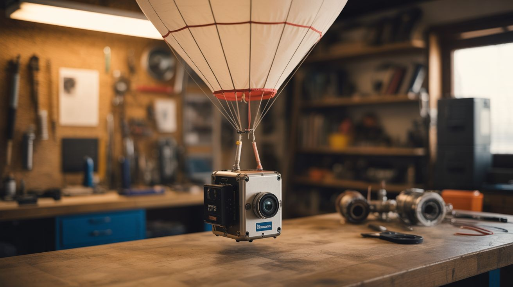

# #192 — Weather Balloon Launch

  

> Send a camera to the edge of space on a helium balloon and get it back — for less than the cost of a plane ticket.

## Ratings

     

## 🧪 What Is It?

A high-altitude balloon launch sends a payload to 80,000-120,000 feet — the stratosphere, where the sky turns black and the curvature of the Earth is visible. The balloon expands as atmospheric pressure drops until it bursts, and the payload parachutes back to Earth. A GPS tracker guides you to the landing site for recovery.

The photos and video from near-space are genuinely breathtaking. You can see weather systems from above, the thin blue line of atmosphere, and the darkness of space in the same frame. People spend thousands going skydiving for this view — you can get it for $150 and a Saturday morning.

<strong>🧰 Ingredients</strong>

- [ ] Weather balloon, 1200g latex (e.g., Hwoyee or Totex brand) *(source: online, ~$30-50)*
- [ ] Helium tank, 80 cubic feet minimum *(source: party supply store or welding supply — ~$40-60 rental)*
- [ ] Raspberry Pi Zero W or similar small computer *(source: online or electronics shop — ~$15)*
- [ ] Pi Camera module or small action camera (GoPro, etc.) *(source: online — $10-30 for Pi camera, or use existing action cam)*
- [ ] GPS module (u-blox compatible, rated for high altitude) *(source: Adafruit, SparkFun — ~$30)*
- [ ] GSM/cellular tracker as backup (e.g., SPOT or cheap GPS tracker) *(source: Amazon — ~$30-50)*
- [ ] Parachute, 3-4 foot diameter *(source: online rocketry supplier — ~$15)*
- [ ] Styrofoam cooler for the payload box *(source: grocery store or fish market — free to $5)*
- [ ] Hand warmers (chemical type) *(source: sporting goods or dollar store)*
- [ ] Nylon cord, 50-lb test, 15-20 feet for balloon-to-parachute-to-payload tether *(source: hardware store)*
- [ ] Zip ties, duct tape, and cable ties *(source: hardware store)*
- [ ] AA lithium batteries (critical — alkaline batteries fail at -40 degrees) *(source: electronics store)*

## 🔨 Build Steps

1. **Check the regulations.** In the US, FAA regulations (14 CFR 101) allow unmanned free balloon launches under certain payload weight and size limits without prior authorization. Your total payload must be under 4 pounds and no individual package over 6 pounds. Verify current regulations for your country. File a NOTAM (Notice to Air Missions) if required.

2. **Build the payload box.** Cut windows in the styrofoam cooler for the camera lens. Mount the Pi Zero and camera inside, oriented to look outward and slightly downward. Use foam to cushion all electronics. Place hand warmers inside — electronics fail at stratospheric temperatures (-40 to -60 degrees C/F) and hand warmers keep the box above freezing.

3. **Set up the tracker.** Configure the GPS module to log coordinates and, if using a cellular tracker, to transmit position periodically. The Pi should log GPS coordinates to an SD card as backup. Note: regular GPS modules have a software altitude limit of 60,000 feet (COCOM limit). You need one rated for high-altitude use.

4. **Write the flight software.** Program the Pi to start recording video and logging GPS on boot. Use a simple Python script: take a photo every 10 seconds, log GPS every 30 seconds, write everything to the SD card. Include a shutdown timer or watchdog to prevent SD card corruption.

5. **Predict the flight path.** Use an online flight predictor (like the CUSF predictor from Cambridge University) to estimate where the balloon will go based on current wind data. Input your launch location, balloon size, payload weight, and helium volume. Choose a launch day when the predicted landing site is in accessible, open terrain — not in a lake, forest, or military base.

6. **Assemble the tether.** String the components: balloon at top, 10 feet of cord, parachute, 5 feet of cord, payload box at bottom. The parachute deploys automatically when the balloon bursts and the assembly starts falling. Use swivel clips at each connection so the line doesn't twist.

7. **Fill the balloon.** On launch day, fill the balloon with helium at the launch site. Use a fish scale to measure neck lift — the upward pull when you hold the balloon. Target 5-6 lbs of gross lift for a 1200g balloon with a 2-3 lb payload. This determines ascent rate (~5 m/s is ideal) and burst altitude.

8. **Launch.** Start all cameras and trackers. Verify GPS lock. Hold the balloon upwind, let the payload line go taut, and release. The balloon should ascend at a visible but unhurried pace. Watch it until it's a dot, then start driving toward the predicted landing zone.

9. **Track and recover.** Monitor the GPS tracker during flight (if using cellular). When the balloon bursts (typically 90-120 minutes after launch), the payload will descend under parachute for 30-45 minutes. Drive to the predicted landing area and use the last GPS coordinates to locate the payload. Bring binoculars — the parachute is your visual target.

10. **Review the footage.** The first time you see the curved Earth and black sky from your own camera, shot from a cooler you packed in your kitchen, is a moment. Pull the SD card, review the photos and video, and export the GPS track. Overlay the track on a map for a complete flight profile.

## ⚠️ Safety Notes

> [!WARNING]
> **Helium is an asphyxiant.** Fill the balloon outdoors only. Helium displaces oxygen — in an enclosed space it can cause suffocation without warning. Never inhale helium from the tank.

- **Balloon burst hazard.** A fully inflated weather balloon is under significant tension. If it pops during filling (rare but possible), the snap can sting exposed skin. Wear gloves during filling and keep your face away.
- **Aviation safety is paramount.** You are launching an object into controlled airspace. Follow all FAA/CAA regulations without exception. Never launch near airports, in restricted airspace, or in conditions where the flight path crosses major air corridors. If in doubt, call your local FAA Flight Standards District Office.

## 🔗 See Also

- [Geodesic Dome Greenhouse](194-geodesic-dome-greenhouse/) — another big build combining physical structure with electronics
- [Ham Radio from Scratch](193-ham-radio-from-scratch/) — another way to reach beyond your neighborhood using DIY technology

