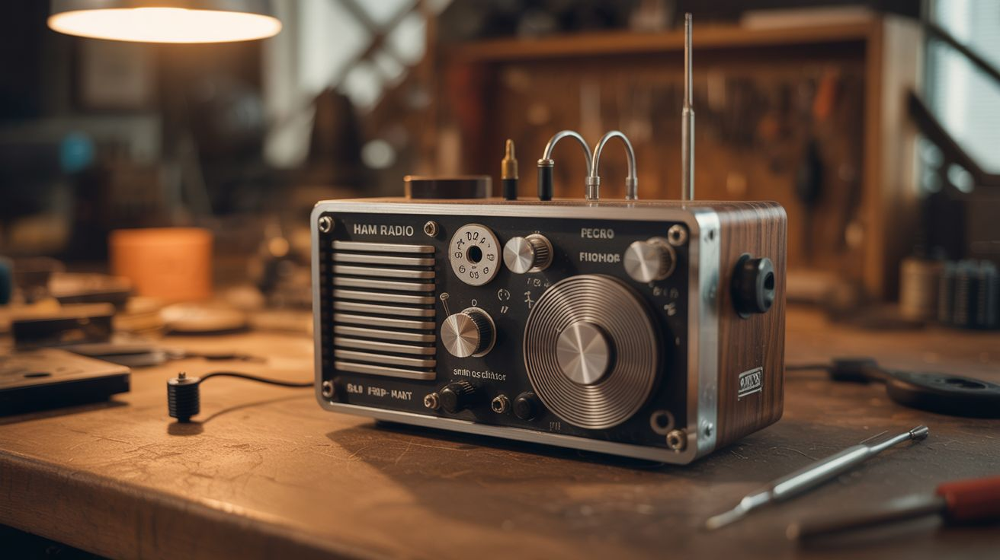

# #193 — Ham Radio from Scratch

  

> Wind your own coils, build a crystal oscillator, and talk to someone on the other side of the planet using scrap metal and patience.

## Ratings

     

## 🧪 What Is It?

A from-scratch amateur radio transceiver: you wind the coils, solder the oscillator, build the amplifier, and string the antenna. The result is a working radio capable of sending and receiving Morse code (CW) or even voice on the amateur bands. On a good night with the right atmospheric conditions, a 5-watt homemade transmitter can reach thousands of miles by bouncing signals off the ionosphere.

This is the original DIY — ham radio operators have been building their own gear since the early 1900s. The beauty of starting from scratch is that you understand every component because you built it. There's no black box. When you make your first contact on a radio you wound by hand, the dopamine hit is indescribable.

<strong>🧰 Ingredients</strong>

- [ ] Magnet wire, 22-28 gauge, at least 100 feet *(source: dead transformer — unwind it — or buy a spool, ~$8)*
- [ ] Quartz crystal for your target frequency (e.g., 7.030 MHz for 40m CW) *(source: electronics supplier or QRP kit vendor — ~$3)*
- [ ] Transistors: 2N2222 or 2N3904 (signal), IRF510 or 2SC1969 (power) *(source: electronics store or salvage from old boards — ~$5 total)*
- [ ] Assorted resistors, capacitors, and an audio transformer *(source: dead electronics — radios, TVs, old circuit boards)*
- [ ] Copper-clad PCB board or perfboard *(source: electronics store — ~$5)*
- [ ] BNC or SO-239 antenna connector *(source: electronics store — ~$3)*
- [ ] Wire for antenna — 50-66 feet of insulated hookup wire *(source: hardware store or old extension cord)*
- [ ] Coax cable, RG-58, 25-50 feet *(source: dead cable TV installation or electronics store — ~$10)*
- [ ] 12V power supply or battery *(source: old laptop charger or car battery)*
- [ ] Morse code key (straight key) or build one from a hacksaw blade *(source: build from scrap — see step 7)*
- [ ] Headphones or small speaker *(source: junk drawer)*
- [ ] Soldering iron and solder *(source: your shop)*

## 🔨 Build Steps

1. **Get your license.** In the US, you need at minimum a Technician class amateur radio license (FCC Part 97). The test is 35 multiple-choice questions and costs ~$15. Study with free online resources — most people pass after a week of casual studying. You need the license before transmitting (receiving is legal without one).

2. **Pick a band and mode.** Start with 40 meters (7 MHz) CW (Morse code). It's the most forgiving band for low-power homebrew gear — it propagates well at night, the components are manageable sizes, and CW can be decoded by ear even with weak, noisy signals.

3. **Wind the oscillator coil.** Calculate the inductance needed for your target frequency using an online LC calculator. Wind magnet wire around a toroidal core (salvage from a dead PC power supply) or a PVC tube form. The number of turns and the core material determine the inductance. This is the heart of the radio.

4. **Build the crystal oscillator.** Wire the quartz crystal with a single transistor (2N2222 or equivalent) in a Colpitts or Pierce oscillator configuration. This generates a stable RF signal at the crystal's frequency. You should be able to hear it on another radio as a steady tone.

5. **Build the receiver.** Construct a direct conversion receiver: the incoming RF signal is mixed with the oscillator signal, and the difference frequency falls in the audio range. You need a mixer (a single diode or transistor), an audio amplifier stage, and a bandpass filter. Wire it up, connect headphones, connect the antenna, and listen. You should hear CW signals as musical tones.

6. **Build the transmitter.** Add a power amplifier stage to the oscillator using an IRF510 MOSFET or similar RF transistor. This boosts your oscillator's milliwatt signal to 1-5 watts. Add a low-pass filter after the amplifier to suppress harmonic radiation (required by law and good practice).

7. **Build a Morse key.** Clamp one end of a hacksaw blade to a wooden base. Mount a contact point (bolt head) on the free end and another on the base directly below it. Pressing the blade makes contact and keys the transmitter. Add a spring or tension adjustment. It's crude but functional — and built from literal junk.

8. **String the antenna.** Build a half-wave dipole: two lengths of wire, each about 33 feet long (for 40m), connected at the center to coax cable. Hang it as high as possible — between two trees, from the roof ridge, or on a telescoping mast. Height matters more than anything else for antenna performance.

9. **Make your first contact.** Connect the antenna, power up the receiver, and tune around 7.030 MHz. Listen for CW signals. When you hear a station calling CQ (general call), respond with their callsign, then yours. When they acknowledge, you've made your first contact on a radio you built from scratch. Log it — this is a moment you'll remember.

## ⚠️ Safety Notes

> [!WARNING]
> **RF burns.** Even 5 watts of RF at HF frequencies can cause painful RF burns if you touch the antenna or feedline while transmitting. Never touch antenna connections while the transmitter is keyed.

- **High voltage in amplifier stage.** Some transmitter designs use voltages above 50V in the power amplifier. Treat all amplifier circuits as live when power is connected. Discharge filter capacitors before servicing.
- **Antenna safety.** Keep antennas away from power lines — an antenna touching a power line is immediately lethal. Maintain at least twice the antenna length in clearance from any power line.

## 🔗 See Also

- [Weather Balloon Launch](192-weather-balloon-launch.md) — another way to reach beyond your horizon with homebrew technology
- [Geodesic Dome Greenhouse](194-geodesic-dome-greenhouse.md) — a different kind of big build with electronics integration
