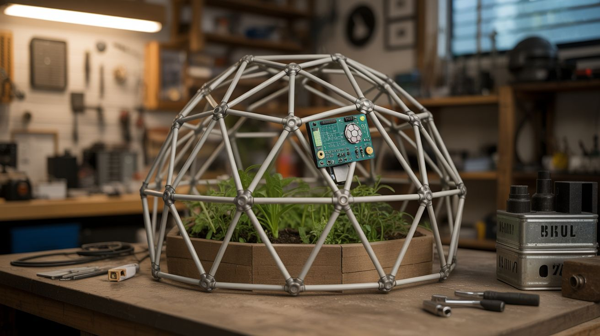

# #194 — Geodesic Dome Greenhouse

  

> EMT conduit + star connectors + a Raspberry Pi climate brain = a greenhouse that looks like it fell out of a sci-fi movie.

## Ratings

     

## 🧪 What Is It?

A geodesic dome greenhouse built from electrical conduit (EMT) with a polyethylene or polycarbonate skin and a Raspberry Pi running climate control — monitoring temperature, humidity, and soil moisture, and automatically triggering fans, vents, and irrigation. The dome structure is wildly strong for its weight (Buckminster Fuller's genius), resists wind and snow loads that would crush a traditional greenhouse, and looks incredible in any backyard.

The build breaks into two satisfying phases: the physical structure (cutting, flattening, bolting conduit into a geometric framework) and the electronics (Pi, sensors, relays, and a simple control script). When it's done, you have a structure that grows tomatoes in February and monitors itself while you sleep.

<strong>🧰 Ingredients</strong>

- [ ] 3/4" EMT conduit (electrical metallic tubing), ~25 sticks of 10-foot lengths *(source: hardware store or electrical supply — ~$3-5 each)*
- [ ] Star connector hubs (6-way and 5-way), steel or 3D-printed *(source: online geodesic dome suppliers, or 3D print your own — ~$50-80 for a set)*
- [ ] Bolts, nuts, and washers for hub connections *(source: hardware store)*
- [ ] 6-mil greenhouse polyethylene film, 20x25 feet *(source: farm supply or greenhouse supplier — ~$30-50)*
- [ ] Raspberry Pi (any model with GPIO) *(source: online — ~$35-50)*
- [ ] DHT22 temperature/humidity sensor *(source: Amazon or electronics shop — ~$8)*
- [ ] Soil moisture sensor (capacitive type preferred) *(source: Amazon — ~$5)*
- [ ] Relay module (4-channel) *(source: Amazon — ~$8)*
- [ ] 12V fans for ventilation, 2-4 *(source: dead computers or electronics — free)*
- [ ] Solenoid valve for irrigation *(source: Amazon or irrigation supply — ~$10-15)*
- [ ] Garden hose and drip irrigation tubing *(source: hardware store)*
- [ ] Conduit bender (or a pipe bender) *(source: hardware store — ~$20)*
- [ ] Raised bed or ground-level planting area inside the dome *(source: lumber or cinder blocks)*

## 🔨 Build Steps

1. **Choose your dome frequency.** A 2V (2-frequency) dome is the simplest and uses only two strut lengths. A 3V dome is more spherical and stronger but requires three strut lengths and more hubs. For a first build, a 2V dome with a 12-foot diameter is the sweet spot — big enough to walk in, small enough to build in a weekend.

2. **Calculate and cut struts.** Use an online geodesic dome calculator. Input your desired diameter and frequency. It will output the exact lengths and quantities for each strut type (A struts and B struts for 2V). Cut the EMT conduit to length and flatten the last 2 inches of each end with a hammer or vise for bolt holes.

3. **Drill the bolt holes.** Drill a 5/16" or 3/8" hole through each flattened strut end. Deburr the holes. Consistency here is critical — if bolt holes are off-center, the dome won't assemble cleanly.

4. **Assemble the hubs.** A 2V dome uses two hub types: 5-way (pentagonal, at the top and key vertices) and 6-way (hexagonal, everywhere else). Bolt the struts into the hubs using the correct pattern. Start from the base ring and work upward. Have a second person hold pieces while you bolt — this is not a solo job.

5. **Raise the dome.** Assemble the base ring on the ground, then build upward ring by ring. The top pentagon hub goes on last. The structure should feel surprisingly rigid once complete. If it wobbles, check for loose bolts or missing struts.

6. **Skin the dome.** Drape the greenhouse poly over the frame and secure it with clips, screws, or conduit straps. Leave one or two triangular sections as operable vents (hinged panels that swing open). Cut a door opening in one base triangle and frame it with wood.

7. **Set up the Pi climate station.** Mount the Raspberry Pi in a weatherproof enclosure inside the dome (out of direct sun). Connect the DHT22 sensor (temperature and humidity), the soil moisture sensor (in a planting bed), and wire the relay module to control fans and the irrigation solenoid valve.

8. **Write the control script.** A simple Python script reads sensors every 60 seconds. If temperature exceeds a threshold (say 85 degrees F), trigger the vent fans. If soil moisture drops below a threshold, open the irrigation solenoid for a timed burst. Log all data to a CSV for tracking growing conditions over time.

9. **Install ventilation and irrigation.** Mount salvaged computer fans in the vent openings, wired through the relay module. Run drip irrigation tubing from the solenoid valve to each planting bed. Connect the solenoid to a garden hose bib. Test the whole system: heat a sensor with your hand and verify the fan kicks on; dry out the soil sensor and verify irrigation triggers.

10. **Plant and grow.** Fill raised beds with soil, start your seeds or transplants, and let the dome do its thing. The geodesic shape distributes light beautifully throughout the day as the sun angle changes — no dark corners like a rectangular greenhouse.

## ⚠️ Safety Notes

> [!WARNING]
> **Conduit cutting produces sharp edges.** Always deburr cut ends and wear gloves during cutting and assembly. A conduit end can slice skin like a knife.

- **Wind load during construction.** A partially assembled dome is a sail, not a structure. If wind picks up during assembly, stop and stake what you have. A half-built dome can lift and tumble.
- **Electrical safety.** The Pi and relay module run on low voltage, but the irrigation solenoid may run on 24V AC. Use appropriate waterproof enclosures for all electronics inside the humid greenhouse environment. Keep 120V connections (if any) in GFCI-protected weatherproof boxes.

## 🔗 See Also

- [Underground Root Cellar](195-underground-root-cellar.md) — food storage to complement your food production
- [Weather Balloon Launch](192-weather-balloon-launch.md) — another big build that combines structure and electronics

**References:**

- [Electronics & Microcontrollers Guide](../../docs/reference/electronics-and-microcontrollers.md)
