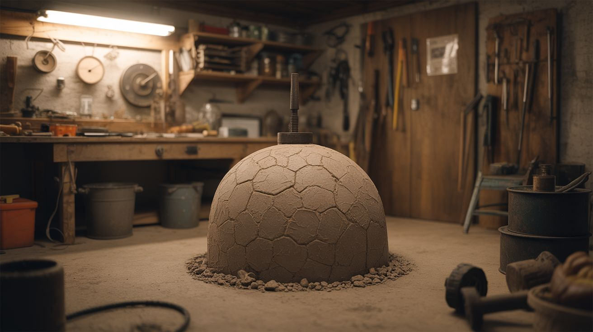

# #195 — Underground Root Cellar

  

> Dig a hole, line it, insulate it, monitor it — and store food at perfect temperature year-round without electricity.

## Ratings

     

## 🧪 What Is It?

A root cellar is an underground storage room that uses the Earth's natural insulation to maintain a stable temperature (typically 32-40 degrees F) and high humidity (85-95%) year-round — ideal conditions for storing root vegetables, canned goods, fermented foods, and beverages for months without refrigeration. Humans have been building these for thousands of years, and they still outperform a refrigerator for bulk storage.

This build combines old-world construction (dig, line, insulate) with modern monitoring (Pi-based temperature and humidity logging) so you know exactly what's happening underground without climbing down to check. The hardest part is the digging. Everything after that is surprisingly straightforward.

<strong>🧰 Ingredients</strong>

- [ ] Shovel, pickaxe, and strong back (or rent a mini excavator for $200/day) *(source: hardware store and determination)*
- [ ] Cinder blocks or poured concrete for walls, ~100-200 blocks *(source: masonry supply — ~$1-2 each)*
- [ ] Concrete for the floor slab, ~1-2 cubic yards *(source: hardware store or ready-mix delivery — ~$100-150)*
- [ ] Rebar for reinforcement *(source: hardware store or scrap yard)*
- [ ] Waterproofing membrane (rubberized asphalt or pond liner) *(source: hardware store or roofing supply — ~$50-100)*
- [ ] Rigid foam insulation (XPS, 2-inch) for the ceiling *(source: hardware store — ~$30-50)*
- [ ] Pressure-treated lumber for the door frame and ceiling joists *(source: lumber yard)*
- [ ] Heavy-duty door (insulated exterior door or custom-built) *(source: salvage yard or hardware store)*
- [ ] PVC pipe for ventilation (4-inch diameter, two runs) *(source: hardware store)*
- [ ] Gravel for drainage, ~1 ton *(source: landscape supply — ~$30-50)*
- [ ] Raspberry Pi with DHT22 sensor for climate monitoring *(source: online — ~$45 total)*
- [ ] Shelving — wooden or metal freestanding units *(source: thrift store or build from lumber)*

## 🔨 Build Steps

1. **Check codes and utilities.** Call 811 (in the US) to mark underground utilities before digging. Check local building codes — some jurisdictions require permits for underground structures. Choose a location with good drainage (hillside is ideal) and no large tree roots.

2. **Excavate.** Dig a hole approximately 8 feet wide, 10 feet long, and 7-8 feet deep. If you're building into a hillside, you can dig horizontally instead of straight down, which makes drainage and access much easier. Save the topsoil separately for backfill later.

3. **Install drainage.** Lay 6 inches of gravel on the floor. Run a perforated drain pipe around the perimeter, sloped to a daylight exit (if on a hillside) or a sump pit. Water management is the single most important factor — a wet root cellar is a failed root cellar.

4. **Pour the floor.** Lay rebar in a grid on the gravel and pour a 4-inch concrete slab. Slope it slightly toward the drain. Let it cure for at least 3 days before building walls.

5. **Build the walls.** Lay cinder blocks up to ceiling height, filling cores with concrete and rebar at corners and every 4 feet. Apply waterproofing membrane to the exterior of the walls before backfilling. This keeps groundwater out.

6. **Build the ceiling.** Span the walls with pressure-treated joists or precast concrete lintels. Lay plywood decking over the joists, then waterproofing membrane, then 2-inch rigid foam insulation, then a layer of plastic sheeting, then 18-24 inches of soil backfill. The soil mass is your insulation — more is better.

7. **Install ventilation.** Run two 4-inch PVC pipes from the cellar to above ground. The intake pipe should enter near the floor; the exhaust pipe should exit near the ceiling. This creates natural convection airflow — cool air sinks in through the intake, warm air rises out through the exhaust. Cap both pipes with screens to keep critters out and elbowed rain caps to keep water out.

8. **Build the entry.** Frame a doorway at one end (or at the top if it's a vertical entry). Install an insulated door with weatherstripping. If the entry is a stairway, build steps from cinder blocks or poured concrete. A hillside entry with a horizontal walk-in door is vastly more convenient than a ladder hatch.

9. **Set up monitoring.** Mount a Raspberry Pi (in a waterproof case) inside the cellar with a DHT22 temperature/humidity sensor. Run a script that logs readings to a file or sends them to your phone. Ideal conditions: 32-40 degrees F and 85-95% relative humidity. If temperature creeps up, you may need more soil cover or better ventilation.

10. **Stock and organize.** Install freestanding shelving units (don't anchor to walls — moisture will rot wood fastened to concrete). Store root vegetables (potatoes, carrots, beets, turnips) in bins of damp sand. Store apples and pears separately (they emit ethylene gas that spoils other produce). Canned goods go on upper shelves. Check stock monthly and rotate.

## ⚠️ Safety Notes

> [!WARNING]
> **Cave-in risk during excavation is the biggest danger.** Unsupported excavation walls can collapse without warning, burying workers. For holes deeper than 4 feet, use trench boxes, sloped walls (1:1 ratio), or benched cuts. Never work alone in an excavation.

- **Carbon dioxide accumulation.** Root cellars can accumulate CO2, especially when storing large quantities of produce (which respires). Before entering a sealed cellar, open the door and let it ventilate for several minutes. If you feel dizzy or short of breath inside, leave immediately.
- **Structural load.** The finished ceiling must support the weight of soil backfill plus any surface loads (people walking, lawn mower). Over-engineer the ceiling — use larger joists and shorter spans than you think you need. A collapsing ceiling underground is not survivable.

## 🔗 See Also

- [Geodesic Dome Greenhouse](194-geodesic-dome-greenhouse.md) — grow the food that you store in the root cellar
- [Ham Radio from Scratch](193-ham-radio-from-scratch.md) — another project that rewards patience and manual craftsmanship

**References:**

- [Electronics & Microcontrollers Guide](../../docs/reference/electronics-and-microcontrollers.md)
