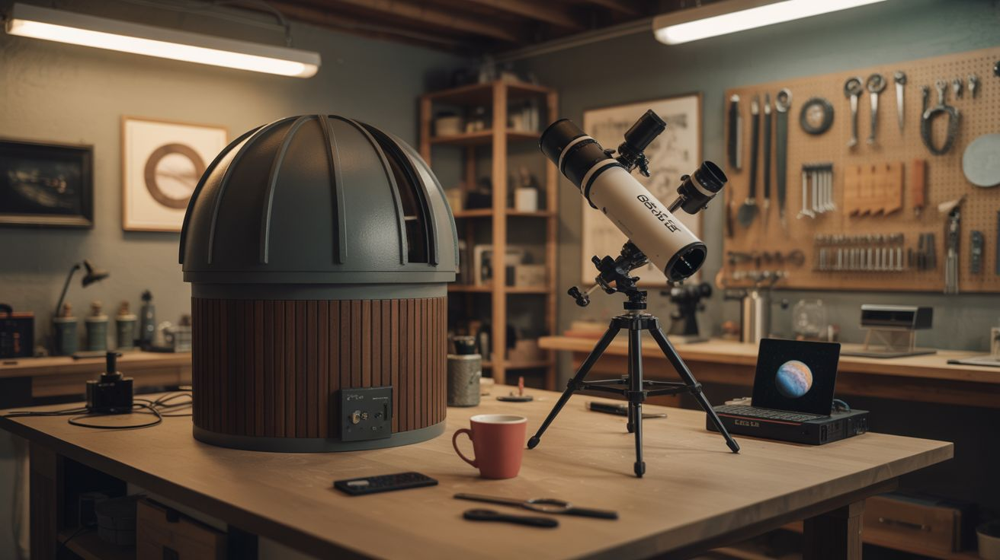

# #300 — Backyard Observatory

  

> A rotating dome, a telescope, and a Raspberry Pi that tracks Jupiter for you while you drink coffee. Your HOA will hate it. Your neighbors will love it.

## Ratings

     

## 🧪 What Is It?

A real, functional observatory in your backyard — rotating dome and all. The dome is built from a
salvaged satellite dish or formed sheet metal, mounted on a circular plywood base with a motorized
azimuth ring so you can rotate the observation slit to any compass heading. Inside sits a telescope
(purchased or built from salvaged optics), pointed at whatever patch of sky the dome reveals.

The rotation mechanism is driven by a geared DC motor controlled by a Raspberry Pi running
INDI/Stellarium. You tell the software what you want to look at, and the dome rotates to match the
telescope's pointing angle. The Pi can also drive the telescope mount itself using a motorized
equatorial or alt-az system, giving you fully automated go-to tracking. Point, click, observe. The
dome follows.

This is a serious build. You're combining structural fabrication (the dome), mechanical engineering
(the rotation ring), electronics (motor drivers and sensors), and software (Stellarium integration)
into one project. But the result is something most people assume costs $15,000+ from a commercial
vendor. You're building it for a fraction of that, and you'll understand every piece of it.

<strong>🧰 Ingredients</strong>

- [ ] Satellite dish (6-10 foot diameter) or sheet metal for dome panels *(source: telecom surplus, Craigslist, or scrap yard — ~$0-100)*
- [ ] 3/4-inch plywood sheets (4x8) for the base platform and dome ring, ~6 sheets *(source: lumber yard — ~$30-45 each)*
- [ ] 2x4 lumber for the base frame and wall structure, ~20 boards *(source: lumber yard — ~$60 total)*
- [ ] Lazy Susan bearing, heavy-duty, 12-inch or larger *(source: hardware store or industrial supply — ~$25-40)*
- [ ] V-groove wheels or roller bearings for the dome rotation track, 8-12 units *(source: industrial supply or caster supplier — ~$40-60)*
- [ ] Steel flat bar or angle iron for the rotation rail *(source: scrap yard or metal supplier — ~$20-30)*
- [ ] Geared DC motor, 12V, with enough torque to rotate the dome (~50+ in-lbs) *(source: surplus motor, windshield wiper motor, or online — ~$15-40)*
- [ ] Motor driver board (L298N or BTS7960) *(source: electronics supplier — ~$8-15)*
- [ ] Raspberry Pi 4 with power supply and SD card *(source: online — ~$45-60)*
- [ ] Rotary encoder or limit switches for dome position sensing *(source: electronics supplier — ~$10-15)*
- [ ] Telescope — 6-8 inch Dobsonian or Newtonian reflector *(source: buy used on Cloudy Nights classifieds, or build from a salvaged mirror — ~$150-300 used)*
- [ ] Equatorial or alt-az motorized mount, or build one with stepper motors *(source: used astronomy gear or DIY with NEMA 17 steppers — ~$50-200)*
- [ ] Stepper motor drivers (A4988 or TMC2209) if building a DIY mount *(source: electronics supplier — ~$10)*
- [ ] Weatherproofing: exterior paint, silicone caulk, and rubber gasket material *(source: hardware store — ~$30)*
- [ ] Hinges for the dome observation slit shutter *(source: hardware store — ~$10)*
- [ ] 12V power supply or deep-cycle battery *(source: your shop or auto parts store)*
- [ ] Slip ring (electrical rotary connector) for passing power through the rotating joint *(source: electronics supplier or robotics vendor — ~$15-30)*

## 🔨 Build Steps

1. **Choose your site and pour footings.** Pick a spot with the clearest view of the sky — away from
   trees, buildings, and streetlights. South-facing exposure is ideal in the northern hemisphere.
   Dig four to six holes 12 inches in diameter and below the frost line. Fill with concrete and set
   anchor bolts. Let them cure for a week. These piers carry the entire observatory weight, so don't
   rush the concrete.

2. **Build the base platform.** Construct a circular or octagonal platform from 2x4 framing and
   plywood decking, 8-10 feet in diameter. Bolt the frame to the anchor bolts in the concrete piers.
   The platform needs to be dead level — use a laser level and shim as needed. This floor is where
   you'll stand while observing, and any tilt translates to tracking errors in the telescope. Seal
   the plywood with exterior paint or deck sealant.

3. **Frame the knee wall.** Build a short wall (3-4 feet high) around the perimeter of the platform
   using 2x4 studs and plywood sheathing. This wall supports the dome rotation track and gives the
   dome a cylindrical base to sit on. Sheathe the exterior with plywood and paint or wrap with house
   wrap for weather protection. The wall doesn't need insulation unless you plan to heat the
   interior (which introduces air turbulence that ruins seeing conditions — so don't).

4. **Install the rotation track.** Bend steel flat bar into a ring that sits on top of the knee
   wall. This is the rail. Weld or bolt it into a continuous circle, keeping it as level and round
   as possible. Mount V-groove wheels on the underside of the dome base ring, spaced evenly around
   the circumference — a minimum of 8 wheels for stability. The wheels ride on the rail, allowing
   the dome to spin freely. A single central lazy Susan bearing bolted through the center of the
   platform takes the vertical load while the V-groove wheels handle lateral alignment and prevent
   the dome from walking off the track.

5. **Fabricate the dome.** If using a satellite dish, you already have a parabolic shell — cut an
   observation slit (roughly 18 inches wide, from the rim to just past the apex) using a
   reciprocating saw with a metal-cutting blade, and add a sliding or hinged shutter to close it
   when not in use. If building from scratch, cut sheet metal or fiberglass into gores (like orange
   peel segments) and rivet or screw them to a skeletal frame of bent metal conduit or EMT. Six to
   eight gores makes a good approximation of a hemisphere. The dome doesn't need to be geometrically
   perfect — it just needs to be smooth enough to rotate without snagging and weatherproof enough to
   keep rain off your optics. Seal all seams with silicone and paint the exterior with reflective
   white paint to reduce solar heating.

6. **Build the observation slit shutter.** The slit in the dome needs a cover that opens for
   observing and closes for weather protection. Hinge a curved metal panel along one edge of the
   slit, with a latch at the other edge. For manual operation, a rope or chain pull works fine. For
   automation, add a small linear actuator controlled by the Pi so you can open and close the
   shutter from your control software. Line the shutter edges with rubber weatherstripping to seal
   against rain when closed.

7. **Mount the dome on the track.** Lift the dome assembly (get help — it's heavy and awkward) onto
   the rotation wheels. Test spin it by hand. It should rotate smoothly with a firm push and no
   binding. If it catches, check wheel alignment and rail levelness. The dome needs to rotate a full
   360 degrees without interference. Add a rubber gasket strip between the dome base and the knee
   wall top plate to block rain and wind infiltration while still allowing free rotation.

8. **Install the drive motor.** Mount the geared DC motor to the knee wall with a friction wheel or
   pinion gear that contacts the dome's rotation ring. A rubber-coated drive wheel pressing against
   the inside of the steel rail is the simplest approach — the rubber provides enough grip to move
   the dome but slips if the dome hits an obstruction, which acts as a safety clutch. Wire the motor
   through the driver board (L298N for bidirectional control) to the Raspberry Pi's GPIO pins. Test
   rotation in both directions at low speed.

9. **Add position sensing.** Mount a rotary encoder on the drive shaft, or attach magnets to the
   dome ring at known positions with Hall effect sensors on the base. The Pi needs to know the
   dome's current azimuth angle to sync it with the telescope's pointing direction. A simple
   approach: one magnet at the north position acts as a home reference, and the encoder counts
   rotation from there. Alternatively, use limit switches at all four cardinal points and
   interpolate between them. Calibrate by pointing the slit at a known landmark and recording the
   encoder value.

10. **Set up the telescope and mount.** Place the telescope on its mount on a dedicated pier inside
   the dome — ideally a concrete-filled steel pipe bolted to its own footing, mechanically isolated
   from the floor you stand on (your footsteps vibrate the floor, and vibrations destroy image
   quality at high magnification). If using a motorized go-to mount, connect it to the Pi via USB or
   serial. If building a DIY motorized mount, attach NEMA 17 stepper motors to both axes with timing
   belts or worm gear reductions, and wire them through stepper drivers to the Pi.

11. **Install the control software.** Set up the Pi with INDI (Instrument Neutral Distributed
   Interface) server, which provides a standard protocol for controlling astronomical equipment.
   Install KStars or Stellarium as the planetarium front end. Configure INDI drivers for your mount
   and write a custom dome driver (or use an existing INDI dome driver) that reads the mount's
   current azimuth and rotates the dome to match. The INDI ecosystem has drivers for hundreds of
   mounts and accessories — odds are yours is already supported.

12. **Wire power through the rotating joint.** Run 12V power to the dome motor, the mount motors,
   and the Pi. The critical problem: power cables from the stationary base to the rotating dome will
   wrap up and shear as the dome turns. Solve this with a slip ring — an electrical rotary connector
   that passes current through rotating contacts. Route all dome-side wiring (shutter actuator,
   interior lights, any sensors on the dome) through the slip ring. If you skip the slip ring, limit
   rotation to 350 degrees in software and reverse when you hit the limit, accepting that you'll
   have a 10-degree dead zone.

13. **Calibrate and first light.** On a clear night, power everything up. Use Stellarium to select a
   bright target — Jupiter, Saturn, or a bright star like Vega. Command the mount to slew. Watch the
   dome rotate to match. Look through the eyepiece. If the target is centered and the slit is
   aligned, you have a working automated observatory. If the slit is offset, adjust the dome azimuth
   offset parameter in the INDI driver configuration. Polar alignment (for equatorial mounts) is
   critical for long-exposure tracking — use the drift alignment method over two to three iterations
   until stars are pinpoints, not streaks, at 60-second exposures.

14. **Add creature comforts.** Install a red LED light inside the dome (red light preserves night
   vision — white light destroys it for 20 minutes). Add a small folding table for a laptop. Run an
   Ethernet cable or set up a Wi-Fi bridge so you can control the telescope remotely from inside the
   house on freezing nights. A dew heater strip around the telescope's secondary mirror prevents dew
   from forming on the optics, which is the most common reason for cutting a session short.

## ⚠️ Safety Notes

> [!WARNING]
> **Structural integrity matters.** The dome is heavy and sits on an elevated platform. Over-engineer the base and the rotation track. A dome that detaches from its track in a windstorm becomes a projectile. Use guy wires or hurricane clips if you're in a high-wind area. Check local building codes — some jurisdictions require permits for structures above a certain height.
- **Pinch and crush hazards.** The rotating dome and motorized mount have gears, wheels, and moving parts that don't care about fingers. Install an emergency stop button accessible from inside the dome and another at the base outside. Never reach into the rotation track while the motor is powered.
- **Electrical safety in a wet environment.** Observatories collect dew on everything — walls, floor, equipment, wiring. All electrical connections should be in weatherproof enclosures or conformal-coated. Use GFCI-protected circuits for any mains power. Keep the slip ring contacts clean and dry.
- **Ladder and lifting injuries.** Mounting the dome requires lifting a heavy, awkward shell overhead. Use enough people (four minimum) and consider rigging a temporary A-frame hoist. Wear hard hats. Falls from the knee wall during construction are a real risk — it's not high, but it's high enough to break an ankle.

## 🔗 See Also

- [Weather Balloon Launch](192-weather-balloon-launch.md) — another way to get above the atmosphere, at least temporarily
- [Geodesic Dome Greenhouse](194-geodesic-dome-greenhouse.md) — similar dome construction principles, different purpose

**References:**
- [Appliance Teardown Guide](../../docs/reference/appliance-teardown-guide.md)
- [Technical Glossary](../../docs/reference/glossary.md)
- [Electronics & Microcontrollers Guide](../../docs/reference/electronics-and-microcontrollers.md)

