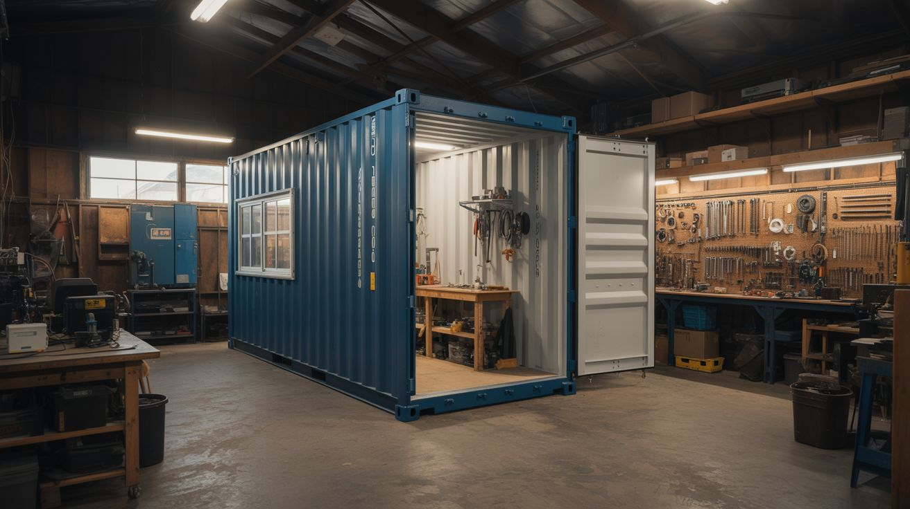

# #301 — Shipping Container Workshop

  

> A 320-square-foot steel box that locks, survives hurricanes, and holds every tool you own. Just add insulation, power, and ambition.

## Ratings

     

## 🧪 What Is It?

A used 40-foot shipping container converted into a fully equipped maker workshop — insulated, wired,
lit, ventilated, and organized. You get 320 square feet of lockable, weather-proof, rodent-proof,
theft-resistant workspace that can be delivered on a flatbed truck and dropped on a gravel pad in
your backyard. When you move, it moves with you.

The conversion process is straightforward but labor-intensive. You're cutting openings for windows
and a personnel door, spraying or boarding insulation on every interior surface, running a proper
electrical panel with circuits for tools, installing lighting and ventilation, building a workbench,
mounting tool storage, and setting up dust collection. The result is a workshop that rivals a
two-car garage in usable space — without pouring a foundation or pulling building permits in most
jurisdictions (check yours — container structures fall into a gray area in many counties).

The economics make sense. A used 40-foot high-cube container costs $1,000-2,000 from surplus depots
or shipping yards. The full conversion runs another $1,500-3,000 in materials depending on how far
you take the finish work. Compare that to a $15,000+ stick-built outbuilding or a $30,000 garage
addition. The container arrives structurally complete — you're just making it livable.

<strong>🧰 Ingredients</strong>

- [ ] Used 40-foot high-cube shipping container (8'6" wide x 9'6" tall x 40' long) *(source: shipping surplus depot, port auction, or Craigslist — ~$1,000-2,000 delivered)*
- [ ] Angle grinder with cutoff wheels and flap discs *(source: your shop or hardware store — ~$30-50 for grinder, ~$15 for discs)*
- [ ] Closed-cell spray foam insulation kit, ~600 board feet *(source: big box store or insulation supplier — ~$300-500 for kits, or hire a spray crew for ~$800)*
- [ ] Steel-framed personnel door, pre-hung *(source: salvage yard or hardware store — ~$100-200)*
- [ ] Windows, 2-3 units, vinyl or aluminum, operable *(source: salvage yard, Habitat ReStore, or surplus — ~$30-75 each)*
- [ ] Electrical sub-panel, 100A, with breakers *(source: hardware store — ~$80-120)*
- [ ] Romex wire (12/2 and 10/3 gauge), outlet boxes, receptacles, conduit *(source: hardware store — ~$100-150 total)*
- [ ] LED shop lights, 4-foot, 6-8 units *(source: hardware store — ~$15-25 each)*
- [ ] Exhaust fan, 12-inch, with motorized shutter *(source: hardware store or farm supply — ~$40-60)*
- [ ] Intake vent with filter and rain hood *(source: HVAC supply — ~$20-30)*
- [ ] Mini-split AC/heat unit, 12,000 BTU *(source: online or HVAC supplier — ~$300-700)*
- [ ] Plywood for interior wall lining and workbench, ~15 sheets of 3/4-inch *(source: lumber yard — ~$30-45 each)*
- [ ] 2x4 lumber for furring strips and workbench frame, ~30 boards *(source: lumber yard — ~$90 total)*
- [ ] Pegboard and/or French cleat strips for tool storage *(source: hardware store — ~$30-50)*
- [ ] Dust collection: shop vac or single-stage collector with ducting *(source: marketplace or discount tool store — ~$50-150)*
- [ ] Rubber stall mats for flooring, 4x6 foot *(source: farm supply store — ~$40 each, need 8-10)*
- [ ] Rust-inhibiting primer and paint *(source: hardware store — ~$40-60)*
- [ ] Steel angle iron for reinforcing cut openings *(source: scrap yard or metal supplier — ~$20-40)*
- [ ] Gravel or crushed stone for the pad, ~5-10 tons *(source: landscape supply — ~$150-300 delivered)*
- [ ] Carbon monoxide detector *(source: hardware store — ~$25)*

## 🔨 Build Steps

1. **Source and deliver the container.** Buy a used "wind and water tight" (WWT) grade container —
   these have cosmetic damage but are structurally sound and don't leak. High-cube (9'6" tall vs
   standard 8'6") is worth the extra $200 because headroom disappears fast once you add insulation,
   furring strips, and flooring. Inspect before buying: open the doors, go inside, close the doors,
   and look for daylight through the walls or ceiling. Any pinhole means a leak. Arrange delivery on
   a tilt-bed trailer.

2. **Prepare the pad.** Before the container arrives, prepare a level gravel pad at least 42 feet
   long and 12 feet wide. Excavate 4-6 inches of topsoil, lay landscape fabric, and fill with
   compacted 3/4-inch crushed stone. The container sits on its four corner castings, so you need
   those four points level to within half an inch. Use a transit or laser level. If the pad isn't
   level, the container doors won't close properly and the whole structure will rack over time. Put
   down railroad ties or concrete blocks at the corners if you want to keep the container off the
   ground for airflow and drainage underneath.

3. **Inspect, clean, and treat the interior.** Once placed, open both cargo doors and inspect the
   interior thoroughly. Look for rust holes, damaged floor sections (the plywood decking in marine
   containers is treated with pesticides — wear a respirator), and any cargo residue or odors.
   Pressure-wash the interior. Hit every rust spot with a wire wheel on your angle grinder down to
   bare metal, then prime immediately with rust-inhibiting primer. Don't skip spots — rust in a
   steel box is cancer, and it spreads.

4. **Plan your layout before cutting anything.** Tape out the locations for your personnel door,
   windows, workbench, and major tools on the walls and floor. Walk the workflow: raw material
   enters from the cargo doors at one end, moves through cutting/processing stations in the middle,
   and reaches the assembly bench at the far end. Place windows on the long walls for natural light
   and cross-ventilation. Put the personnel door on a short wall or near one end of a long wall so
   you don't walk through the middle of your workspace every time you enter. Live with the tape
   layout for a few days. It's far easier to move tape than to weld a window shut.

5. **Cut door and window openings.** Mark the openings with a chalk line and straight edge. Use a
   4.5-inch angle grinder with a cutoff wheel to slice through the corrugated steel walls. This
   throws a shower of sparks and is extremely loud inside the container — wear a full face shield,
   hearing protection, and leather gloves. Cut slightly undersized, then grind to fit. The
   container's structural strength comes from its corrugated box shape: every opening weakens it.
   Weld or bolt a frame of steel angle iron around each cut-out to restore rigidity. Two to three
   windows and one personnel door is the practical limit before you start compromising the
   structure.

6. **Install the door and windows.** Set the pre-hung personnel door into its framed opening. Shim,
   level, and fasten with self-tapping screws into the steel frame. Caulk the entire exterior
   perimeter with polyurethane sealant — not silicone, which doesn't bond well to steel. Install
   windows the same way: set, shim, fasten, seal. The windows must be operable (not fixed pane) so
   they can supplement mechanical ventilation. Keep the original container cargo doors functional —
   they're your large opening for moving sheet goods, lumber, and big tools in and out.

7. **Install furring strips.** Attach 2x4 furring strips horizontally to the walls and ceiling,
   spaced 16 inches on center, secured with self-tapping metal screws into the corrugated steel. The
   furring strips create the cavity for insulation and provide a nailing surface for the plywood
   lining. On the ceiling, you may need to use toggle bolts or weld tabs to the corrugated ribs,
   since the steel is thin and screws can pull out under the weight of overhead plywood. Check each
   strip with a level — the corrugated walls aren't flat, so the furring strips bridge the ridges
   and create a flat plane for the interior finish.

8. **Insulate everything.** Spray closed-cell foam between the furring strips — 2 inches gives
   roughly R-13, which is adequate for most climates with the mini-split handling the rest. The foam
   is doing double duty here: insulation and vapor barrier. Without it, warm humid air hitting cold
   steel equals condensation, and condensation equals rust, mold, and ruined tools. The floor gets
   1-inch rigid foam board laid between the existing plywood decking and the stall mats. Don't skip
   the ceiling — uninsulated, a steel roof in summer turns the container into a convection oven that
   tops 140 degrees.

9. **Run electrical.** Mount the sub-panel near the personnel door on the interior wall. Run a
   feeder cable from your house panel or a dedicated meter (check with your utility and local code —
   most jurisdictions require a permit for a new sub-panel). Wire individual circuits: one 20A
   circuit per workbench zone, a 30A 240V circuit for large tools (table saw, welder, compressor), a
   15A lighting circuit, and a dedicated circuit for the mini-split. Use metal conduit on the
   surface of furring strips, or Romex stapled to the furring strips behind the plywood. Install
   duplex receptacles every 4 feet along the workbench wall and at least one on each remaining wall.
   Add a 240V outlet near where the big tools will live. If you're not confident in your electrical
   skills, hire an electrician for this step — it's the one part of the build where a mistake kills
   you or burns the shop down.

10. **Line the interior walls and ceiling.** Screw 3/4-inch plywood over the furring strips using
   drywall screws. This gives a solid surface for mounting shelves, pegboard, French cleats, and
   anything else you want to hang. It also protects the spray foam from tool impacts and UV
   degradation. Paint everything white or light gray — it doubles the effectiveness of your lighting
   by bouncing light into shadows. Use exterior-grade plywood for any wall that might see moisture
   (near the door, below windows).

11. **Install lighting.** Mount 4-foot LED shop lights in two parallel rows along the ceiling,
   spaced evenly across the length. Eight lights gives roughly 40,000 lumens — bright enough to do
   fine detail work anywhere in the space. Wire them to a single switch by the personnel door. Add a
   dedicated task light (swing-arm LED) above the main workbench for close work. LEDs are mandatory
   over fluorescents: they start instantly in cold weather, don't flicker (which causes headaches
   during long sessions), and draw a fraction of the power.

12. **Set up ventilation and climate control.** Cut a hole near the ceiling on one end wall for the
   exhaust fan. The motorized shutter opens when the fan runs and closes when it stops, keeping
   weather out. Cut a filtered intake vent low on the opposite wall. This creates cross-flow
   ventilation that exchanges the entire air volume every few minutes — critical when you're
   generating sawdust, paint fumes, or welding smoke. Mount the mini-split indoor unit high on one
   end wall and run the refrigerant lines through a 3-inch hole to the outdoor unit mounted on
   brackets outside. The mini-split handles year-round climate control efficiently — heat in winter,
   cooling in summer, dehumidification always. Mount the CO detector near the center of the ceiling.

13. **Build the workbench.** Construct an L-shaped or straight workbench from 2x4 framing with a
   double layer of 3/4-inch plywood for the top. Make it 36 inches high (standard shop height), at
   least 24 inches deep, and as long as your wall allows. Lag-bolt it through the plywood wall
   lining into the furring strips and the steel wall behind them. Mount a bench vise on one end. Run
   a power strip along the back edge, plugged into the dedicated bench circuit. Add a shelf
   underneath for storage and a tool well (a recessed tray) in the bench top to keep small parts
   from rolling off.

14. **Install tool storage and dust collection.** Mount pegboard panels and French cleat strips on
   the walls above and beside the workbench. Hang your most-used hand tools where you can see and
   grab them without walking. Set up a dust collector (even a shop vac with a cyclone separator
   bucket in front of it) with 4-inch flexible hose and blast gates running to your table saw, miter
   saw, and sander stations. In a sealed steel box, airborne dust accumulates faster and lingers
   longer than in a drafty garage. A good dust collection setup is the difference between a usable
   workshop and a respiratory hazard.

15. **Lay flooring and move in.** Drop rubber stall mats over the rigid foam on the floor. They're
   anti-fatigue, easy to clean, and won't absorb oil or solvents. Butt them tight — no gaps for
   sawdust to hide in. Organize tool stations by workflow: lumber rack and raw material storage at
   the cargo door end, cutting and processing in the middle, assembly and finishing at the bench
   end. Hang extension cords and air hoses on retractable reels from the ceiling to keep the floor
   clear. Step back, look at what you built, and accept that you're going to spend more time in here
   than in your house.

## ⚠️ Safety Notes

> [!WARNING]
> **Ventilation is critical in a sealed steel box.** Running a gas engine, propane heater, or even certain adhesives in an unventilated container can produce lethal CO concentrations in minutes. The exhaust fan is not optional. If you weld or use solvents, open the cargo doors fully and run the fan simultaneously. The CO detector is your last line of defense, not your first.

- **Electrical work in a metal structure requires extra care.** The entire container shell is a grounded conductor. Your electrical system must be properly grounded and bonded to the container. Any hot wire touching the steel wall creates a fault that energizes the entire structure. Use GFCI protection on all circuits. Test your ground bond with a meter after installation.
- **Cutting steel produces sparks, sharp edges, and dangerous noise levels.** Wear a full face shield (not just safety glasses), hearing protection rated for 100+ dB, leather gloves, and long sleeves when grinding. Deburr every cut edge immediately with a flap disc — fresh-cut corrugated steel will slice through a leather glove without slowing down.
- **Container floors may contain pesticide residue.** Marine containers are routinely fumigated with methyl bromide or phosphine. Wear a P100 respirator while cleaning the interior for the first time. If the floor smells chemical or your eyes burn, ventilate aggressively for several days before working inside. Sealing the floor with epoxy before installing mats adds a barrier layer.
- **Fire in a steel box is survivable only if you can get out.** The personnel door and the cargo doors give you two exits. Never block either one. Keep a fire extinguisher (ABC-rated) mounted near the personnel door. Cutting and grinding operations throw sparks that can ignite sawdust — clean your dust collector and sweep the floor before doing any metal work.

## 🔗 See Also

- [Underground Root Cellar](195-underground-root-cellar.md) — another permanent structure build, but going down instead of staying above ground
- [Ham Radio from Scratch](193-ham-radio-from-scratch.md) — fill your new workshop with a project the day it's finished

**References:**

- [Appliance Teardown Guide](../../docs/reference/appliance-teardown-guide.md)
- [Technical Glossary](../../docs/reference/glossary.md)

