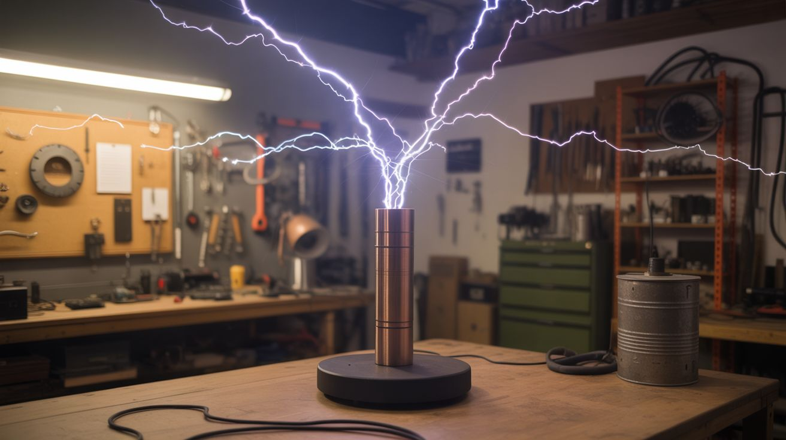

# #302 — Giant Outdoor Tesla Coil

  

> Six-foot lightning bolts that play music. Visible from across a field. Audible from a block away. Your insurance company doesn't need to know.

## Ratings

     

## 🧪 What Is It?

A large-scale dual-resonant solid-state Tesla coil (DRSSTC) that throws 6-10 foot electrical arcs
into the night sky — and plays recognizable music through the sound of the discharge. The arcs are
modulated by switching the primary circuit on and off at audio frequencies, which means the
superheated plasma channel expanding and contracting at those frequencies literally becomes a
speaker. A speaker made of lightning.

The DRSSTC design uses IGBT (Insulated Gate Bipolar Transistor) switching instead of a traditional
spark gap, which gives you precise electronic control over arc behavior. You feed it an audio signal
— MIDI from a keyboard, a WAV file, whatever — and the interrupter circuit converts that signal into
on/off timing for the primary coil. The result is arcs that buzz, hum, and sing. The Imperial March
played through a Tesla coil at midnight is an experience nobody forgets.

This is the most dangerous build in the big-builds category by a wide margin. You're working with
voltages that can stop your heart from 10 feet away, currents that vaporize metal, and RF energy
dense enough to fry electronics across the yard. The construction requires high-voltage power supply
work, precision coil winding, IGBT driver circuit design, and careful resonant frequency tuning.
None of this is theoretical — get the resonance wrong and you blow $60 worth of IGBTs. Get the
safety wrong and you're dead. But get it right, and you own the single most spectacular
demonstration device a human being can build in a garage.

<strong>🧰 Ingredients</strong>

- [ ] Secondary coil form: PVC pipe, 6-8 inch diameter, 3-4 feet long *(source: hardware store — ~$20-30)*
- [ ] Magnet wire for secondary, 24-28 AWG, ~2,000 feet *(source: dead transformers or buy a spool — ~$30-50)*
- [ ] Primary coil tubing: 3/8-inch copper or brass, ~30 feet *(source: hardware store, HVAC supply, or salvage — ~$40-60)*
- [ ] Topload: aluminum dryer duct or spun aluminum toroid, 24-36 inch major diameter *(source: build from dryer duct on plywood form ~$10, or buy fabricated ~$80-150)*
- [ ] IGBT modules: CM300 or equivalent, 2 units for half-bridge *(source: electronics surplus or online — ~$30-60 each)*
- [ ] IGBT gate driver board (UCC3732x or dedicated DRSSTC driver design) *(source: build from schematic or buy PCB kit — ~$30-50)*
- [ ] Current transformer for primary current feedback *(source: wind on a ferrite toroid — ~$5)*
- [ ] MMC capacitor bank: CDE 942C series or equivalent polypropylene film caps *(source: electronics supplier — ~$50-80 for 10-15 caps)*
- [ ] Bus capacitors, 450V 1000uF+ electrolytics, 2-4 units *(source: dead amplifiers, UPS units, or buy new — ~$20-40)*
- [ ] Bridge rectifier, 50A or higher *(source: electronics supplier — ~$10)*
- [ ] MOTs (microwave oven transformers) for power supply, 2-4 units *(source: dead microwaves from appliance shops or curb — free)*
- [ ] Variac (variable autotransformer), 20A minimum *(source: surplus or online — ~$50-100)*
- [ ] Interrupter: Arduino with MIDI shield or 555 timer circuit *(source: Arduino ~$10, shield ~$15)*
- [ ] Heat sinks and 12V cooling fans for IGBT modules *(source: salvaged server/PC equipment — ~$10-20)*
- [ ] High-voltage silicone-insulated wire for primary connections *(source: neon sign supply — ~$15-25)*
- [ ] Polycarbonate sheet for control enclosure, 1/4-inch *(source: hardware store or plastics supplier — ~$20-30)*
- [ ] Heavy-gauge wire (8 AWG or larger) for RF ground *(source: hardware store — ~$15)*
- [ ] Copper-clad ground rods, 8-foot, 2-3 units *(source: hardware store — ~$12-15 each)*
- [ ] Plywood and PVC for the coil support structure *(source: hardware store — ~$30)*
- [ ] Bleeder resistors, 10M ohm, one per MMC cap *(source: electronics supplier — ~$5 total)*
- [ ] Fiber optic cable for isolated interrupter signal transmission *(source: electronics supplier — ~$10-15)*

## 🔨 Build Steps

1. **Wind the secondary coil.** This is the tall coil that produces the output voltage, and winding
   it is the most tedious part of the build. Mount the PVC pipe horizontally on a winding jig — a
   lathe works, or two end brackets with the pipe spinning on a bolt axle. Clamp the starting end of
   the magnet wire, mark your winding boundaries, and start turning. Wind a single, tight layer from
   bottom to top: no overlaps, no gaps, no crossed turns. Every flaw in the winding is a potential
   arc-over point that will destroy the coil under power. A 6-inch diameter form wound with 26 AWG
   wire over 30 inches of length gives roughly 1,000 turns. This takes 3-4 hours of careful work.
   Once complete, coat the entire winding with 4-5 thin layers of polyurethane varnish, letting each
   coat dry fully. The varnish locks the wire in place and adds dielectric insulation between turns.

2. **Measure the secondary's resonant frequency.** Before building anything else, you need to know
   the secondary's natural resonant frequency. Connect a signal generator (or use a function
   generator app and an audio amplifier) to a single-turn coupling loop near the base of the
   secondary, and sweep frequencies while monitoring the voltage at the topload connection with an
   oscilloscope. The resonant peak is sharp and obvious — typically 60-120 kHz for a coil this size.
   Record this number. Every other component in the system is tuned to match it. If you don't own a
   scope, borrow one. Guessing the frequency and hoping for the best is how you blow IGBTs on the
   first power-up.

3. **Build the topload.** The topload is a large, smooth metal shape mounted on top of the
   secondary. It adds capacitance to the secondary circuit (lowering the resonant frequency and
   storing more energy per discharge cycle) and its smooth, rounded surface controls where arcs
   break out — from the outer rim, not from the coil winding. Form a toroid from aluminum dryer
   duct: bend 4-inch flexible duct into a ring around a plywood disc, secure the seam with rivets or
   aluminum tape, and cover the entire surface with smooth aluminum tape. A 30-inch major diameter
   toroid on a 6-inch secondary is a good starting ratio. After mounting the topload, re-measure the
   resonant frequency — it will drop significantly from the unloaded value. This loaded frequency is
   your actual target.

4. **Build the primary coil.** Wind 12-15 turns of copper tubing in a flat spiral (pancake coil) or
   an inverted cone around the base of the secondary, maintaining at least 2 inches of clearance
   between the primary and secondary windings. The primary is tapped at a specific turn number to
   tune its resonant frequency (with the MMC capacitor) to match the secondary. Leave the outer
   turns accessible and use an alligator clip or bolt tap for easy adjustment during tuning. Support
   the copper tubing on standoffs made from PVC or acrylic — nothing conductive.

5. **Build the MMC capacitor bank.** Wire CDE 942C (or equivalent high-voltage polypropylene film)
   capacitors in a series-parallel configuration to achieve the required capacitance at the required
   voltage rating for the primary circuit. Use a DRSSTC design calculator (JavaTC or similar) to
   determine the target capacitance based on your secondary's loaded resonant frequency and your
   chosen primary tap point. Solder a 10M ohm bleeder resistor across each individual capacitor —
   these slowly discharge the bank when the system is off, preventing you from grabbing a charged
   cap days later. Mount the array on an acrylic or fiberglass board with generous spacing between
   caps for cooling and voltage standoff.

6. **Build the half-bridge inverter.** This is the core power electronics. Two IGBT modules (CM300
   or equivalent, rated for 1200V and 300A) switch the DC bus voltage across the primary coil
   through the resonant capacitor bank, driving an oscillating current at the resonant frequency.
   The gate driver circuit uses a current transformer wound on the primary lead to detect
   zero-crossings of the primary current, feeding back to the gate drivers to maintain
   self-oscillation at the exact resonant frequency. Build the gate driver from a well-documented
   reference design (Steve Ward's Universal Driver board is the gold standard in the hobby). Use
   opto-isolators or fiber optic links between the low-voltage interrupter logic and the
   high-voltage gate driver to maintain galvanic isolation. Poor isolation here means a primary-side
   fault sends hundreds of volts into your Arduino, your hands, or both.

7. **Build the power supply.** Wire two MOTs (microwave oven transformers) with their secondaries in
   series to create a roughly 4 kV AC source. Bond the transformer cores together and to earth
   ground for safety. Rectify the output with the bridge rectifier and filter with the bus
   capacitors to produce a DC bus of 340-680V depending on your configuration (single MOT for
   testing, stacked for full power). Feed the MOT primary through the variac, which controls input
   voltage and therefore arc length. The variac is your throttle — it goes from "gentle purple
   tendrils" at 20% to "call the fire department" at 100%. Always start testing at the lowest
   setting.

8. **Build the interrupter.** The interrupter controls when the coil fires and for how long each
   burst lasts. For basic operation, a 555 timer circuit generates a pulse train where the frequency
   determines the audible pitch and the duty cycle determines the average power. For music, program
   an Arduino to read MIDI input (via a MIDI shield or serial MIDI adapter) and generate interrupter
   pulses at the corresponding note frequencies. The pulse on-time should be limited to 100-200
   microseconds per burst at low duty cycles (under 10%) to keep the IGBT thermal load manageable.
   Longer on-times mean bigger arcs but hotter IGBTs — push it too far and you get one spectacular
   arc followed by the distinct pop of a dead transistor. Connect the interrupter to the gate driver
   through the fiber optic isolator.

9. **Build the RF ground system.** This is not your house electrical ground, and must never be
   connected to it. Drive 2-3 copper-clad ground rods at least 8 feet deep into the earth within 10
   feet of the coil's base. Connect them together with bare 8 AWG (or heavier) copper wire. Run a
   dedicated, short, straight ground conductor from the bottom of the secondary winding to this
   ground system. The RF ground return carries enormous currents at radio frequencies. If these
   currents find a path through your household wiring — through a shared ground rod, a water pipe,
   or a long, inductive ground wire — they will induce voltages in every circuit in your house,
   destroy electronics, and potentially start fires in walls.

10. **Assemble the complete system.** Mount the secondary vertically on a plywood base platform,
   centered within the primary coil. Position the primary coil on its standoffs at the correct
   height (bottom of the secondary). Connect the half-bridge output to the primary coil through the
   MMC bank. Connect the power supply DC bus to the half-bridge input. Connect the interrupter to
   the gate driver. Connect the secondary base to the RF ground. Double-check every connection.
   Triple-check the grounding. Verify all capacitor bleeder resistors are installed. Place the
   variac at zero. Plug in the power supply. Breathe.

11. **First power-up and tuning.** Turn on the interrupter at a low repetition rate (50 Hz, 5% duty
   cycle). Slowly advance the variac. At around 20-30% input voltage, small purple brush discharges
   should appear at the topload. If instead you hear a grinding, buzzing, or crackling from the
   primary area, kill power immediately — the tuning is off and the primary isn't resonating with
   the secondary. Adjust the primary tap point (move the connection one turn in or out) and try
   again. When properly tuned, the arcs should be clean, sharp, white-purple streamers reaching
   outward from the topload rim. Increase variac voltage in small increments, pausing to check IGBT
   heat sink temperature by feel (power off first, obviously). At full power, a well-built 6-inch
   DRSSTC throws 6-10 foot arcs with an aggressive, ripping sound.

12. **Add music and perform.** Connect a MIDI keyboard or laptop running a MIDI sequencer to the
   Arduino interrupter. Play a single note. The arc should produce an audible tone at that note's
   frequency — the plasma channel vibrates the air like a speaker cone. Play a melody. The coil
   sings. For public demonstrations, rope off a safety perimeter of at least 20 feet in every
   direction from the topload (30 feet is better). Brief every spectator verbally: stay behind the
   rope, no phones inside the perimeter, anyone with a pacemaker or implanted medical device stays
   back 100 feet minimum. Have a fire extinguisher and first aid kit visible. Kill all lights in the
   area for maximum visual impact. Run the coil outdoors only, on clear dry ground, never in rain.
   Hit record. This thing films like nothing else you'll ever build.

## ⚠️ Safety Notes

> **Spicy Level 5 build.** Read the [Safety Guide](../../docs/safety/README.md) before starting.

> [!CAUTION]
> **This build can kill you.** Not hypothetically — the DC bus voltage (340-680V), the primary circuit peak currents (hundreds of amps), and the secondary output (hundreds of thousands of volts) are each independently capable of stopping a human heart. There is no safe way to touch any powered component. Treat the entire system as lethal any time the power supply is plugged into the wall, even if the variac is at zero.
- **Capacitors store lethal charge after power-off.** The bus capacitors and the MMC bank retain dangerous voltage for minutes after unplugging. Bleeder resistors drain them slowly, but slowly isn't the same as safely. After every power-down, wait 60 seconds, then verify zero voltage on the bus caps and MMC with a multimeter before touching anything. Use a shorting stick (insulated handle, grounded probe tip) on each capacitor group as a final step. Make this a ritual. Skip it once and statistics catch up with you.
- **RF interference destroys electronics.** A DRSSTC at full power radiates intense broadband electromagnetic energy. Phones, laptops, hearing aids, pacemakers, Wi-Fi routers, garage door openers, car key fobs, and LED drivers within range will malfunction or suffer permanent damage. Keep all electronics at least 50 feet away. Anyone with a pacemaker or implanted defibrillator must stay at least 100 feet away — the RF field can cause implanted devices to misfire, pace erratically, or reset.
- **Fire is a real and immediate risk.** Arcs from the topload reach 6-10 feet and are hot enough to ignite dry grass, leaves, paper, hair, and synthetic clothing on contact. Operate on cleared, non-combustible ground — dirt, concrete, or wet grass at minimum. Remove all combustible material within the arc reach radius plus a generous safety margin. Keep a CO2 or dry-chemical fire extinguisher (never water — not around this much electricity) within arm's reach of the kill switch at all times.
- **The kill switch is not optional.** Wire a clearly marked, high-visibility emergency disconnect that cuts all mains power to the entire system with a single action. Mount it where the operator can reach it without crossing through the arc zone. A second person should stand at the kill switch during all operation. Practice the shutdown sequence cold before the first power-up.
- **Never operate alone.** Always have a second person present who knows three things: where the kill switch is, how to call 911, and not to touch a person in contact with the coil while it's energized. If the operator goes down, the protocol is: kill power, call emergency services, then render aid. Touching someone who's in the circuit makes two casualties.

## 🔗 See Also

- [Musical Tesla Coil](../mad-scientist/033-musical-tesla-coil.md) — the smaller, tabletop version of this concept
- [Jacob's Ladder](../mad-scientist/034-jacobs-ladder.md) — a simpler high-voltage arc project to cut your teeth on

**References:**
- [Appliance Teardown Guide](../../docs/reference/appliance-teardown-guide.md)
- [Technical Glossary](../../docs/reference/glossary.md)
- [Electronics & Microcontrollers Guide](../../docs/reference/electronics-and-microcontrollers.md)

