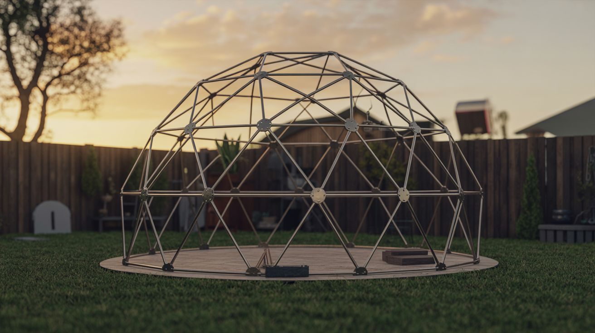

# 🏢 Big Builds

  

  

> When your project outgrows the workbench, escapes the garage, and takes over the entire yard. Neighbors will have questions.

This category is for builds that demand real space, real time, and real commitment. These are weekend-plus projects that result in something massive, permanent, or airborne. Not for the faint of heart or the small of garage.

**Common salvage sources:** EMT conduit, tarps, PVC pipe, submersible pumps, old electronics, shipping pallets, corrugated roofing.

## Builds

| # | Build | Jaw Drop | Brain Melt | Wallet | Spicy | Clout | Time |
|---|---|---|---|---|---|---|---|
| 191 | [Backyard Water Slide](191-backyard-water-slide.md) | ⭐⭐⭐⭐ | ⭐⭐ | ⭐⭐⭐ | ⭐⭐ | ⭐⭐⭐⭐⭐ | ⭐⭐ |
| 192 | [Weather Balloon Launch](192-weather-balloon-launch.md) | ⭐⭐⭐⭐⭐ | ⭐⭐⭐ | ⭐⭐⭐ | ⭐⭐ | ⭐⭐⭐⭐⭐ | ⭐⭐⭐ |
| 193 | [Ham Radio from Scratch](193-ham-radio-from-scratch.md) | ⭐⭐⭐⭐ | ⭐⭐⭐⭐ | ⭐⭐ | ⭐ | ⭐⭐⭐ | ⭐⭐⭐⭐ |
| 194 | [Geodesic Dome Greenhouse](194-geodesic-dome-greenhouse.md) | ⭐⭐⭐⭐ | ⭐⭐⭐ | ⭐⭐⭐ | ⭐ | ⭐⭐⭐⭐ | ⭐⭐⭐⭐ |
| 195 | [Underground Root Cellar](195-underground-root-cellar.md) | ⭐⭐⭐⭐ | ⭐⭐⭐⭐ | ⭐⭐⭐⭐ | ⭐⭐ | ⭐⭐⭐⭐ | ⭐⭐⭐⭐⭐ |
| 300 | [Backyard Observatory](300-backyard-observatory.md) | ⭐⭐⭐⭐⭐ | ⭐⭐⭐⭐ | ⭐⭐⭐ | ⭐ | ⭐⭐⭐⭐⭐ | ⭐⭐⭐⭐ |
| 301 | [Shipping Container Workshop](301-shipping-container-workshop.md) | ⭐⭐⭐⭐ | ⭐⭐⭐ | ⭐⭐⭐⭐ | ⭐⭐ | ⭐⭐⭐⭐ | ⭐⭐⭐⭐⭐ |
| 302 | [Giant Outdoor Tesla Coil](302-giant-outdoor-tesla-coil.md) | ⭐⭐⭐⭐⭐ | ⭐⭐⭐⭐⭐ | ⭐⭐⭐⭐ | ⭐⭐⭐⭐⭐ | ⭐⭐⭐⭐⭐ | ⭐⭐⭐⭐⭐ |

---

### Suggested Build Order

1. **[#191 — Backyard Water Slide](191-backyard-water-slide.md)** — Lowest complexity. Plumbing and tarps.
2. **[#194 — Geodesic Dome Greenhouse](194-geodesic-dome-greenhouse.md)** — Structural geometry. EMT conduit and math.
3. **[#300 — Backyard Observatory](300-backyard-observatory.md)** — Motorized dome + optics. Electronics meet carpentry.
4. **[#301 — Shipping Container Workshop](301-shipping-container-workshop.md)** — Full build-out. Electrical, insulation, dust collection.
5. **[#193 — Ham Radio from Scratch](193-ham-radio-from-scratch.md)** — RF engineering. Requires licensing.
6. **[#192 — Weather Balloon Launch](192-weather-balloon-launch.md)** — Payload engineering + recovery logistics.
7. **[#195 — Underground Root Cellar](195-underground-root-cellar.md)** — Excavation and structural engineering.
8. **[#302 — Giant Outdoor Tesla Coil](302-giant-outdoor-tesla-coil.md)** — The final boss. Lethal voltage, massive scale.

### Related Categories

- [Functional Machines](../functional-machines/) — Workshop tools you build yourself
- [Mad Scientist](../mad-scientist/) — More high-voltage and physics projects
- [Survival & Off-Grid](../survival-off-grid/) — Off-grid infrastructure builds
