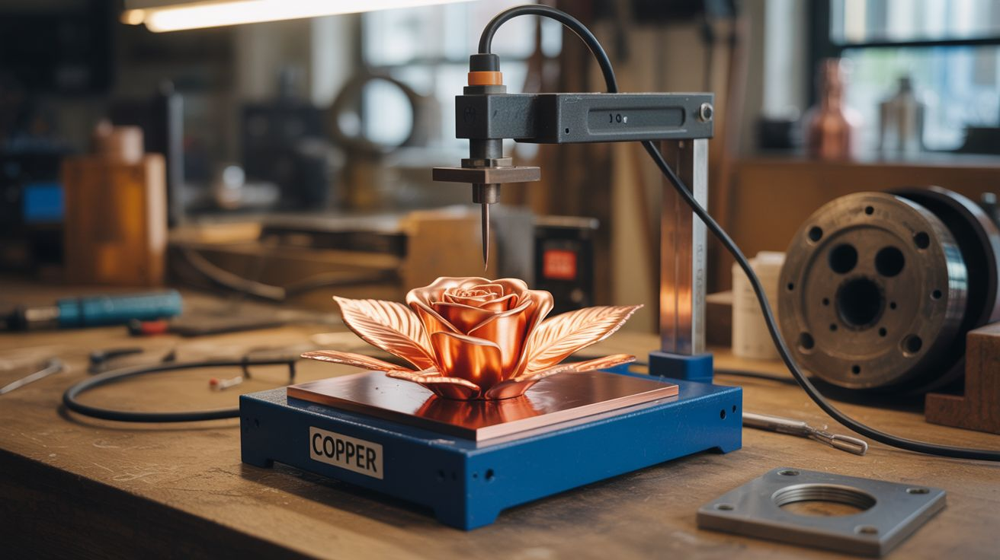

# #156 — Electroplating Station

  

> Copper sulfate + DC power + a copper anode — plate anything in a shiny layer of copper. Roses, 3D prints, leaves, anything.

## Ratings

     

## 🧪 What Is It?

Electroplating deposits a thin layer of metal onto any conductive surface using electricity. Dissolve copper sulfate in water, dip in a copper anode (positive) and your object (negative), apply DC power, and copper atoms migrate from the anode through the solution and deposit onto your object. The catch: the object must be conductive. But ANY object can be made conductive by painting it with conductive paint (graphite spray or copper paint). Suddenly you can copper-plate a real rose, a 3D print, a leaf, a seashell, or a shoe. The copper coating is real metal — durable, shiny, and absolutely stunning. It's alchemy you can do in a plastic tub.

<strong>🧰 Ingredients</strong>

- [ ] Copper sulfate — crystals or powder *(hardware store as root killer, garden supply)*
- [ ] Distilled water *(grocery store)*
- [ ] White vinegar — improves solution conductivity *(grocery store)*
- [ ] Copper anode — thick copper wire, pipe, or sheet *(hardware store, plumbing supply)*
- [ ] DC power supply — adjustable 1-12V, or old laptop charger *(electronics supplier, junk drawer)*
- [ ] Graphite spray or conductive copper paint — to make non-conductive objects conductive *(art supply, electronics supplier)*
- [ ] Plastic tub — large enough for your objects *(dollar store)*
- [ ] Alligator clips and wire *(electronics supplier)*
- [ ] Fine sandpaper — for surface prep *(hardware store)*

## 🔨 Build Steps

1. **Mix the plating solution.** Dissolve copper sulfate in warm distilled water until the solution is deep blue (about 1 cup per gallon). Add a splash of white vinegar (about 2 tablespoons per gallon) to improve conductivity and deposit quality.
2. **Prepare the object.** For conductive objects (metal), clean and lightly sand the surface. For non-conductive objects (3D prints, flowers, leaves), apply 3-4 coats of graphite spray or conductive copper paint, ensuring complete coverage. Every surface that needs plating must be conductive — any gaps will remain unplated.
3. **Set up the copper anode.** Bend thick copper wire or cut copper pipe to create an anode that surrounds the object in the bath. More anode surface area = more even plating. The anode dissolves slowly during plating, replenishing the copper in the solution.
4. **Wire the circuit.** Connect the positive terminal of the DC power supply to the copper anode. Connect the negative terminal to the object being plated. Use alligator clips for easy connection. The object MUST be the cathode (negative).
5. **Submerge and plate.** Lower both the anode and object into the solution, fully submerged. Set the power supply to 1-3V initially. Too much voltage produces rough, powdery deposits. Low voltage produces smooth, shiny copper.
6. **Wait and monitor.** Plating takes 1-6 hours depending on desired thickness. Check periodically — rotate the object for even coverage. If the deposit looks rough or dark, reduce voltage. If it's very slow, increase slightly.
7. **Remove and rinse.** When the copper layer is thick enough, remove the object, rinse thoroughly with water, and dry. The copper surface can be polished with fine sandpaper or steel wool for a mirror finish.
8. **Seal the finish.** Apply clear lacquer or Renaissance Wax to prevent the copper from oxidizing and turning green over time. For the patina look, skip the sealer and let nature take its course.

## ⚠️ Safety Notes

- Copper sulfate solution is toxic if ingested and irritating to skin and eyes. Wear gloves when handling. Keep away from children and pets. Do not pour used solution down the drain — neutralize with baking soda first and dispose of according to local regulations.
- The electroplating process produces small amounts of hydrogen gas at the cathode. Work in a ventilated area. The amounts are tiny but good practice.
- The DC power supply should be low voltage (under 12V). There's no shock hazard at these voltages, but ensure the power supply is rated for continuous operation at the current you're drawing.

## 🔗 See Also

- [Electroforming Art](160-electroforming-art.md)
- [Electrochemical Etching](162-electrochemical-etching.md)

**References:**
- [Chemicals Reference](../../reference/chemicals.md)
