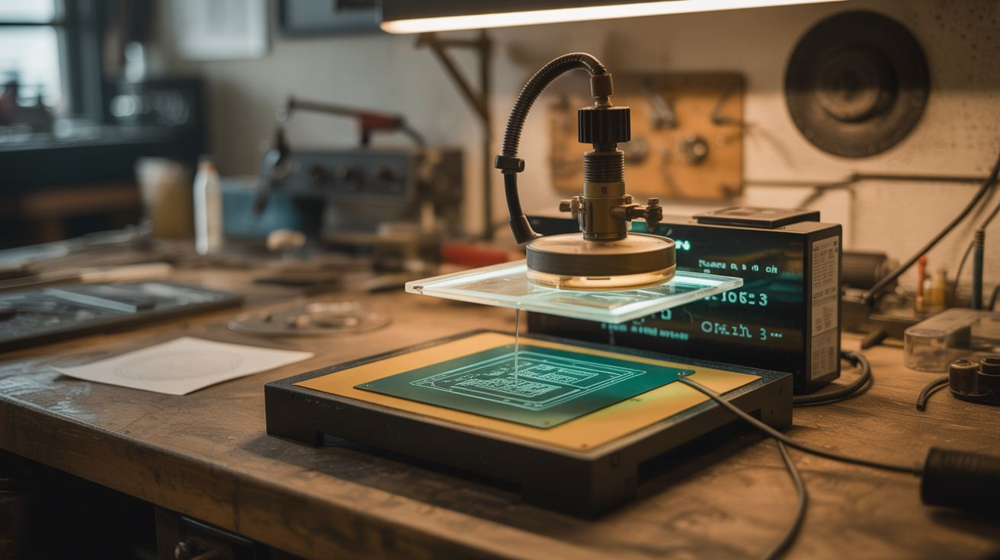

# #158 — PCB Etching Station

  

> Ferric chloride + an aquarium heater + an air pump — print circuit designs, iron-transfer them to copper board, and etch custom PCBs.

## Ratings

     

## 🧪 What Is It?

Custom circuit boards used to require sending designs to a factory and waiting weeks. With a PCB etching station, you design a circuit on your computer, print it on glossy paper with a laser printer, iron-transfer the toner to a copper-clad board, and drop it in ferric chloride solution. The acid eats away the exposed copper but the toner resists it, leaving your circuit traces behind. An aquarium heater keeps the solution warm (faster etching) and an air pump agitates it (more even etching). In 15-30 minutes, you have a custom PCB. Drill the holes, solder your components, and you've gone from schematic to working circuit board in an afternoon.

<strong>🧰 Ingredients</strong>

- [ ] Ferric chloride solution — the etchant *(electronics supplier, online)*
- [ ] Copper-clad PCB blanks — single or double-sided *(electronics supplier)*
- [ ] Laser printer — for printing the circuit mask *(already own)*
- [ ] Glossy magazine paper or transfer paper — toner transfers better from glossy stock *(recycling bin, office supply)*
- [ ] Clothes iron — for heat transfer *(already own)*
- [ ] Plastic container — acid-resistant, sized for the PCB *(dollar store)*
- [ ] Aquarium heater — to maintain solution temperature *(pet store)*
- [ ] Aquarium air pump + tubing + air stone — for agitation *(pet store)*
- [ ] Fine drill bits (0.8-1mm) and drill — for component holes *(hardware store)*
- [ ] Acetone — to remove toner after etching *(hardware store)*

## 🔨 Build Steps

1. **Design your circuit.** Use KiCad (free, open source) or EasyEDA to design your schematic and layout. Export the copper layer as a mirrored PDF — it must be mirrored because you're transferring face-down.
2. **Print the mask.** Print the mirrored layout on glossy magazine paper (the shiny pages from magazines work perfectly) using a laser printer. The toner needs to be thick and solid — adjust print density to maximum. Inkjet does NOT work; only laser toner transfers.
3. **Prepare the copper board.** Clean the copper-clad board with fine sandpaper (400 grit) and acetone. The surface must be spotless — any grease or oxidation prevents toner from adhering. Handle by the edges only after cleaning.
4. **Iron-transfer the toner.** Place the printed design face-down on the copper board. Set the iron to maximum heat (no steam). Press firmly and evenly for 3-5 minutes, keeping constant pressure. The heat melts the toner, which bonds to the copper surface.
5. **Remove the paper.** Soak the board in warm water for 10 minutes. The paper softens and peels away, leaving the toner design on the copper. Gently rub remaining paper fibers with your finger under running water. Touch up any broken traces with a permanent marker.
6. **Set up the etching bath.** Pour ferric chloride into the plastic container. Set the aquarium heater to 40-50°C and place it in the solution. Drop in the air stone connected to the air pump. Warm, agitated solution etches 3-5x faster than cold, still solution.
7. **Etch the board.** Submerge the board in the heated, agitated ferric chloride. Check every 5 minutes. The exposed copper dissolves, turning the solution darker. When all exposed copper is gone and only the toner-protected traces remain, remove the board immediately. Over-etching undercuts traces.
8. **Clean and drill.** Remove the toner with acetone, revealing clean copper traces. Drill component holes with a 0.8-1mm bit using a drill press or rotary tool. Clean the board one final time.
9. **Solder components.** Your custom PCB is ready for assembly. Apply flux, place components, and solder. The satisfaction of a working circuit on a board you designed and manufactured yourself is unmatched.

## ⚠️ Safety Notes

- Ferric chloride permanently stains everything it touches — skin, clothes, surfaces, sinks. Wear old clothes and gloves. Work on a surface you don't care about. Do NOT pour used solution down the drain — it corrodes pipes and is toxic to aquatic life. Neutralize with baking soda and dispose according to local hazardous waste guidelines.
- The iron is extremely hot during the transfer step. Don't rush. Use a firm, flat pressing surface and keep fingers away from the iron's edge. Burns from the iron are the most common injury in this process.
- Drilling PCBs creates fine fiberglass dust (the board substrate is fiberglass-reinforced). Wear a dust mask and clean up dust with a damp cloth, not a vacuum (which spreads fine particles).

## 🔗 See Also

- [Electrochemical Etching](162-electrochemical-etching.md)
- [Electroplating Station](156-electroplating-station.md)

**References:**
- [Chemicals Reference](../../docs/reference/chemicals.md)
