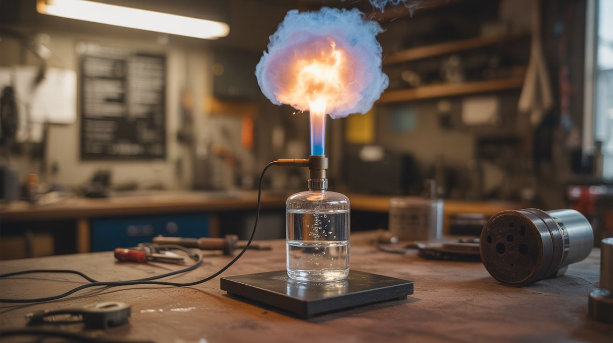

# #159 — Hydrogen Generator

  

> Water + lye + DC power = hydrogen and oxygen gas. Capture the hydrogen, ignite it for a fireball. Electrolysis in action.

## Ratings

     

## 🧪 What Is It?

Electrolysis splits water into hydrogen and oxygen using electricity. Add lye (sodium hydroxide) to water to make it conductive, dip in two electrodes, apply DC voltage, and bubbles immediately form — hydrogen at the cathode, oxygen at the anode. Capture the hydrogen in an inverted container or balloon. Touch a flame to pure hydrogen and it burns with an almost invisible flame. Pop a hydrogen-filled balloon near a flame and you get a dramatic fireball with a deep WHOOMP. This is the most fundamental electrochemistry demonstration — splitting the most abundant molecule on Earth into its components using nothing but electricity and water.

<strong>🧰 Ingredients</strong>

- [ ] DC power supply — 12-24V, 3A+ (old laptop charger works) *(junk drawer)*
- [ ] Stainless steel plates or graphite rods — electrodes *(hardware store, pencil lead)*
- [ ] Sodium hydroxide (lye) — electrolyte *(hardware store as drain opener)*
- [ ] Plastic container — for the electrolysis cell *(dollar store)*
- [ ] Tubing — to collect gas *(hardware store, aquarium supply)*
- [ ] Balloons — to capture hydrogen *(party supply)*
- [ ] Inverted bottle — for gas collection over water *(kitchen)*
- [ ] Long lighter or match taped to a stick *(hardware store)*
- [ ] Safety goggles *(hardware store)*
- [ ] Gloves *(hardware store)*

## 🔨 Build Steps

1. **Build the electrolysis cell.** Mount two stainless steel plates (or graphite rods) parallel to each other, about 1 inch apart, in a plastic container. Secure them so they don't touch. Connect wires to each plate.
2. **Mix the electrolyte.** Dissolve 2-3 tablespoons of lye in warm water to fill the container. Pure water barely conducts electricity — the lye provides ions that carry current between the electrodes. More lye = more current = more gas production.
3. **Connect the power.** Attach the positive wire to one electrode (anode, produces oxygen) and negative to the other (cathode, produces hydrogen). Apply 12-24V DC. Bubbles should immediately start forming on both electrodes.
4. **Identify the gases.** The cathode (negative) produces TWICE as much gas as the anode — this is hydrogen (H2). The anode produces oxygen (O2). In water (H2O), there are two hydrogens for every oxygen, so the volume ratio is 2:1.
5. **Collect hydrogen — SEPARATELY from oxygen.** Place an inverted water-filled bottle over the **cathode only**. As hydrogen bubbles rise, they displace the water and fill the bottle. Alternatively, attach tubing to a funnel over the cathode and route it into a balloon. **Critical: collect gas from the cathode ONLY.** Do NOT use a single container to collect gas from both electrodes — hydrogen and oxygen mixed at a 2:1 ratio is a detonation hazard. Keep the electrodes far enough apart (at least 2 inches) that their bubble streams don't merge. If using a small container, consider a physical barrier (e.g., a submerged divider) between the two electrodes.
6. **Test for hydrogen.** Outdoors, hold a lit match or lighter at the mouth of an inverted bottle of collected gas. Pure hydrogen ignites with a quiet "pop" and an almost invisible flame. If the gas detonates loudly, it's mixed with oxygen — **stop and redesign your collection method to better separate the two gas streams.** A loud detonation means you're collecting a dangerous explosive mixture.
7. **Balloon fireball.** Fill a balloon with collected hydrogen. Tie it off. Attach a long string. Using a long lighter or match on a stick (from at least arm's length), ignite the balloon. The hydrogen fireball is dramatic, with a deep percussive WHOOMP sound.
8. **Optimize the cell.** More electrode surface area = more gas. Closer electrode spacing = more efficient (but too close and you risk mixing gases). Higher voltage = faster production. The gas can also be fed to a hydrogen torch tip for a clean-burning flame.

## ⚠️ Safety Notes

- Hydrogen is EXTREMELY flammable and explosive when mixed with air at concentrations of 4-75%. Never collect hydrogen in a sealed container that could build pressure. Always collect over water or in open balloons. Never accumulate large quantities indoors.
- Keep ALL ignition sources away from the electrolysis cell and collection apparatus. The gases are produced at the electrode surfaces — a spark near the cell could ignite the gases before they're collected.
- Sodium hydroxide (lye) is caustic and causes severe burns on skin and eyes. Wear gloves and goggles when handling. If lye solution contacts skin, flush immediately with running water for 15 minutes.

## 🔗 See Also

- [Calcium Carbide Cannon](../pyro-and-chemistry/116-calcium-carbide-cannon.md)
- [Electroplating Station](156-electroplating-station.md)

**References:**
- [Chemicals Reference](../../reference/chemicals.md)
