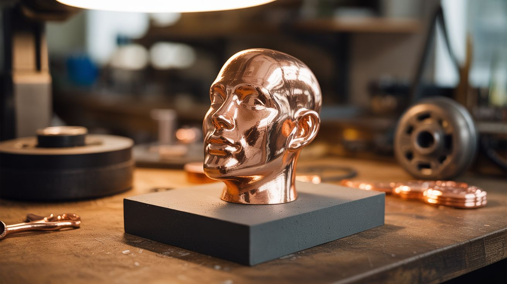

# #160 — Electroforming Art

  

> Heavy copper buildup on wax or 3D printed molds — dissolve the mold and you have hollow copper sculptures. Jewelers charge hundreds.

## Ratings

     

## 🧪 What Is It?

Electroplating deposits a thin coating. Electroforming deposits a THICK one — thick enough to be structural. Create a form from wax, 3D printed PLA, or any dissolvable material. Paint it with conductive coating, then electroplate for days or weeks until you've built up 1-2mm of solid copper. Then dissolve or melt out the internal form, and you're left with a hollow copper shell — a copper sculpture that perfectly reproduces every detail of the original. Jewelers use this technique to create copper-wrapped crystals, leaves, and pendants that sell for $50-200 each. Artists create hollow copper skulls, geometric forms, and organic shapes. The copper is real, solid, and permanent.

<strong>🧰 Ingredients</strong>

- [ ] Copper sulfate — large quantity, this process consumes copper *(hardware store, online bulk)*
- [ ] Sulfuric acid (optional) — improves deposit quality at larger scale *(auto parts store)*
- [ ] Copper anode — thick copper sheet or pipe *(plumbing supply)*
- [ ] DC power supply — adjustable, low voltage (1-3V), moderate current *(electronics supplier)*
- [ ] Conductive paint or graphite spray *(electronics supplier, art supply)*
- [ ] Wax, PLA 3D prints, or found objects — the forms to electroform *(craft store, workshop)*
- [ ] Large plastic tub — for the plating bath *(dollar store)*
- [ ] Aquarium heater — to maintain bath temperature *(pet store)*
- [ ] Copper wire — for hanging and electrical connections *(hardware store)*
- [ ] Lacquer or sealant — for finishing *(hardware store)*

## 🔨 Build Steps

1. **Create the form.** Sculpt your design in wax, or 3D print it in PLA. The form should be the exact shape of the final copper piece — every detail will be reproduced. Wax is easiest to remove later; PLA can be dissolved in sodium hydroxide or left inside.
2. **Make it conductive.** Apply 3-4 coats of graphite spray or conductive copper paint to the entire surface. Every square millimeter must be conductive — any gap will remain unplated. Use a brush for tight areas the spray can't reach.
3. **Prepare the plating bath.** Mix a concentrated copper sulfate solution (saturated — as much as will dissolve). Add a small amount of sulfuric acid if desired (improves crystal structure of the deposit). Set up the aquarium heater to maintain 70-80°F.
4. **Suspend the form.** Hang the conductive form in the bath using copper wire connected to the negative terminal. Position copper anodes around the form (positive terminal). The anodes should surround the form for even deposition from all sides.
5. **Plate slowly.** Set the power supply to 1-2V. Low voltage = dense, smooth copper deposits. High voltage = rough, porous deposits that look bad. Electroforming is a patience game — the copper builds up at roughly 0.001 inches per hour. A structural thickness (1-2mm) takes 24-72 hours.
6. **Monitor and rotate.** Check the form every 8-12 hours. Rotate it in the bath to ensure even coverage on all sides. Areas facing the anodes plate faster. Touch up thin spots with additional conductive paint if needed.
7. **Remove from bath.** When the copper layer is thick enough to be self-supporting (test by gently flexing an edge), remove the piece from the bath and rinse thoroughly.
8. **Remove the internal form.** For wax: heat the piece carefully and pour out the melted wax. For PLA: soak in sodium hydroxide solution for 24-48 hours (dissolves PLA but not copper). For found objects (crystals, flowers): they often stay inside permanently.
9. **Finish the piece.** Polish with fine sandpaper and metal polish for a mirror finish. Apply patina chemicals for an aged look. Seal with lacquer to prevent oxidation. The finished piece is solid copper and will last centuries.

## ⚠️ Safety Notes

> **Spicy Level 3 build.** Read the [Safety Guide](../../docs/safety/README.md) and [Chemical Safety](../../docs/safety/chemicals.md), [Fire & Pyro Safety](../../docs/safety/fire-and-pyro.md), [High Voltage Safety](../../docs/safety/high-voltage.md) before starting.

- Copper sulfate solution is toxic. The addition of sulfuric acid makes it caustic as well. Wear gloves, goggles, and a lab apron. Work in a ventilated area. Keep away from food, children, and pets.
- Electroforming runs for days unattended. Ensure the setup is stable and can't be knocked over. A spilled acid bath creates a dangerous mess. Place the tub in a secondary containment tray.
- Dissolving PLA in sodium hydroxide produces heat and fumes. Do this outdoors or under a fume hood with proper PPE.

## 🔗 See Also

- [Electroplating Station](156-electroplating-station.md)
- [Copper Crystal Tree](161-copper-crystal-tree.md)

**References:**
- [Chemicals Reference](../../docs/reference/chemicals.md)
