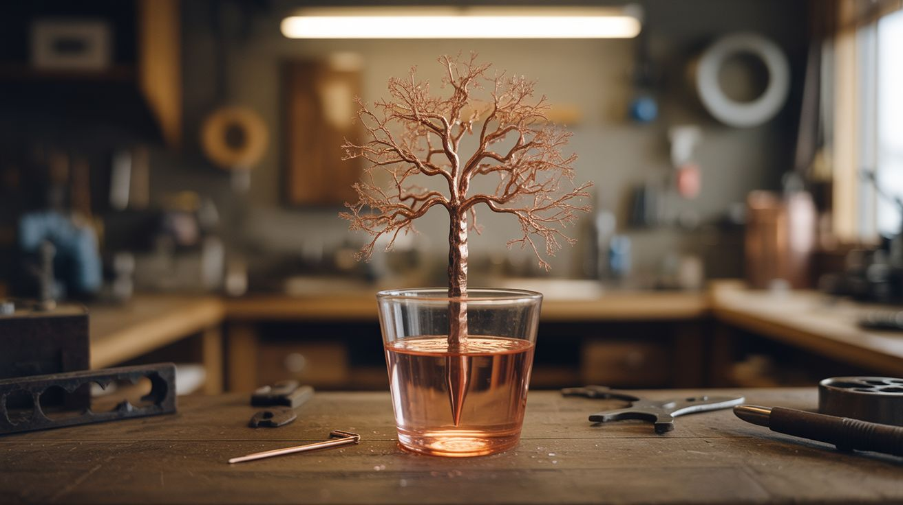

# #161 — Copper Crystal Tree

  

> Drop an iron nail in copper sulfate solution — iron displaces copper, depositing dendritic crystal branches over hours. Time-lapse it.

## Ratings

     

## 🧪 What Is It?

Iron is more reactive than copper in the electrochemical series. When you place an iron nail in a copper sulfate solution, the iron dissolves and copper precipitates out of the solution, depositing on the nail's surface as metallic copper. Over hours, the copper doesn't form a smooth coating — it grows as dendritic crystals that branch outward like a tree. The "tree" is pure copper metal, grown atom by atom through a displacement reaction. Set up a camera for a time-lapse and the growth looks like a living organism. The deep blue solution slowly fades as copper leaves the solution and builds the crystal structure. It's chemistry you can watch happen in real time.

<strong>🧰 Ingredients</strong>

- [ ] Copper sulfate — 2-3 tablespoons *(hardware store as root killer)*
- [ ] Iron nail — clean, ungalvanized *(hardware store)*
- [ ] Glass jar or beaker — for a clear view of the growth *(kitchen, lab supply)*
- [ ] Warm water *(tap)*
- [ ] Camera + tripod — for time-lapse *(already own)*
- [ ] Sandpaper — to clean the nail *(hardware store)*

## 🔨 Build Steps

1. **Prepare the solution.** Dissolve 2-3 tablespoons of copper sulfate in a glass jar of warm water. Stir until fully dissolved. The solution should be a vivid blue color. More concentrated = faster growth but coarser crystals.
2. **Clean the nail.** Sand the iron nail with fine sandpaper to remove any coating, oxide, or grease. A clean iron surface is essential for the reaction to start evenly. Handle the cleaned nail with clean hands or tweezers.
3. **Suspend the nail.** Lower the clean iron nail into the copper sulfate solution. You can lay it on the bottom, lean it against the jar wall, or suspend it on a string from the rim for the best visual effect.
4. **Watch the displacement.** Within minutes, you'll see the nail's surface turn copper-colored as metallic copper deposits. Over the next 1-6 hours, dendritic copper crystals begin to branch outward from the nail's surface, growing like a metallic tree.
5. **Set up the time-lapse.** Position a camera on a tripod aimed at the jar. Set it to capture one frame every 30-60 seconds. Over 6-12 hours, you'll have footage of the copper tree growing from nothing. Backlighting the jar makes the blue solution and copper crystals pop on camera.
6. **Observe the color change.** As copper leaves the solution and deposits on the nail, the blue color fades (copper sulfate is blue; iron sulfate is pale green). The nail itself gets smaller as iron dissolves. Mass is conserved — iron atoms leave, copper atoms arrive.
7. **Harvest the crystal.** Once growth has slowed (usually 12-24 hours), carefully remove the nail and its copper crystal tree from the solution. Rinse gently — the dendritic crystals are fragile. Let it dry.
8. **Preserve the crystal.** Spray with a thin coat of clear lacquer to prevent the copper from oxidizing. Display in a shadow box or on a stand. The crystal structure is beautiful under a magnifying glass, showing fractal branching at every scale.

## ⚠️ Safety Notes

- Copper sulfate is toxic if ingested. Wear gloves when handling the solution. Do not use drinking glasses — label the jar clearly. Keep away from children and pets. Dispose of the spent solution responsibly (not down the drain).
- The reaction produces iron sulfate in solution, which can stain surfaces greenish-brown. Place the jar on a tray to catch any drips.
- Do not use galvanized (zinc-coated) nails. The zinc reacts preferentially and contaminates the copper deposit, producing a messy gray mass instead of clean copper crystals.

## 🔗 See Also

- [Bismuth Crystal Garden](../pyro-and-chemistry/107-bismuth-crystal-garden/)
- [Electroplating Station](156-electroplating-station/)

