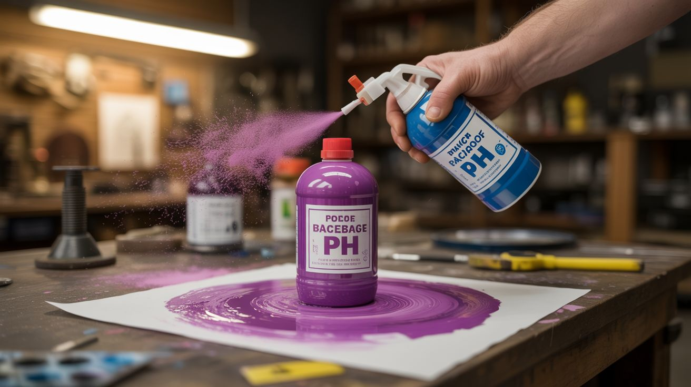

# #163 — pH Reactive Paint

  

> Red cabbage juice is a natural pH indicator — paint with it, then spray vinegar for pink or baking soda for blue. Invisible art revealed by chemistry.

## Ratings

     

## 🧪 What Is It?

Red cabbage contains anthocyanin, a natural pigment that changes color based on pH. It's bright pink in acid, purple at neutral, blue-green in mild base, and yellow in strong base. Boil red cabbage, strain the juice, and you have a natural pH-indicating paint. Paint a picture, message, or design on paper or fabric. The dried paint is barely visible — a faint purplish tint. Now spray the surface with vinegar (acid) and the paint turns vivid pink. Spray with baking soda solution (base) and it turns blue-green. The same painting displays completely different colors depending on what you spray on it. It's invisible ink meets interactive art, powered by nothing but kitchen chemistry.

<strong>🧰 Ingredients</strong>

- [ ] Red cabbage — one head *(grocery store)*
- [ ] White vinegar — the acid activator *(grocery store)*
- [ ] Baking soda — the base activator *(grocery store)*
- [ ] Spray bottles — one per activator *(dollar store)*
- [ ] Watercolor paper or white cotton fabric — the canvas *(art supply)*
- [ ] Paint brushes *(art supply)*
- [ ] Pot for boiling *(kitchen)*
- [ ] Strainer *(kitchen)*

## 🔨 Build Steps

1. **Extract the indicator.** Chop a red cabbage into chunks and boil in water for 20-30 minutes until the water turns deep purple. Strain out the cabbage pieces. The purple liquid is your pH-indicator paint. Let it cool.
2. **Prepare the activator sprays.** Fill one spray bottle with white vinegar (acid activator). Fill another with a baking soda solution (2 tablespoons per cup of water — base activator). Label them clearly.
3. **Paint your design.** Using brushes, paint with the cabbage juice on watercolor paper or white fabric. The wet paint is purple but dries to a very faint, nearly invisible purple tint. Paint boldly — the design should be easy to see when activated.
4. **Let it dry completely.** Dry the painting thoroughly. Use a hair dryer to speed this up. The indicator needs to be dry before activation, otherwise the activator solutions dilute and blur the image.
5. **Activate with acid.** Spray the vinegar activator across the painting. Wherever the cabbage juice paint is, it turns vivid pink/red instantly. The unpainted areas are unaffected. The hidden design is revealed in pink.
6. **Neutralize and re-activate.** Let the vinegar dry or blot it. Now spray the baking soda activator over the same painting. The pink areas shift through purple to blue to blue-green. The same design now appears in a completely different color.
7. **Create layered reveals.** Paint different parts of the design at different concentrations. Thin paint reacts differently than thick paint, creating depth and tonal variation when activated. Multiple layers create watercolor-like effects.
8. **Interactive art installation.** Mount the paintings on a wall with spray bottles for viewers to activate them themselves. Each person's spray pattern reveals the art differently. The paintings can be re-activated repeatedly.

## ⚠️ Safety Notes

- All materials (cabbage juice, vinegar, baking soda) are non-toxic and food-safe. This is one of the safest chemistry experiments possible. However, cabbage juice stains can be persistent on clothing and surfaces.
- Vinegar and baking soda are individually harmless, but mixing them in large quantities in a sealed container produces CO2 gas and pressure. Keep them in separate, labeled spray bottles. Never mix in a sealed vessel.
- Red cabbage juice spoils after a few days at room temperature. Store unused juice in the refrigerator (lasts 1-2 weeks) or freeze in ice cube trays for long-term storage.

## 🔗 See Also

- [Thermochromic Paint](../pyro-and-chemistry/119-thermochromic-paint.md)
- [Sodium Silicate Demos](164-sodium-silicate-demos.md)

**References:**

- [Chemicals Reference](../../docs/reference/chemicals.md)
