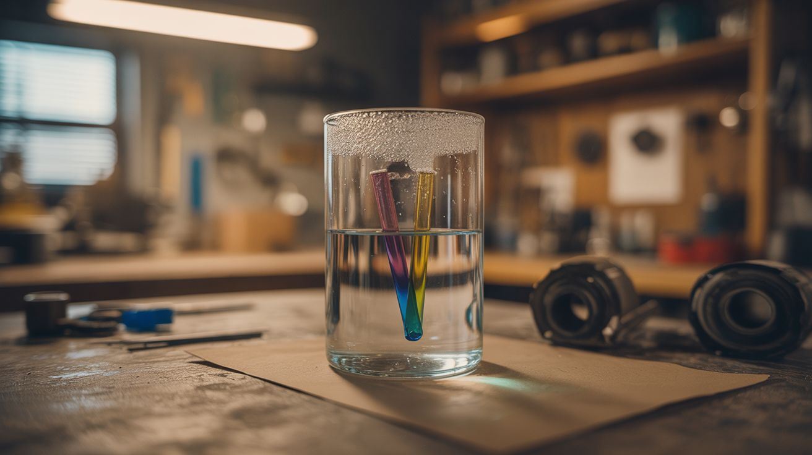

# #164 — Sodium Silicate Demos

  

> Water glass: coat paper for a fireproof demo, or pour metal salts into the solution for a chemical garden of growing colorful tubes.

## Ratings

     

## 🧪 What Is It?

Sodium silicate (water glass) is a liquid glass solution used in industry for fireproofing, adhesives, and water treatment. It enables two spectacular demonstrations. First: coat paper or fabric in sodium silicate and it becomes fireproof — hold a flame to it and it chars but doesn't burn. Second: pour sodium silicate solution into a jar, then drop in crystals of metal salts (copper sulfate, iron sulfate, cobalt chloride, nickel sulfate). The salts react with the silicate to form semi-permeable membranes that grow upward as colorful tubes and tendrils — a "chemical garden" that looks like an alien undersea landscape. Each metal salt produces a different color, and the tubes grow over minutes to hours.

<strong>🧰 Ingredients</strong>

- [ ] Sodium silicate solution (water glass) — available as concrete sealer *(hardware store, online)*
- [ ] Metal salt crystals — copper sulfate (blue), iron sulfate (green), cobalt chloride (purple), nickel sulfate (green), manganese sulfate (pink) *(chemistry supplier, hardware store)*
- [ ] Tall glass jar — for the chemical garden *(kitchen, thrift store)*
- [ ] Paper or cotton fabric — for the fireproof demo *(office supply, old t-shirt)*
- [ ] Lighter or candle — for the fire test *(junk drawer)*
- [ ] Tongs — for holding the fireproof paper *(kitchen)*

## 🔨 Build Steps

1. **Fireproof paper demo.** Soak a piece of paper or cotton fabric in undiluted sodium silicate solution. Hang it to dry completely — it dries to a stiff, glassy coating. Hold the treated paper with tongs over a candle flame. The paper chars and turns black but does NOT ignite or flame. Compare with an untreated piece that burns instantly.
2. **Prepare the chemical garden jar.** Pour sodium silicate solution into a tall glass jar, filling it about 3/4 full. If the solution is too viscous, dilute with a small amount of water. The solution should be thick but pourable.
3. **Grow the garden.** Carefully drop crystals of different metal salts into the sodium silicate solution. Use a separate crystal for each color — don't mix the salts. The crystals sink to the bottom and immediately begin reacting.
4. **Watch the growth.** A semi-permeable silicate membrane forms around each crystal. Water osmosis pushes through the membrane, building pressure. The membrane ruptures and a new tube of precipitate grows upward from the break. The tubes continue growing as osmotic pressure pushes more solution upward.
5. **Observe the colors.** Each metal produces a characteristic color: copper sulfate = blue tubes, iron sulfate = brown/green, cobalt chloride = purple, nickel sulfate = bright green, manganese sulfate = pink/white. Multiple crystals create a multicolored undersea forest.
6. **Time-lapse the growth.** Set up a camera to capture the garden growing. Most of the dramatic growth happens in the first 1-2 hours. The time-lapse reveals the organic, almost biological growth pattern of the silicate tubes.
7. **Preserve the garden.** Once growth stops (12-24 hours), carefully decant the sodium silicate solution and slowly add water to rinse. The silicate tubes are fragile and will dissolve if disturbed too aggressively. A gentle rinse stabilizes them.
8. **Display.** Fill the jar with fresh water for display. The garden is fragile and will slowly dissolve over weeks, but it looks stunning while it lasts. For permanent preservation, replace water with clear resin and let it cure.

## ⚠️ Safety Notes

- Sodium silicate is a strong base (pH ~12) that irritates skin and eyes. Wear gloves when handling. If it contacts skin, wash immediately with water. It dries to a glassy, hard-to-remove coating on surfaces — protect your work area.
- The metal salt crystals used for the chemical garden are toxic (especially cobalt and nickel compounds). Handle with gloves. Do not ingest. Dispose of the spent solution according to local hazardous waste guidelines.
- The fireproof demo involves open flame. Perform over a non-flammable surface. Even though the treated paper doesn't burn, the untreated comparison piece does. Have water nearby.

## 🔗 See Also

- [pH Reactive Paint](163-ph-reactive-paint.md)
- [Instant Ice Sculpture](../pyro-and-chemistry/108-instant-ice-sculpture.md)

**References:**
- [Appliance Teardown Guide](../../docs/reference/appliance-teardown-guide.md)
- [Technical Glossary](../../docs/reference/glossary.md)
- [Chemicals Reference](../../docs/reference/chemicals.md)
