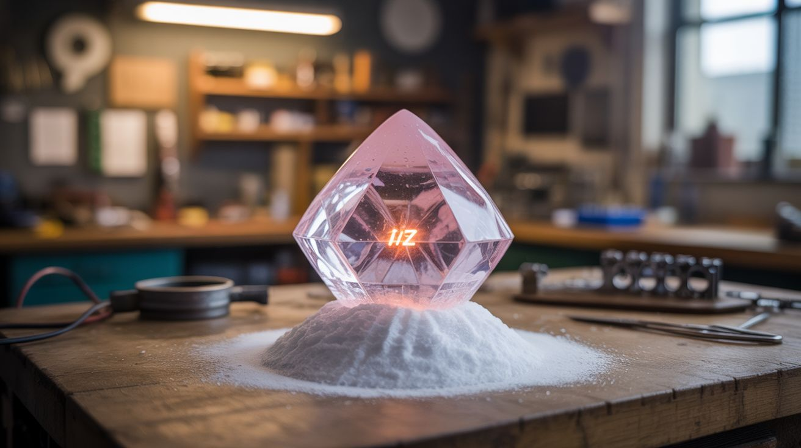

# #165 — Rochelle Salt Crystal

  

> Grow a piezoelectric crystal from cream of tartar and baking soda — squeeze it and an LED flashes. Electricity from a kitchen-grown crystal.

## Ratings

     

## 🧪 What Is It?

Rochelle salt (potassium sodium tartrate) is one of the strongest known piezoelectric materials — squeeze it and it generates voltage. It's also trivially easy to make from two kitchen ingredients: cream of tartar and baking soda. Dissolve them, heat, filter, and slowly evaporate to grow large transparent crystals. Wire two copper electrodes to opposite faces of a crystal, connect an LED, and squeeze. The LED flashes. You just generated electricity from a crystal you grew in your kitchen. This is the same piezoelectric effect that makes lighters click, microphones work, and quartz watches keep time. Growing the crystal takes patience (days to weeks for a large one), but the payoff — visible electricity from hand-pressure on a homemade crystal — is pure magic.

<strong>🧰 Ingredients</strong>

- [ ] Cream of tartar (potassium bitartrate) — 200g *(grocery store)*
- [ ] Baking soda (sodium bicarbonate) — 100g *(grocery store)*
- [ ] Distilled water *(grocery store)*
- [ ] Saucepan *(kitchen)*
- [ ] Coffee filter or lab filter paper *(kitchen, lab supply)*
- [ ] Clean glass jar — for growing the crystal *(kitchen)*
- [ ] Thin copper sheet or foil — for electrodes *(hardware store)*
- [ ] LED — low-voltage, high-brightness *(electronics supplier)*
- [ ] Thin wire *(electronics supplier)*
- [ ] Nylon fishing line — to suspend the seed crystal *(sporting goods)*

## 🔨 Build Steps

1. **Synthesize Rochelle salt.** Heat 1 liter of water to boiling. Dissolve 200g of cream of tartar (it barely dissolves in cold water but dissolves readily in hot). Slowly add baking soda — it fizzes violently. Add until the fizzing stops completely. The reaction produces sodium potassium tartrate (Rochelle salt).
2. **Filter the solution.** Filter the hot solution through a coffee filter to remove any undissolved particles. Pour the clear solution into a clean glass jar.
3. **Get seed crystals.** Let the solution cool and sit overnight. Small crystals form on the bottom and sides. Select the clearest, most well-formed crystal as your seed. Discard the rest or dissolve them back.
4. **Grow the main crystal.** Tie the seed crystal to a nylon line and suspend it in a fresh batch of warm, saturated Rochelle salt solution. Place in a quiet spot at room temperature. Cover with a paper towel (allows evaporation, blocks dust). The crystal grows as the solution slowly evaporates and concentrates.
5. **Be patient.** A good crystal takes 1-4 weeks to reach usable size (1-2 cm on a side). Faster evaporation = faster growth but cloudier crystals. Slower = clearer but takes longer. Remove the crystal if the solution gets cloudy and re-filter.
6. **Prepare the crystal.** Once the crystal is large enough, remove it from the solution and dry it carefully. The crystal is water-soluble, so avoid prolonged contact with wet hands.
7. **Attach electrodes.** Cut two small squares of thin copper sheet. Glue them to opposite flat faces of the crystal using conductive epoxy or simply press them on with tape. Solder thin wires to each copper electrode.
8. **Connect the LED.** Wire the LED across the two electrode leads. The polarity doesn't matter — a piezoelectric crystal produces AC voltage, so the LED will flash on either polarity of the squeeze/release cycle.
9. **Generate electricity.** Squeeze the crystal firmly between your fingers. The LED flashes visibly. The harder the squeeze, the brighter the flash. Release, and the voltage reverses, which may produce a second flash depending on the LED type.

## ⚠️ Safety Notes

- Rochelle salt crystals dissolve in water. Keep them dry. Protect from humidity with a coat of clear nail polish or lacquer if displaying long-term. A dissolved crystal cannot be re-formed into the same shape.
- The voltages generated by squeezing are tiny (a few volts at microamp currents) — there is no shock hazard from the crystal itself. However, the crystal can produce sharp edges when it breaks. Handle with care.
- Cream of tartar and baking soda are non-toxic kitchen ingredients. This is one of the safest chemistry projects possible. The only risk is the hot water when making the solution — use standard kitchen safety around boiling water.

## 🔗 See Also

- [Copper Crystal Tree](161-copper-crystal-tree.md)
- [Instant Ice Sculpture](../pyro-and-chemistry/108-instant-ice-sculpture.md)

**References:**
- [Chemicals Reference](../../docs/reference/chemicals.md)
