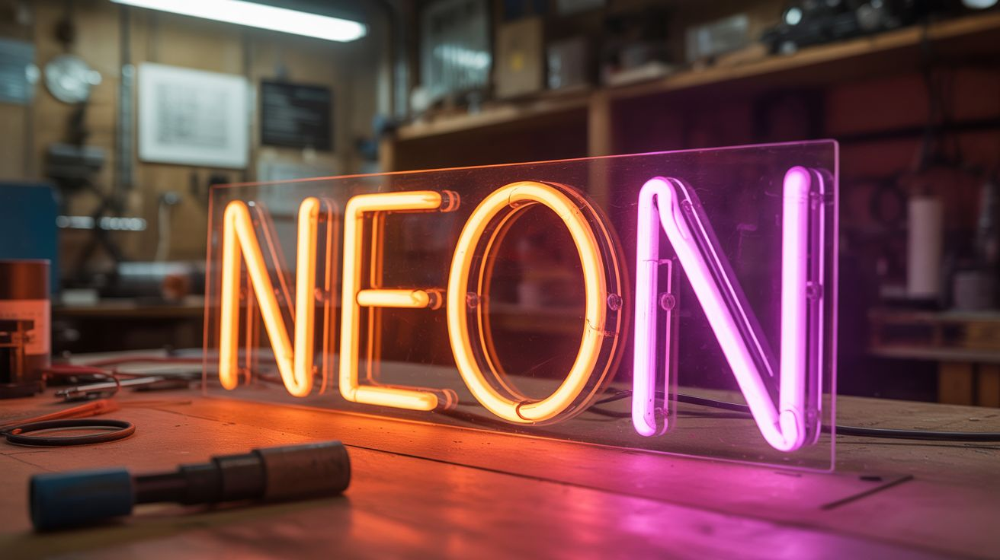

# #166 — DIY Neon Sign

  

> Bend glass tubing, fill with gas, seal, and apply high voltage — real neon glows orange, argon glows purple. Hand-bent custom neon signs.

## Ratings

     

## 🧪 What Is It?

Real neon signs are glass tubes filled with gas that glows when high voltage excites the gas atoms. Neon gas glows orange-red. Argon glows lavender-purple. Phosphor coatings inside the tube can produce any color. Commercial neon signs cost $200-1000+ and are made by skilled glassblowers. Learning to bend glass tubing yourself (with a ribbon burner or cross-fire torch) opens up the ability to create custom neon art. This is the most difficult build in this section — real glassblowing, vacuum systems, and high-voltage electronics. But the result is a genuine handmade neon sign that glows with the same warm, analog light that's been captivating humans since 1910.

<strong>🧰 Ingredients</strong>

- [ ] Borosilicate glass tubing — 8-12mm diameter *(scientific glass supplier)*
- [ ] Ribbon burner or crossfire torch — for bending glass *(glassblowing supplier)*
- [ ] Neon sign transformer — 15kV, 30-60mA *(sign supply, online)*
- [ ] Vacuum pump — to evacuate the tubes *(lab supply, HVAC supply)*
- [ ] Gas source — neon, argon, or neon/argon mix *(specialty gas supplier)*
- [ ] Electrodes — tubulated, sealed into tube ends *(neon sign supply)*
- [ ] Manifold and stopcocks — for vacuum and gas filling *(lab glass supply)*
- [ ] Phosphor coating (optional) — for colors beyond the gas's native emission *(neon sign supply)*
- [ ] Torch tip kit and fuel (propane/MAPP) *(hardware store)*
- [ ] GTO wire — high-voltage wire for connections *(sign supply)*

## 🔨 Build Steps

1. **Design your sign.** Start with a simple shape — a heart, star, or short word. Complex curves and tight bends come with experience. Draw the design full-size on paper as a template.
2. **Learn to bend glass.** Practice bending scrap glass tubing over the ribbon burner. Heat a section evenly until it glows orange, then bend smoothly. The glass must be uniformly hot or it kinks. This is the hardest skill in the build — expect to break many tubes before achieving clean bends.
3. **Bend the design.** Following your paper template, bend the glass tubing into your design shape. Make bends one at a time, letting the glass cool between bends. Complex designs require multiple separate tube sections joined together.
4. **Attach electrodes.** Seal tubulated electrodes into each end of the tube using a glass-to-glass seal at the torch. The electrodes are metal shells with glass-sealed leads that provide electrical contact with the gas inside.
5. **Evacuate the tube.** Connect one tubulation to the vacuum pump. Pump the tube down to below 1 torr (very low pressure). While pumping, gently heat the tube with a soft flame to drive out adsorbed water and contaminants (bombarding). This is critical for a clean fill.
6. **Fill with gas.** Close the pump valve and open the gas valve. Slowly admit neon, argon, or a mixture into the evacuated tube to a pressure of 8-15 torr (well below atmospheric). The exact pressure affects the glow characteristics — lower pressure = wider glow, higher = brighter.
7. **Seal the tube.** Using the torch, carefully heat and collapse the tubulation to seal the gas inside permanently. The tube is now a closed system with low-pressure gas and two electrodes.
8. **Wire the transformer.** Connect the high-voltage output of the neon sign transformer to the electrodes via GTO wire. Neon transformers output 15,000V at low current — enough to ionize the gas and produce the glow.
9. **Light it up.** Power on the transformer. The gas ionizes and the tube glows. Neon = warm orange-red. Argon = cool lavender-purple. Argon with mercury = bright blue. Phosphor-coated tubes produce virtually any color.
10. **Mount and display.** Mount the sign on a backing board using glass tube supports. Conceal the transformer behind the backing. Add a dimmer for ambiance control. Hang on the wall and bask in the warm glow of gas-discharge lighting you made with your own hands.

## ⚠️ Safety Notes

> **Spicy Level 3 build.** Read the [Safety Guide](../../safety/README.md) and [Chemical Safety](../../safety/chemicals.md), [Fire & Pyro Safety](../../safety/fire-and-pyro.md), [High Voltage Safety](../../safety/high-voltage.md) before starting.

- Neon sign transformers output 15,000 VOLTS. This is lethal. Never touch the electrodes or GTO wire while the transformer is energized. Always disconnect power before working on connections. Use insulated tools only. This is NOT a beginner project — respect the voltage.
- Glassblowing involves extreme heat and hot glass that looks identical to cold glass. Always assume glass is hot after working it. Wear safety glasses rated for infrared (didymium lenses ideal for glasswork). Burns are the most common glassblowing injury.
- The vacuum pump and gas filling system must be properly sealed. Gas leaks result in tubes that don't glow or glow dimly. Vacuum system leaks introduce air that contaminates the fill.

## 🔗 See Also

- [Vacuum Tube Amp](169-vacuum-tube-amp.md)
- [Ozone Generator](167-ozone-generator.md)

**References:**
- [Chemicals Reference](../../reference/chemicals.md)
