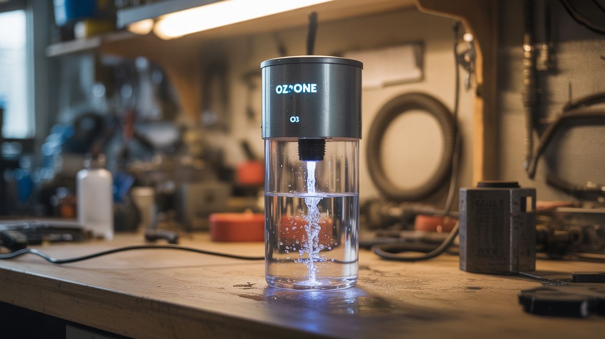

# #167 — Ozone Generator

  

> Corona discharge or UV creates ozone (O3) — bubbled through water, it purifies better than chlorine. Industrial water treatment tech on your bench.

## Ratings

     

## 🧪 What Is It?

Ozone (O3) is a powerful oxidizer — it destroys bacteria, viruses, and organic contaminants more effectively than chlorine, and it breaks down to plain oxygen (O2) after doing its work, leaving no chemical residue. Municipal water treatment plants use ozone generators costing millions. You can build one on your workbench. Two approaches: corona discharge (high voltage arcs through air convert O2 to O3) or UV (short-wavelength UV light splits O2 molecules, which recombine as O3). Bubble the ozone through water and it oxidizes contaminants, eliminates odors, and sterilizes. It's also used for removing odors from rooms, cars, and HVAC systems.

<strong>🧰 Ingredients</strong>

- [ ] High-voltage power source — neon sign transformer or flyback driver *(sign supply, salvaged from CRT TV)*
- [ ] Corona discharge plates or tube — stainless steel mesh with dielectric separator *(online, DIY from steel mesh + glass)*
- [ ] UV lamp (optional approach) — 185nm germicidal UV *(lab supply, online)*
- [ ] Air pump — aquarium-type *(pet store)*
- [ ] Silicone tubing — ozone degrades rubber, must use ozone-resistant tubing *(hardware store)*
- [ ] Air stone — to create fine bubbles in water *(pet store)*
- [ ] Glass container — for water treatment *(kitchen)*
- [ ] Ozone-safe enclosure — for the generator *(project box, glass jar)*

## 🔨 Build Steps

1. **Choose your approach.** Corona discharge produces more ozone but requires high voltage. UV is simpler but produces less ozone. For water purification, corona discharge is more practical. For odor elimination, either works.
2. **Build the corona discharge cell (if using HV).** Stack two stainless steel mesh plates separated by a thin glass dielectric (a microscope slide works). When high voltage is applied across the plates, corona discharge occurs in the air gap, converting O2 to O3. Enclose in a glass or plastic housing.
3. **Build the UV cell (if using UV).** Mount a 185nm germicidal UV bulb inside a tube. Air flows through the tube past the UV bulb, and the UV light converts O2 to O3. The tube should be opaque to UV from the outside — you don't want UV exposure.
4. **Set up the air flow.** Connect the aquarium pump to the input of the ozone cell using silicone tubing. Air is pumped through the cell, gets ozonated, and exits from the output. Use silicone or PTFE tubing throughout — ozone degrades rubber and vinyl.
5. **Connect to the air stone.** Route the ozonated air output to an air stone submerged in a glass container of water. The air stone creates fine bubbles that maximize ozone-water contact. The water bubbles and takes on a slight metallic taste as ozone dissolves.
6. **Test the output.** You can smell ozone at very low concentrations — it has a sharp, clean smell (the "after lightning" smell). If you can smell it strongly, the generator is working but also producing more than is safe to breathe. Operate in a ventilated area.
7. **Treat water.** Run the ozone through water for 10-15 minutes per liter. The ozone oxidizes dissolved organic compounds, kills bacteria, and breaks down to oxygen. Let the water sit for 30 minutes after treatment before drinking.
8. **Odor elimination mode.** For removing odors from a room or car, run the generator with the output open to the air. The ozone reacts with odor-causing compounds. Run for 30 minutes in an UNOCCUPIED space, then ventilate for 1 hour before re-entering.

## ⚠️ Safety Notes

> **Spicy Level 3 build.** Read the [Safety Guide](../../safety/README.md) and [Chemical Safety](../../safety/chemicals.md), [Fire & Pyro Safety](../../safety/fire-and-pyro.md), [High Voltage Safety](../../safety/high-voltage.md) before starting.

- Ozone is toxic to breathe at concentrations above 0.1 ppm. It causes respiratory irritation, chest pain, and lung damage. NEVER run an ozone generator in an occupied room. Treat the space while empty and ventilate thoroughly before re-entering. You should not be able to smell ozone — if you can, the concentration is too high.
- Corona discharge systems use high voltage (thousands of volts). Follow all high-voltage safety precautions. Insulate connections. Never touch the discharge cell while energized.
- Ozone degrades rubber, vinyl, and many plastics. Use only ozone-compatible materials: silicone, PTFE, stainless steel, glass. Check all tubing and fittings for compatibility.

## 🔗 See Also

- [Hydrogen Generator](159-hydrogen-generator.md)
- [DIY Neon Sign](166-diy-neon-sign.md)

**References:**
- [Chemicals Reference](../../reference/chemicals.md)
