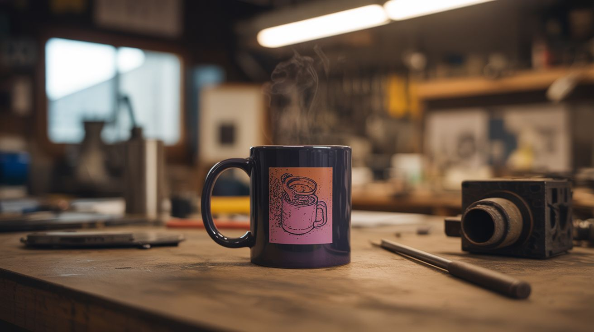

# #168 — Thermochromic Mug

  

> Thermochromic pigment screen-printed onto a mug — pour hot coffee and the design appears. Print heat-reactive shirts too.

## Ratings

     

## 🧪 What Is It?

Thermochromic pigment changes from opaque to transparent at a specific temperature. Print or paint it onto a white ceramic mug with a hidden design underneath, and the mug appears to be a single solid color. Pour hot coffee and the heat makes the thermochromic layer turn clear, revealing the hidden image underneath. Cold mug = solid color. Hot mug = design appears. The same technique works on t-shirts (body heat reveals hidden patterns), coasters, and greeting cards. Commercial color-changing mugs sell for $15-25 each. Make them for $3 in materials and sell them as custom products.

<strong>🧰 Ingredients</strong>

- [ ] Thermochromic pigment powder — activation temp ~95°F for body heat, ~150°F for hot drinks *(online specialty supplier)*
- [ ] White ceramic mugs — blank, matte finish works best *(dollar store, craft supply)*
- [ ] Screen printing ink base or clear acrylic medium — carrier for the pigment *(art supply)*
- [ ] Ceramic-safe markers or paint — for the hidden design underneath *(craft store)*
- [ ] Foam brushes or screen printing screen *(craft store)*
- [ ] Oven — for curing the finish *(kitchen)*
- [ ] Clear ceramic sealer — dishwasher-safe top coat *(craft store)*
- [ ] T-shirts — for heat-reactive clothing (optional) *(craft store, blank tee supplier)*
- [ ] Screen printing supplies — for fabric application (optional) *(art supply)*

## 🔨 Build Steps

1. **Create the hidden design.** Using ceramic-safe markers or paint, draw or print your design directly on the white mug. This is the image that will be revealed when the mug heats up. Let it dry completely and cure according to the marker/paint instructions.
2. **Mix the thermochromic coating.** Blend thermochromic pigment into clear acrylic medium or screen printing ink base at a ratio of about 1 part pigment to 5 parts medium. Mix thoroughly until the color is uniform and opaque.
3. **Apply the thermochromic layer.** Brush or screen print the thermochromic mixture over the entire surface covering the hidden design. Apply 2-3 thin, even coats, letting each coat dry between applications. The coating should be uniformly opaque, completely hiding the design underneath.
4. **Cure the coating.** For ceramic mugs, bake in a conventional oven at 300°F for 30 minutes to set the coating. For t-shirts, heat-set with an iron or heat press according to the ink base instructions. Proper curing ensures durability.
5. **Apply the sealer.** Coat with a thin layer of clear ceramic sealer to protect the thermochromic layer from scratches and washing. The sealer must be thin enough that heat transfers through it quickly — thick coats insulate and slow the color change.
6. **Test the effect.** Pour hot water into the mug. Within 10-20 seconds, the thermochromic layer becomes transparent, revealing the hidden design. As the mug cools, the design disappears again. The transition should be complete and dramatic.
7. **For t-shirts.** Screen print or brush the thermochromic mixture onto fabric. Hidden designs appear where body heat contacts the shirt — handprints, hidden messages, or patterns that emerge in warm environments. Cure with a heat press.

## ⚠️ Safety Notes

- Thermochromic pigments are generally non-toxic, but the mugs should not be considered food-safe unless all materials used (paint, medium, sealer) are specifically certified as food-safe and dishwasher-safe. When in doubt, apply the design only to the exterior of the mug.
- Baking the mug in an oven requires careful temperature control. Temperatures above 350°F can permanently damage the thermochromic pigment, causing it to lose its color-changing properties. Use an oven thermometer to verify.
- Thermochromic coatings degrade with UV exposure and aggressive dishwasher detergents over time. Hand washing extends the life of the color-changing effect. Inform anyone you sell or gift these mugs to.

## 🔗 See Also

- [Thermochromic Paint](../pyro-and-chemistry/119-thermochromic-paint.md)
- [pH Reactive Paint](163-ph-reactive-paint.md)

**References:**

- [Chemicals Reference](../../docs/reference/chemicals.md)
