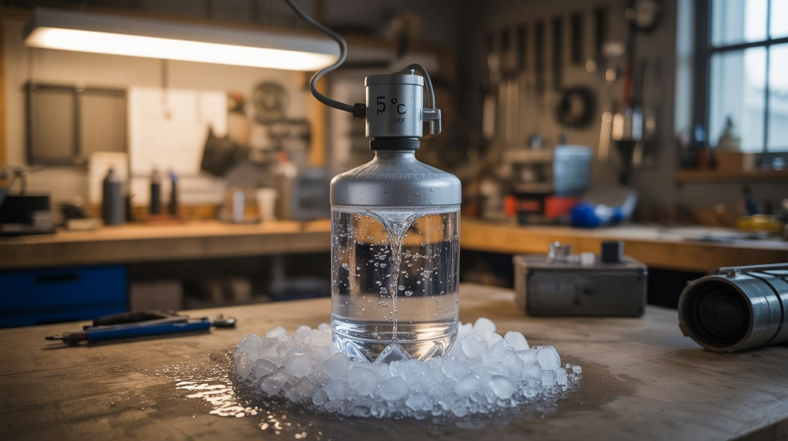

# #170 — Supercooled Water

  

> PID-controlled freezer keeps purified water at exactly -5°C — stays liquid below freezing. Pour it onto ice and it freezes INSTANTLY.

## Ratings

     

## 🧪 What Is It?

Water normally freezes at 0°C (32°F). But if the water is very pure (no dissolved minerals or particles) and cooled very gently (no vibration or disturbance), it can remain liquid below freezing. This is supercooling — the water is below its freezing point but hasn't started crystallizing because there's no nucleation site to trigger the phase change. Now pour this supercooled water onto a piece of ice. The ice provides the nucleation trigger and the water freezes INSTANTLY on contact, building an ice sculpture in real time. Tap a bottle of supercooled water and a crystallization wave propagates through the entire bottle in a second, turning it from liquid to slush before your eyes. It's the most visually stunning physics demonstration that uses nothing but water.

<strong>🧰 Ingredients</strong>

- [ ] Distilled or purified water — must be very pure, no minerals *(grocery store)*
- [ ] Clean plastic bottles — smooth interior, no scratches *(new, unused bottles)*
- [ ] Freezer — adjustable temperature, or a cooler with PID control *(already own, or build)*
- [ ] Arduino + temperature sensor (DS18B20) — for PID temperature control (optional) *(electronics supplier)*
- [ ] Relay — to control freezer compressor (optional) *(electronics supplier)*
- [ ] Thermometer — to verify temperature *(kitchen, lab supply)*
- [ ] Ice cubes — for the nucleation trigger *(freezer)*
- [ ] Bowl — for the pouring demonstration *(kitchen)*
- [ ] Camera — slow-motion captures the freezing beautifully *(phone or camera)*

## 🔨 Build Steps

1. **Prepare the water.** Use distilled or purified water only — mineral water and tap water contain dissolved particles that act as nucleation sites. Pour the water into clean, smooth plastic bottles. Don't use glass (scratches provide nucleation sites) or old bottles (internal scratches).
2. **Set the freezer temperature.** You need the freezer at exactly -5 to -7°C (23-19°F). Standard freezers run at -18°C, which is too cold — the water freezes normally. Adjust the thermostat to its warmest setting, or use a PID controller.
3. **Build a PID controller (optional).** For reliable results, connect a DS18B20 temperature sensor to an Arduino inside the freezer. The Arduino controls the freezer's compressor via a relay, maintaining a precise temperature. PID control prevents the temperature from oscillating past the target.
4. **Place bottles carefully.** Put the water bottles in the freezer, standing upright, and close the door gently. The bottles must not be disturbed during cooling. Vibration triggers nucleation and ruins the supercooling. Don't slam the freezer door.
5. **Wait patiently.** Leave the bottles undisturbed for 2-3 hours. The water cools to -5°C or below while remaining liquid. The exact time depends on your freezer temperature, bottle size, and water purity. Multiple bottles increase your chances — some may freeze normally.
6. **Test a bottle.** Gently open the freezer and carefully remove one bottle. Move it smoothly — any sudden jolt can trigger instant crystallization in your hand. If the water is still liquid, it's supercooled. If it's already frozen, adjust the temperature or wait less time.
7. **The pour demonstration.** Place a piece of ice in a bowl. Slowly pour the supercooled water onto the ice. On contact with the ice nucleation site, the water freezes instantly, building an ice mound that grows as you pour. The ice structure builds upward in real time.
8. **The tap demonstration.** Hold a supercooled bottle and give it a sharp tap on a table. A crystallization wave propagates through the water from the impact point. The entire bottle converts from clear liquid to opaque slush in about 1-2 seconds. Film this in slow motion — the wave front is clearly visible.
9. **Film everything.** Both demonstrations are incredibly photogenic. Slow-motion capture (240fps on most phones) reveals the crystallization front propagating through the water. Backlight the bottle for the best visibility of the wave.

## ⚠️ Safety Notes

- Standard kitchen freezers with manual temperature adjustment may not hold a precise-enough temperature. The water may freeze solid (too cold) or not supercool (not cold enough). A PID controller dramatically improves reliability.
- Supercooled water in glass bottles can freeze and expand, shattering the glass. Use plastic bottles only. Glass fragments in a freezer are dangerous and difficult to clean up completely.
- This demonstration requires patience and gentle handling. Frustrated shaking of bottles that "won't work" guarantees they won't — vibration is the enemy. Approach with calm, deliberate movements.

## 🔗 See Also

- [Instant Ice Sculpture](../pyro-and-chemistry/108-instant-ice-sculpture/)
- [Dry Ice Bubble Cauldron](../pyro-and-chemistry/120-dry-ice-bubble-cauldron/)

