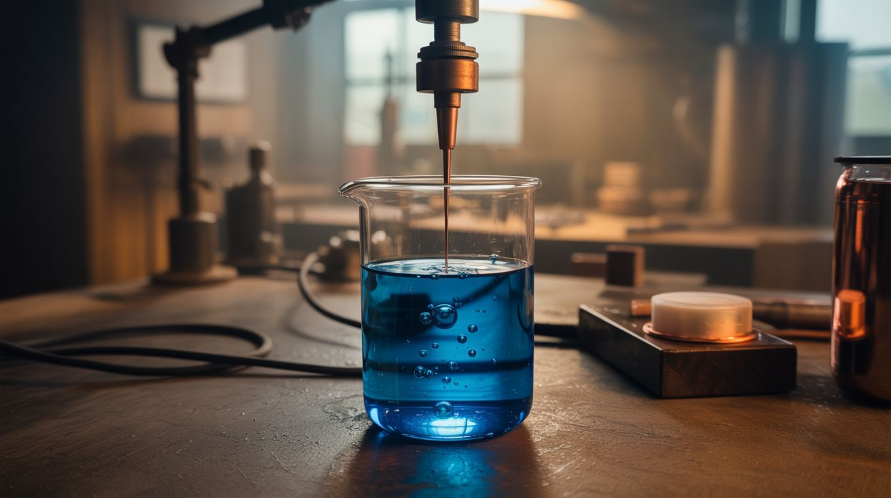

# ⚗️ Chemical & Electronic

  

  

> Electrons do chemistry. Chemistry makes electronics. This is the category where your workbench needs both a multimeter and safety goggles.

This is the overlap zone where electrons do chemistry and chemistry makes electronics. Electroplating turns any object into a copper sculpture. Anodizing creates colored aluminum. Ferric chloride etches custom circuit boards. Piezoelectric crystals grown in your kitchen generate electricity when squeezed. Neon gas glows when you run high voltage through it.

Every one of these processes is used in industry — plating, etching, gas discharge, water treatment. The difference is that industry does it in a factory and you're doing it on your workbench. The chemistry is the same. The results are the same. The satisfaction of doing it yourself is incomparably better.

---

## Builds

<a class="cat-card" href="156-electroplating-station.md">
#156Electroplating Station

Jaw

Brain

Wallet

Spicy

Clout

Time

</a>
<a class="cat-card" href="157-anodizing-setup.md">
#157Anodizing Setup

Jaw

Brain

Wallet

Spicy

Clout

Time

</a>
<a class="cat-card" href="158-pcb-etching-station.md">
#158PCB Etching Station

Jaw

Brain

Wallet

Spicy

Clout

Time

</a>
<a class="cat-card" href="159-hydrogen-generator.md">
#159Hydrogen Generator

Jaw

Brain

Wallet

Spicy

Clout

Time

</a>
<a class="cat-card" href="160-electroforming-art.md">
#160Electroforming Art

Jaw

Brain

Wallet

Spicy

Clout

Time

</a>
<a class="cat-card" href="161-copper-crystal-tree.md">
#161Copper Crystal Tree

Jaw

Brain

Wallet

Spicy

Clout

Time

</a>
<a class="cat-card" href="162-electrochemical-etching.md">
#162Electrochemical Etching

Jaw

Brain

Wallet

Spicy

Clout

Time

</a>
<a class="cat-card" href="163-ph-reactive-paint.md">
#163pH Reactive Paint

Jaw

Brain

Wallet

Spicy

Clout

Time

</a>
<a class="cat-card" href="164-sodium-silicate-demos.md">
#164Sodium Silicate Demos

Jaw

Brain

Wallet

Spicy

Clout

Time

</a>
<a class="cat-card" href="165-rochelle-salt-crystal.md">
#165Rochelle Salt Crystal

Jaw

Brain

Wallet

Spicy

Clout

Time

</a>
<a class="cat-card" href="166-diy-neon-sign.md">
#166DIY Neon Sign

Jaw

Brain

Wallet

Spicy

Clout

Time

</a>
<a class="cat-card" href="167-ozone-generator.md">
#167Ozone Generator

Jaw

Brain

Wallet

Spicy

Clout

Time

</a>
<a class="cat-card" href="168-thermochromic-mug.md">
#168Thermochromic Mug

Jaw

Brain

Wallet

Spicy

Clout

Time

</a>
<a class="cat-card" href="169-vacuum-tube-amp.md">
#169Vacuum Tube Amp

Jaw

Brain

Wallet

Spicy

Clout

Time

</a>
<a class="cat-card" href="170-supercooled-water.md">
#170Supercooled Water

Jaw

Brain

Wallet

Spicy

Clout

Time

</a>

---

### Suggested Build Order

Start with kitchen chemistry demos, progress toward precision fabrication:

1. **[#163 — pH-Reactive Paint](163-ph-reactive-paint.md)** — Minimal setup. Instant color-change chemistry.
2. **[#164 — Sodium Silicate Demos](164-sodium-silicate-demos.md)** — Simple solution chemistry foundation.
3. **[#168 — Thermochromic Mug](168-thermochromic-mug.md)** — Quick craft project with temperature-reactive materials.
4. **[#161 — Copper Crystal Tree](161-copper-crystal-tree.md)** — Teaches basic electrochemistry.
5. **[#159 — Hydrogen Generator](159-hydrogen-generator.md)** — Fastest electrolysis demo.
6. **[#162 — Electrochemical Etching](162-electrochemical-etching.md)** — Builds on electrolysis knowledge.
7. **[#170 — Supercooled Water](170-supercooled-water.md)** — Phase transition chemistry.
8. **[#156 — Electroplating Station](156-electroplating-station.md)** — Foundation equipment for downstream projects.
9. **[#167 — Ozone Generator](167-ozone-generator.md)** — Oxidation chemistry with electrical components.
10. **[#157 — Anodizing Setup](157-anodizing-setup.md)** — Controlled current management.
11. **[#158 — PCB Etching Station](158-pcb-etching-station.md)** — Precision chemistry application.
12. **[#165 — Rochelle Salt Crystal](165-rochelle-salt-crystal.md)** — Extended crystallization patience.
13. **[#160 — Electroforming Art](160-electroforming-art.md)** — Long-form electrochemical art.
14. **[#169 — Vacuum Tube Amp](169-vacuum-tube-amp.md)** — Vintage electronics + circuit design.
15. **[#166 — DIY Neon Sign](166-diy-neon-sign.md)** — Top tier: gas discharge + glass work. The endgame.

### Related Categories

- [Light & Visual](../light-and-visual/) — Gas discharge displays and lighting arts
- [Raspberry Pi & Arduino](../pi-and-arduino/) — Electrochemical sensing and control
- [Alchemist Cookbook](../alchemist-cookbook/) — Advanced chemistry-electronics crossovers

---

## 📚 Reference Guides

- [Accessible Chemicals Guide](../../docs/reference/chemicals.md)
- [Electronics & Microcontrollers](../../docs/reference/electronics-and-microcontrollers.md)
- [Tools Needed](../../docs/reference/tools-needed.md)
- [Sourcing Guide](../../docs/reference/sourcing-guide.md)
- [Difficulty & Ratings Guide](../../docs/reference/difficulty-guide.md)
