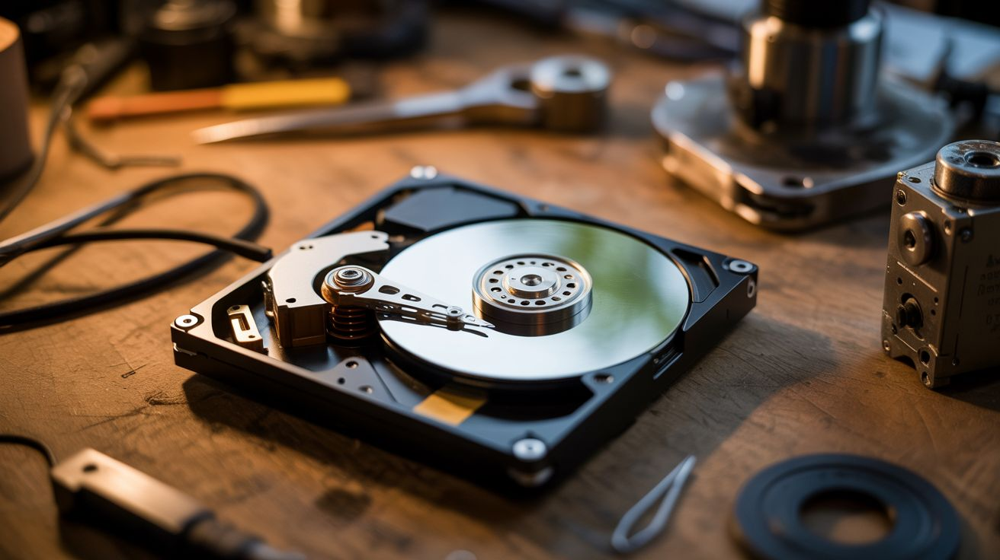

# #056 — Hard Drive Speaker

  

> The read/write arm in your dead hard drive is literally a speaker. Same voice coil tech. Just add music.

## Ratings

| Jaw Drop Rating | Brain Melt Level | Wallet Damage | Spicy Level | Clout Potential | Time to Build |
|---|---|---|---|---|---|
| ⭐⭐⭐ | ⭐⭐ | ⭐ | ⭐ | ⭐⭐⭐⭐ | ⭐ |

## What Is It?

A hard drive's read/write head moves using a voice coil actuator — the exact same technology inside every speaker on the planet. A coil of wire sits in a magnetic field, and when current flows through it, the coil moves. In a speaker, that moves a cone. In a hard drive, it moves the arm. Feed an amplified audio signal into the voice coil, and the arm vibrates. The platter acts as a sounding board, and the whole drive plays music. The sound is tinny and lo-fi, but unmistakably music coming from a hard drive. It's deeply weird and deeply satisfying.

## Ingredients

- [ ] Dead hard drive — 3.5" desktop drives work best, louder than 2.5" laptop drives *(e-waste bin, old PC)*
- [ ] Small audio amplifier module — PAM8403 or similar, $2 *(electronics supplier)*
- [ ] 3.5mm audio cable *(junk drawer)*
- [ ] 5V power source — USB cable or old phone charger *(junk drawer)*
- [ ] Torx T8 screwdriver — for opening the drive *(hardware store)*
- [ ] Soldering iron + solder *(workshop)*
- [ ] Audio source — phone, laptop, MP3 player *(already own)*

## Build Steps

1. **Open the hard drive.** Remove all visible Torx screws from the top cover, including any hidden under labels. Pry the cover off carefully. There's often a hidden screw under the center label — check for it.
2. **Identify the voice coil.** The read/write arm pivots on a bearing near the back of the drive. At the base of the arm, you'll see a flat coil of wire sitting between two powerful neodymium magnets. This is the voice coil actuator.
3. **Trace the voice coil wires.** Follow the thin flex cable from the voice coil back to the PCB connector. You need to find the two solder pads that connect to the coil. Use a multimeter on continuity mode — the coil typically reads 5-15 ohms.
4. **Disconnect the arm from the control board.** Either cut the flex cable near the PCB end or desolder the voice coil leads. You want direct access to just the coil wires.
5. **Solder leads to the voice coil.** Attach two thin wires to the voice coil pads. If using the flex cable, solder to the coil-side end of the cut cable.
6. **Wire up the amplifier.** Connect the amplifier module's speaker output to your two voice coil wires. Connect the amplifier's audio input to the 3.5mm cable. Power the amplifier from the 5V source.
7. **Remove the head parking ramp** (if present) so the arm can swing freely across the platter. Some drives use a latch — release or remove it.
8. **Play music.** Connect your audio source, power on the amplifier, and hit play. Start at low volume and increase gradually. The arm will vibrate and the platter resonates as the sounding board.
9. **Tune the sound.** Try placing the drive on different surfaces — wood desks amplify bass, metal surfaces add brightness. You can also try removing or adding platters to change the resonance.
10. **Optional: leave the drive spinning.** If the drive's motor still works, you can power the spindle motor separately. A spinning platter creates a different acoustic character and looks spectacular while playing.

## Safety Notes

- The neodymium magnets inside hard drives are extremely strong. They can pinch skin hard enough to draw blood and will shatter if they snap together. Handle with care and keep away from credit cards, phones, and pacemakers.
- Keep volume moderate. Overdriving the voice coil with too much current can overheat the coil or demagnetize the magnets. If the arm stops moving, you've pushed too hard.
- Torx screws sometimes strip. Use the correct size (T8 for most drives) and press firmly while turning.

## See Also

- [HDD Platter Wind Chimes](058-hdd-platter-wind-chimes.md)
- [Hard Drive POV Clock](057-hard-drive-pov-clock.md)
