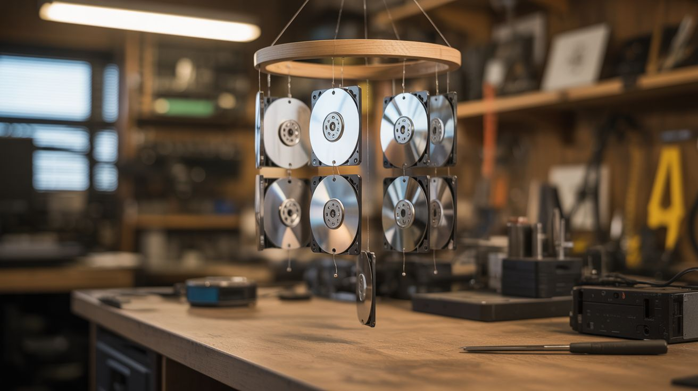

# #058 — HDD Platter Wind Chimes

  

> Hard drive platters are precision-polished mirrors that ring like bells. String up a dozen for the most futuristic wind chimes ever made.

## Ratings

| Jaw Drop Rating | Brain Melt Level | Wallet Damage | Spicy Level | Clout Potential | Time to Build |
|---|---|---|---|---|---|
| ⭐⭐⭐ | ⭐ | ⭐ | ⭐ | ⭐⭐⭐ | ⭐ |

## What Is It?

Hard drive platters are made from precision-polished aluminum or glass, machined to tolerances measured in nanometers. When you tap one, it produces a clear, sustained, bell-like ring — surprisingly musical for a computer part. Collect 10-15 platters from dead drives, string them at varying heights so they can strike each other in the breeze, and you get wind chimes that look like they belong on a space station. The mirror-polished surfaces catch and scatter light beautifully, and each platter has a slightly different pitch depending on its size, material, and thickness.

## Ingredients

- [ ] 10-15 hard drive platters — mix 3.5" and 2.5" for pitch variety *(dead hard drives, e-waste bins)*
- [ ] Fishing line or thin steel wire — for hanging *(hardware store, tackle shop)*
- [ ] Driftwood branch, copper pipe, or metal ring — top mounting bar *(nature, hardware store)*
- [ ] Small drill bit (1-2mm) or center punch *(workshop)*
- [ ] Small metal or glass striker bead *(craft store)*
- [ ] Swivel hook or carabiner — for hanging *(hardware store)*

## Build Steps

1. **Harvest the platters.** Open each hard drive with a Torx T8 driver. Remove the top platter retaining ring (usually a Torx screw in the center), then slide the platters off the spindle. Most 3.5" drives have 1-3 platters; collect from multiple drives for variety.
2. **Sort by pitch.** Tap each platter with a fingernail or small metal rod and listen. Glass platters ring higher and longer than aluminum. Thicker platters are lower-pitched. Arrange them in a pleasing tonal sequence.
3. **Drill hanging holes.** Carefully drill a small hole near the edge of each platter. Aluminum platters drill easily — go slow to avoid cracking. Glass platters need a diamond-tipped drill bit and water cooling. Alternatively, use the existing center hole and hang platters horizontally.
4. **Prepare the top bar.** Drill evenly spaced small holes along your driftwood branch, copper pipe, or metal ring. Space them so the platters can swing freely and contact their neighbors.
5. **String the platters.** Thread fishing line or thin wire through each platter's hole, tying a secure knot or crimp above and below to fix the hanging height. Stagger heights so platters overlap vertically and can strike each other.
6. **Add a wind sail.** Hang a lightweight flat piece (another platter works great) at the bottom center. This catches wind and transfers motion to the hanging platters, ensuring they chime even in light breezes.
7. **Hang and tune.** Mount the assembly outdoors in a spot that catches wind. Adjust platter spacing — closer together means more frequent chiming, further apart means only stronger breezes trigger sound. Listen and rearrange the tonal order until the sequence is pleasing.

## Safety Notes

- Glass platters can shatter if dropped on hard surfaces, producing razor-sharp fragments. Handle over a towel and wear safety glasses when drilling.
- Platter edges on aluminum discs can be surprisingly sharp, especially after drilling. Lightly sand any burrs with fine-grit sandpaper.

## See Also

- [Hard Drive Speaker](056-hard-drive-speaker.md)
- [CPU Resin Jewelry](059-cpu-resin-jewelry.md)

**References:**
- [Appliance Teardown Guide](../../reference/appliance-teardown-guide.md)
- [Technical Glossary](../../reference/glossary.md)
