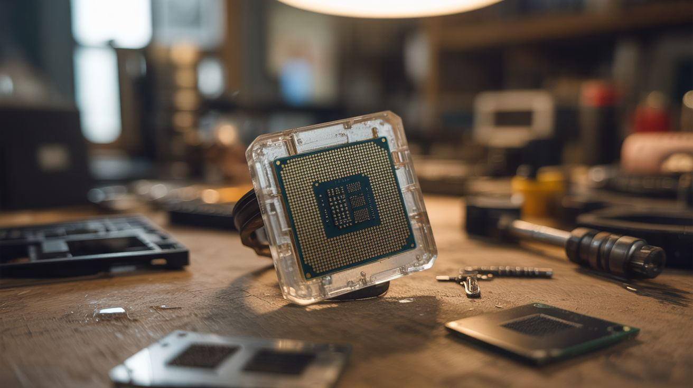

# #059 — CPU Resin Jewelry

  

> Dead processors and RAM chips are genuinely beautiful at macro scale. Embed them in clear resin for wearable tech art.

## Ratings

| Jaw Drop Rating | Brain Melt Level | Wallet Damage | Spicy Level | Clout Potential | Time to Build |
|---|---|---|---|---|---|
| ⭐⭐⭐ | ⭐ | ⭐ | ⭐ | ⭐⭐⭐⭐ | ⭐⭐ |

## What Is It?

CPUs, RAM sticks, and IC chips contain some of the most intricate patterns humans have ever created — billions of transistors laid out in fractal-like geometries on silicon dies. The gold-plated pins, the ceramic substrates, the tiny surface-mount components — all of it looks incredible when embedded in crystal-clear epoxy resin. Make keychains, pendants, coasters, paperweights, or earrings. The die patterns are genuinely beautiful at macro scale, and every piece is unique because every chip has a different layout. It's wearable industrial art that starts conversations every time.

## Ingredients

- [ ] Dead CPUs — variety of sizes and eras for different looks *(e-waste bin, old PCs)*
- [ ] RAM sticks — cut into smaller sections for pendants *(e-waste bin)*
- [ ] Small ICs and surface-mount components — for earrings and detail work *(dead circuit boards)*
- [ ] Clear epoxy resin + hardener — jewelry-grade, UV-resistant *(craft store, ~$15)*
- [ ] Silicone molds — circle, rectangle, pendant shapes *(craft store)*
- [ ] Keychain hardware, pendant bails, earring hooks *(craft store)*
- [ ] Small drill or pin vise — for adding hanging holes *(craft store)*
- [ ] Fine sandpaper (400-2000 grit) + polishing compound *(hardware store)*
- [ ] Mixing cups, stir sticks, gloves *(craft store)*

## Build Steps

1. **Harvest components.** Remove CPUs from motherboard sockets (lift the ZIF lever for modern CPUs, or gently pry older soldered ones). Pull RAM sticks. Desolder interesting-looking ICs from dead circuit boards with a heat gun.
2. **Prepare the chips.** Clean all components with isopropyl alcohol to remove dust and thermal paste. For CPUs with heat spreaders, you can leave them on for the classic look, or carefully remove the IHS with a razor blade to expose the actual silicon die underneath — the die is the real showpiece.
3. **Plan your layout.** Arrange components in your silicone molds to test fit. Consider layering — put small components like capacitors and resistors alongside a central CPU for visual interest. A single exposed die centered in a round mold makes a stunning pendant.
4. **Mix the resin.** Follow the manufacturer's ratio exactly (usually 1:1 or 2:1 resin to hardener by volume). Mix slowly and thoroughly for at least 3 minutes. Avoid vigorous stirring — air bubbles are the enemy.
5. **Pour the first layer.** Fill the mold about 1/3 full with resin. This becomes the back of the piece. Let it set for about 4 hours until tacky but not fully cured — this helps the next layer bond without a visible seam.
6. **Place components.** Carefully position your chips, pins-up or pins-down depending on the look you want. Press gently into the tacky first layer. Use tweezers for small parts.
7. **Pour the final layer.** Fill the mold to the top with fresh resin, covering all components completely. Pop any visible air bubbles with a lighter held briefly over the surface (heat rises the bubbles) or use a toothpick.
8. **Cure fully.** Let the piece cure for 24-48 hours in a dust-free, level location. Covering with a box prevents dust from settling on the tacky surface.
9. **Demold and finish.** Pop the piece out of the mold. Sand any rough edges starting at 400 grit and working up to 2000 grit. Apply polishing compound for a glass-clear finish.
10. **Add hardware.** Drill a small hole near the top for pendant bails or keychain rings. Attach appropriate jewelry hardware. For coasters, add felt pads to the bottom.

## Safety Notes

- Epoxy resin is a skin sensitizer — once you develop an allergy, it's permanent. Always wear nitrile gloves and work in a ventilated area. Avoid skin contact with uncured resin.
- Sanding cured resin produces fine dust. Wear a dust mask and sand wet when possible to keep particles down.
- Some older CPUs and circuit boards contain lead solder. Wash hands after handling, and don't sand or grind components without a mask.

## See Also

- [GPU Wall Art](060-gpu-wall-art.md)
- [RAM Stick Ruler](068-ram-stick-ruler.md)

**References:**
- [Appliance Teardown Guide](../../reference/appliance-teardown-guide.md)
- [Technical Glossary](../../reference/glossary.md)
