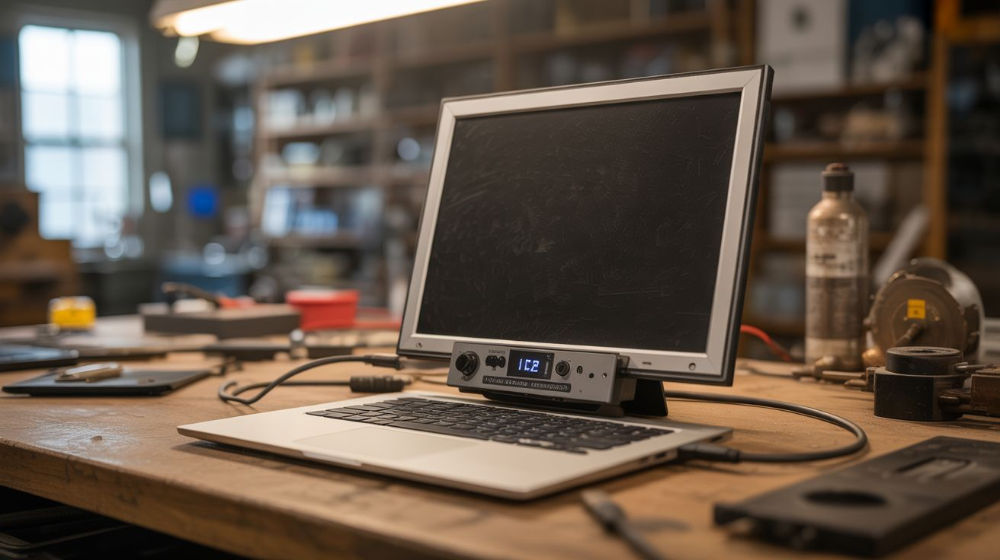

# #061 — Laptop Screen Monitor

  

> Old laptop screen + $12 controller board = portable HDMI monitor. Mount it in a picture frame for a stealth display.

## Ratings

| Jaw Drop Rating | Brain Melt Level | Wallet Damage | Spicy Level | Clout Potential | Time to Build |
|---|---|---|---|---|---|
| ⭐⭐⭐ | ⭐⭐ | ⭐⭐ | ⭐ | ⭐⭐⭐ | ⭐ |

## What Is It?

Every dead laptop contains a perfectly good LCD panel — the screen almost never dies before the rest of the laptop. Pull the panel out, buy a cheap LVDS or eDP controller board ($10-15 shipped), plug in HDMI, and you have a fully functional external monitor. Mount it in a picture frame for a stealth display that looks like wall art when showing a photo, but switches to a functional second monitor, dashboard, or smart mirror at the flip of an input. 15.6" 1080p IPS panels from dead laptops rival budget monitors that cost $100+.

## Ingredients

- [ ] Dead laptop with working screen — IPS panels preferred for viewing angles *(e-waste bin)*
- [ ] LVDS/eDP controller board — search your exact panel model number + "controller board" *(~$12, eBay/AliExpress)*
- [ ] 12V power adapter — usually included with the controller board *(controller board kit)*
- [ ] HDMI cable *(junk drawer)*
- [ ] Picture frame — sized to fit the panel, or custom cut *(thrift store)*
- [ ] Hot glue or double-sided tape — for mounting *(craft store)*
- [ ] Cardboard or thin plywood — for backing *(recycling bin)*

## Build Steps

1. **Extract the LCD panel.** Remove the laptop screen bezel (usually clips or hidden screws under rubber bumpers). Unscrew the panel from the lid hinges. Carefully disconnect the LVDS/eDP ribbon cable and the backlight power connector from the panel.
2. **Identify your panel model.** Look at the label on the back of the LCD panel. It will have a model number like "LP156WH4" or "B156HAN01.2". Write this down exactly — you need it to buy the right controller board.
3. **Order the controller board.** Search for your panel model number + "HDMI controller board" online. These universal boards accept HDMI (and often VGA/DVI) input and output the correct LVDS/eDP signal for your specific panel. They cost $10-15 and ship with the matching ribbon cable.
4. **Connect the controller to the panel.** Plug the controller board's ribbon cable into the panel's input connector. Connect the backlight power cable. Connect the 12V power adapter to the controller board.
5. **Test before mounting.** Connect an HDMI source and power on. The panel should display immediately. Use the controller board's buttons to adjust brightness, contrast, and input. If you get no image, double-check the ribbon cable orientation.
6. **Prepare the picture frame.** Remove the glass from the picture frame (you won't need it). Cut a cardboard or thin plywood backing to fit, with a rectangular cutout matching the panel's active display area.
7. **Mount the panel.** Center the LCD panel behind the frame opening and secure with hot glue or double-sided tape along the edges. Mount the controller board on the backing behind the panel. Route cables neatly.
8. **Create cable exit.** Cut a small notch in the bottom of the frame backing for the HDMI cable and power cable to exit cleanly. Secure cables with tape so they don't pull on the controller board.
9. **Hang and enjoy.** Mount the framed monitor on the wall. Connect HDMI to a Raspberry Pi for a smart display, or to your PC as a second monitor. Display family photos when not in use for full stealth mode.

## Safety Notes

- LCD panels are fragile and flex easily. Support the panel from the back when handling — applying pressure to the front surface can crack the liquid crystal layer and create permanent dark spots.
- Some older CCFL-backlit panels run the backlight at high voltage (600-1000V AC). Be cautious around the inverter board. Modern LED-backlit panels are much safer.
- The controller board runs warm. Ensure adequate ventilation behind the frame, especially if the display will run for extended periods.

## See Also

- [Laptop Screen Light Table](062-laptop-screen-light-table.md)
- [Tablet AI Picture Frame](065-tablet-ai-picture-frame.md)

**References:**
- [Electronics & Microcontrollers Guide](../../reference/electronics-and-microcontrollers.md)
