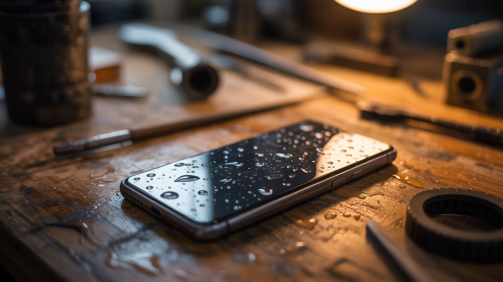

# #063 — Phone Macro Photography

  

> Use an old phone's OLED screen as a controllable backlight for macro shots. Water droplets on the screen + a macro lens = mind-blowing abstract images.

## Ratings

| Jaw Drop Rating | Brain Melt Level | Wallet Damage | Spicy Level | Clout Potential | Time to Build |
|---|---|---|---|---|---|
| ⭐⭐⭐⭐ | ⭐ | ⭐ | ⭐ | ⭐⭐⭐⭐ | ⭐ |

## What Is It?

Old phones with OLED screens can display pure, vivid colors with perfect black backgrounds — each pixel is its own light source. Lay the phone flat, display a solid color or gradient, place water droplets on the screen, and shoot from above with a macro lens (or another phone with a macro mode). Each water droplet acts as a tiny lens, refracting the screen's colors into swirling, kaleidoscopic patterns. The results look like images from the Hubble telescope — abstract, colorful, and genuinely stunning. No Photoshop, no filters. Just physics. Change the displayed color and each droplet transforms instantly.

## Ingredients

- [ ] Old phone with OLED/AMOLED screen — cracked glass is fine as long as the display works *(junk drawer)*
- [ ] Macro lens — clip-on phone macro lens ($5-10), or DSLR with macro lens *(camera store)*
- [ ] Spray bottle with water *(kitchen)*
- [ ] Small dropper or syringe — for placing precise droplets *(pharmacy)*
- [ ] Glycerin (optional) — mix with water for rounder, longer-lasting droplets *(pharmacy, ~$3)*
- [ ] Tripod or phone mount — to keep the shooting camera steady *(already own or ~$10)*
- [ ] Second phone or camera — to take the actual photos *(already own)*

## Build Steps

1. **Set up the OLED phone.** Lay the old phone flat on a stable surface. Set screen brightness to maximum and disable auto-lock/sleep so the screen stays on continuously.
2. **Display a background.** Open a solid color app or display a full-screen image. Start with vibrant gradients — rainbow, sunset, or nebula images work spectacularly. Solid colors (deep blue, magenta, green) also produce striking results.
3. **Apply water droplets.** Use a dropper or spray bottle to place small water droplets on the screen surface. Vary the sizes — tiny droplets create sharp lensing, larger drops create softer refraction. For rounder, more stable droplets, mix a few drops of glycerin into the water.
4. **Set up the shooting camera.** Mount your macro-capable camera or phone on a tripod directly above the OLED screen, pointing straight down. Get as close as your macro lens allows. Focus on the droplets, not the screen surface — the refracted colors inside the drops are the subject.
5. **Shoot and experiment.** Take photos. Then change the background color on the OLED phone and shoot again — each color completely transforms every droplet. Try moving the background slowly (use a video or animation) for psychedelic shifting effects.
6. **Try different liquids.** Oil droplets on water (or water on a lightly oiled screen) create interference patterns and color separation. Soap solutions create thin-film rainbow effects in bubbles.
7. **Adjust lighting.** Darken the room completely so the OLED screen is the only light source. This eliminates reflections and makes the droplet colors maximally vivid.
8. **Post-process minimally.** These images usually need nothing more than a slight contrast boost. The raw captures are already surreal. Crop tight on individual droplets for the most impact.

## Safety Notes

- Water on electronics: use an old phone you don't care about. Even water-resistant phones can be damaged by prolonged water contact. Place only small droplets and wipe dry after the session.
- If using glycerin, it's non-toxic but slippery. Clean surfaces afterward to prevent slipping hazards.

## See Also

- [Phone IR Camera](066-phone-ir-camera.md)
- [Laptop Screen Light Table](062-laptop-screen-light-table.md)
