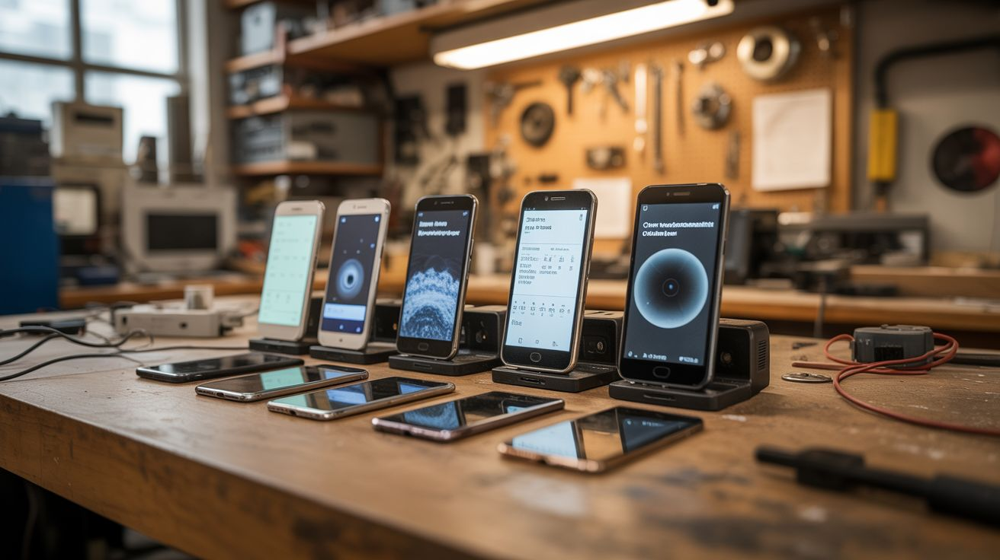

# #064 — Phone Sensor Network

  

> Old phones are packed with sensors. Run Phyphox on a fleet of them for distributed environmental monitoring — seismograph, weather station, security cameras, noise monitors. All free.

## Ratings

     

## 🧪 What Is It?

Every smartphone contains an accelerometer, gyroscope, magnetometer, barometer, light sensor, microphone, camera, GPS, and temperature sensor. That's a full environmental monitoring lab in your pocket — and you probably have 3-4 old ones sitting in a drawer. Install Phyphox (free physics experiment app from RWTH Aachen University) on each phone, and you've got a distributed sensor network. Place them around your house, yard, or workshop. One monitors vibration (seismograph mode), another logs barometric pressure (weather station), another tracks ambient noise levels, and the cameras serve as security cams. All feeding data over WiFi.

<strong>🧰 Ingredients</strong>

- [ ] 2-5 old Android or iOS phones — any condition as long as they power on and connect to WiFi *(junk drawer)*
- [ ] Phyphox app — free, open source *(Google Play / App Store)*
- [ ] IP Webcam app or Alfred Camera — for security camera function *(Google Play / App Store)*
- [ ] Old phone chargers — one per phone for permanent power *(junk drawer)*
- [ ] Phone mounts or stands — 3D printed, bought, or improvised from binder clips *(dollar store)*
- [ ] WiFi network *(already have)*
- [ ] Optional: Raspberry Pi or old laptop — as a central data collection hub *(e-waste bin)*

## 🔨 Build Steps

1. **Factory reset all phones.** Clear out old data, remove accounts, and start fresh. This frees up storage and processing power for sensor duties.
2. **Connect all phones to WiFi.** Ensure each phone has a stable connection to your home WiFi network. Assign static IPs in your router settings if possible — this makes remote access more reliable.
3. **Install Phyphox on each phone.** Phyphox provides direct access to every sensor with data logging, graphing, and remote access via web interface. Open the app and explore what sensors each phone has — they vary by model.
4. **Assign roles.** Designate each phone for a specific monitoring task: Phone 1 = seismograph (accelerometer logging), Phone 2 = weather station (barometer + light sensor), Phone 3 = noise monitor (microphone dB meter), Phone 4 = security camera (IP Webcam app instead of Phyphox).
5. **Position the phones.** Place the seismograph phone on a solid surface away from foot traffic (basement floor is ideal for detecting actual seismic activity vs. household vibration). Place the weather phone near a window. Position noise monitors in areas of interest. Mount cameras at entry points.
6. **Enable remote access in Phyphox.** Each phone's Phyphox instance can serve a web interface — enable "Remote Access" in the app menu. Access sensor data from any browser on the same network by navigating to the phone's IP address.
7. **Set up continuous logging.** Configure each Phyphox experiment to log data continuously. Set appropriate sampling rates — seismograph needs high frequency (100Hz), weather station can sample every 30 seconds.
8. **Build a central dashboard (optional).** Use a Raspberry Pi or old laptop as a hub. Write a simple script to poll each phone's Phyphox API endpoint and aggregate data into a single dashboard using Grafana, a spreadsheet, or a custom web page.
9. **Power management.** Plug all phones into chargers permanently. Disable unnecessary radios (Bluetooth, NFC) to reduce power draw and heat. Enable airplane mode with WiFi-only if the phone supports it.

## ⚠️ Safety Notes

- Old lithium-ion batteries can swell or overheat when left plugged in permanently. Inspect phones periodically for battery swelling (screen lifting away from frame is the first sign). Replace swollen batteries or discontinue use.
- Phones left in direct sunlight will overheat. Position weather monitoring phones in shade or behind a window, not in direct outdoor sun exposure.

## 🔗 See Also

- [Tablet AI Picture Frame](065-tablet-ai-picture-frame.md)
- [Phone IR Camera](066-phone-ir-camera.md)

**References:**
- [Appliance Teardown Guide](../../reference/appliance-teardown-guide.md)
- [Technical Glossary](../../reference/glossary.md)
- [Electronics & Microcontrollers Guide](../../reference/electronics-and-microcontrollers.md)
