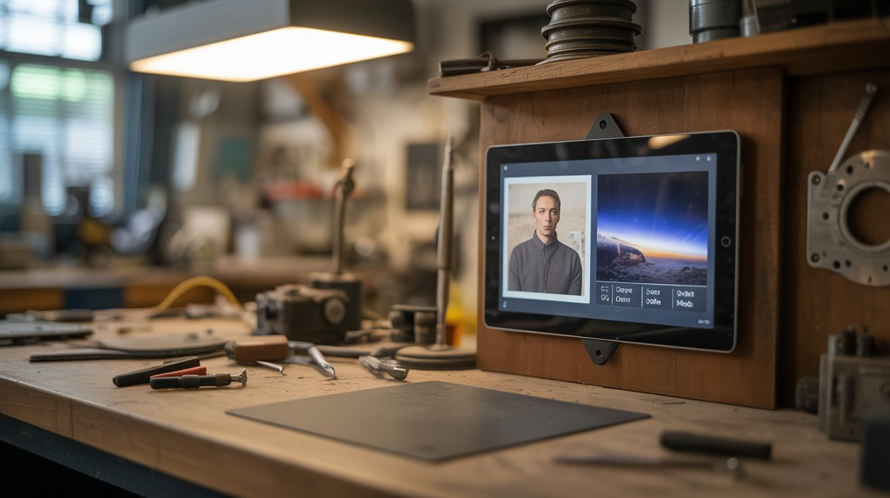

# #065 — Tablet AI Picture Frame

  

> Old tablet + wall mount = dynamic picture frame. Run AI art generators on family photos, or a live dashboard for space imagery, weather, and stocks.

## Ratings

     

## 🧪 What Is It?

That old iPad or Android tablet with the cracked corner and sluggish performance? It's the perfect dedicated smart picture frame. Wall-mount it, plug in power permanently, and set it up as a rotating photo frame that pulls from your Google Photos or iCloud library. But the real magic is going beyond basic photo slideshows: display NASA's Astronomy Picture of the Day, live weather radar, stock tickers, a family shared calendar, or feed your photos through an AI style transfer app to display them as oil paintings, watercolors, or anime renditions. It's a living piece of wall art that changes every time you look at it.

<strong>🧰 Ingredients</strong>

- [ ] Old tablet — iPad, Android, or Amazon Fire, any generation *(junk drawer)*
- [ ] Tablet wall mount — 3D printed, command strips, or commercial mount *(~$8, or free if 3D printed)*
- [ ] USB cable + wall charger — for permanent power *(junk drawer)*
- [ ] Cable management clips — to run the power cable neatly along the wall *(dollar store)*
- [ ] Optional: smart plug — to schedule power on/off and save battery life overnight *(~$8)*

## 🔨 Build Steps

1. **Factory reset the tablet.** Wipe it clean and set it up fresh. Install only the apps you'll use — less bloat means better performance on older hardware.
2. **Choose your display mode.** Decide what to show: photo slideshow, AI art, live dashboard, or a rotation of all three. Install the appropriate apps — Google Photos for slideshows, Prisma or Starryai for AI art, DAKboard or Fully Kiosk Browser for dashboards.
3. **Configure the photo source.** For slideshows, connect to your cloud photo library and select specific albums. For AI art, set up a queue of family photos to process through style transfer. For dashboards, configure widgets for weather, calendar, news, or NASA APOD.
4. **Set up kiosk mode.** Use a kiosk/launcher app (Fully Kiosk Browser on Android, Guided Access on iPad) to lock the tablet to a single app. This prevents accidental taps from exiting the display and gives a clean, frame-like experience.
5. **Adjust display settings.** Set brightness to auto or a comfortable fixed level. Enable night mode on a schedule to reduce blue light in the evening. Disable notifications, sounds, and popup dialogs.
6. **Mount the tablet.** Attach a wall mount at eye level. Command strip mounts work well for lighter tablets and leave no holes. For heavier tablets, use a screw-mounted bracket. Ensure the mount allows cable access for charging.
7. **Route the power cable.** Run the USB cable from the tablet down the wall to the nearest outlet. Use cable management clips or cable raceways to keep it neat. Paint the raceway to match the wall for a clean look.
8. **Schedule power cycling (optional).** Connect the charger to a smart plug. Schedule power off at midnight and on at 7 AM to extend battery lifespan and save electricity. Some tablets can be set to auto-boot when power is connected.

## ⚠️ Safety Notes

- Tablets left permanently charging can degrade the battery over time. Use a smart plug to cycle power, or look for battery management apps that stop charging at 80%. Inspect for battery swelling every few months.
- Ensure the tablet is mounted securely, especially in high-traffic areas. A falling tablet is a hazard and a mess. Test the mount's holding power before going permanent.

## 🔗 See Also

- [Laptop Screen Monitor](061-laptop-screen-monitor/)
- [Phone Sensor Network](064-phone-sensor-network/)
