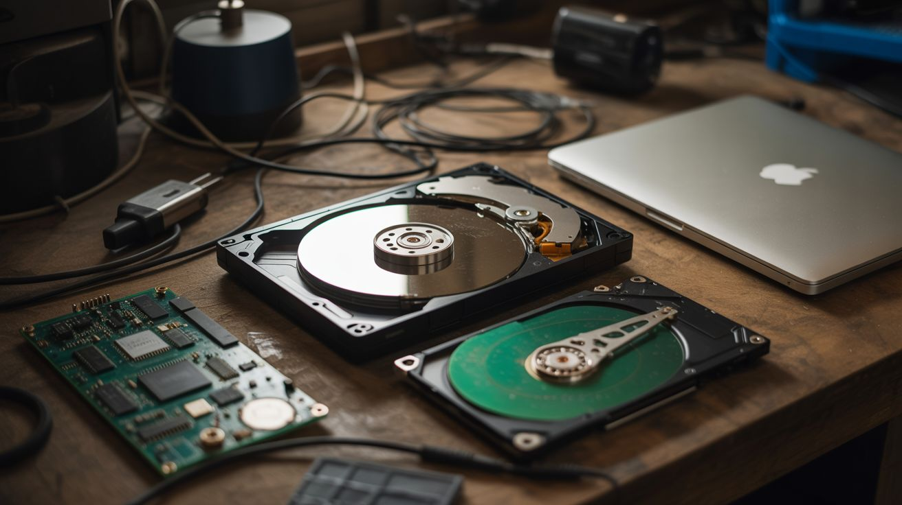

# 💻 Computer & Phone Parts

  

  

> Dead laptops, cracked phones, and retired desktops are goldmines of precision-engineered components.

Hard drives contain voice coil actuators, precision-polished platters, and rare-earth magnets. Laptops have high-resolution LCD panels, 18650 battery cells, and tiny fans. Old phones pack OLED screens, IR cameras, accelerometers, gyroscopes, and GPS receivers. GPUs and CPUs are works of art at the silicon level. RAM sticks are perfectly machined PCBs.

None of this should go in a landfill. Every single component has a second life.

---

## Builds

<a class="cat-card" href="056-hard-drive-speaker.md">
#056Hard Drive Speaker

Jaw

Brain

Wallet

Spicy

Clout

Time

</a>
<a class="cat-card" href="057-hard-drive-pov-clock.md">
#057Hard Drive POV Clock

Jaw

Brain

Wallet

Spicy

Clout

Time

</a>
<a class="cat-card" href="058-hdd-platter-wind-chimes.md">
#058HDD Platter Wind Chimes

Jaw

Brain

Wallet

Spicy

Clout

Time

</a>
<a class="cat-card" href="059-cpu-resin-jewelry.md">
#059CPU Resin Jewelry

Jaw

Brain

Wallet

Spicy

Clout

Time

</a>
<a class="cat-card" href="060-gpu-wall-art.md">
#060GPU Wall Art

Jaw

Brain

Wallet

Spicy

Clout

Time

</a>
<a class="cat-card" href="061-laptop-screen-monitor.md">
#061Laptop Screen Monitor

Jaw

Brain

Wallet

Spicy

Clout

Time

</a>
<a class="cat-card" href="062-laptop-screen-light-table.md">
#062Laptop Screen Light Table

Jaw

Brain

Wallet

Spicy

Clout

Time

</a>
<a class="cat-card" href="063-phone-macro-photography.md">
#063Phone Macro Photography

Jaw

Brain

Wallet

Spicy

Clout

Time

</a>
<a class="cat-card" href="064-phone-sensor-network.md">
#064Phone Sensor Network

Jaw

Brain

Wallet

Spicy

Clout

Time

</a>
<a class="cat-card" href="065-tablet-ai-picture-frame.md">
#065Tablet AI Picture Frame

Jaw

Brain

Wallet

Spicy

Clout

Time

</a>
<a class="cat-card" href="066-phone-ir-camera.md">
#066Phone IR Camera

Jaw

Brain

Wallet

Spicy

Clout

Time

</a>
<a class="cat-card" href="067-laptop-battery-power-bank.md">
#067Laptop Battery Power Bank

Jaw

Brain

Wallet

Spicy

Clout

Time

</a>
<a class="cat-card" href="068-ram-stick-ruler.md">
#068RAM Stick Ruler

Jaw

Brain

Wallet

Spicy

Clout

Time

</a>

---

### Suggested Build Order

Start with zero-mod crafts, progress toward electronics integration:

1. **[#058 — HDD Platter Wind Chimes](058-hdd-platter-wind-chimes.md)** — Zero electronics. Pure component reuse.
2. **[#063 — Phone Macro Photography](063-phone-macro-photography.md)** — Minimal learning. Immediate results.
3. **[#068 — RAM Stick Ruler](068-ram-stick-ruler.md)** — Trivial craft project.
4. **[#059 — CPU Resin Jewelry](059-cpu-resin-jewelry.md)** — Simple resin casting with components.
5. **[#060 — GPU Wall Art](060-gpu-wall-art.md)** — Display-focused aesthetic project.
6. **[#056 — Hard Drive Speaker](056-hard-drive-speaker.md)** — Introduces audio driver principles.
7. **[#061 — Laptop Screen Monitor](061-laptop-screen-monitor.md)** — LCD controller board wiring.
8. **[#062 — Laptop Screen Light Table](062-laptop-screen-light-table.md)** — Backlight electronics.
9. **[#065 — Tablet AI Picture Frame](065-tablet-ai-picture-frame.md)** — Software integration basics.
10. **[#067 — Laptop Battery Power Bank](067-laptop-battery-power-bank.md)** — Power management understanding.
11. **[#066 — Phone IR Camera](066-phone-ir-camera.md)** — Sensor modification techniques.
12. **[#064 — Phone Sensor Network](064-phone-sensor-network.md)** — Multi-device software integration.
13. **[#057 — Hard Drive POV Clock](057-hard-drive-pov-clock.md)** — Timing, rotation control, LED multiplexing.

### Related Categories

- [Raspberry Pi & Arduino](../pi-and-arduino/) — Sensor integration and embedded electronics
- [Light & Visual](../light-and-visual/) — Display technologies and visual projects
- [Junk Instruments](../junk-instruments/) — Creative audio component reuse

---

## 📚 Reference Guides

- [Electronics & Microcontrollers](../../docs/reference/electronics-and-microcontrollers.md)
- [Tools Needed](../../docs/reference/tools-needed.md)
- [Sourcing Guide](../../docs/reference/sourcing-guide.md)
- [Difficulty & Ratings Guide](../../docs/reference/difficulty-guide.md)
