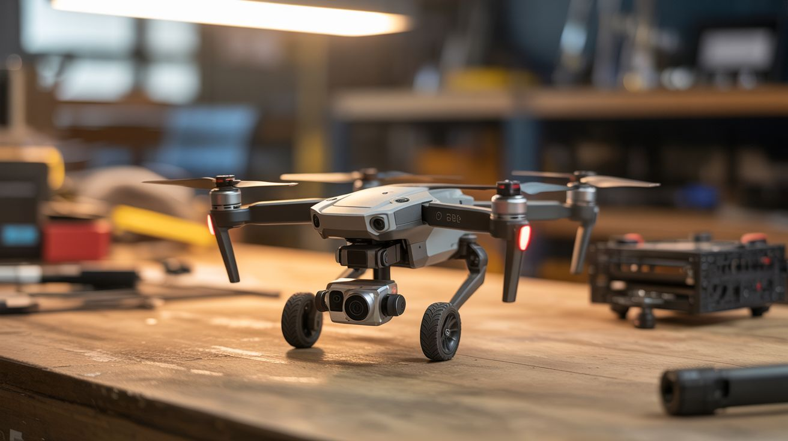

# #205 — Obstacle-Dodging Robot

  

> Salvage the ToF sensors, IR proximity detectors, and flight controller IMU from a drone — put them on a ground robot that autonomously navigates around obstacles.

## Ratings

| Jaw Drop Rating | Brain Melt Level | Wallet Damage | Spicy Level | Clout Potential | Time to Build |
|---|---|---|---|---|---|
| ⭐⭐⭐⭐ | ⭐⭐⭐⭐ | ⭐⭐ | ⭐ | ⭐⭐⭐⭐ | ⭐⭐⭐ |

## What Is It?

Modern drones are packed with obstacle-avoidance sensors — time-of-flight (ToF) rangefinders, infrared proximity sensors, downward-facing optical flow cameras, and ultrasonic distance sensors. These sensors are designed to detect walls, trees, and the ground at high speed and feed distance data to the flight controller for automatic avoidance. Strip them out and mount them on a wheeled robot, and you've got a ground vehicle that can navigate a room without hitting anything.

The drone's flight controller board contains an IMU (accelerometer + gyroscope) that provides orientation and motion data. Combined with the obstacle sensors, you have all the inputs needed for autonomous navigation: the robot knows where it is (IMU dead reckoning), how fast it's moving (IMU integration), and what's in front of it (ToF/IR sensors). An Arduino or the flight controller itself runs the decision loop — if something is too close on the left, steer right. If something is ahead, stop and turn.

The result is a robot that drives itself around a room, hallway, or outdoor space without colliding with anything — the same tech that makes Roombas and warehouse robots work, built from crash wreckage.

## Ingredients

- [ ] ToF distance sensors (VL53L0X or similar) — salvaged from drone's obstacle avoidance system *(source: crashed DJI Mavic/Air — free)*
- [ ] IMU module — MPU-6050 from the flight controller, or buy one *(salvaged or electronics supplier, ~$3)*
- [ ] Arduino Mega or ESP32 — needs enough I/O pins for multiple sensors and motor drivers *(electronics supplier, ~$8-$15)*
- [ ] Robot chassis with two DC motors and caster wheel — tank-drive or differential-drive *(online or salvaged toy, ~$10-$20)*
- [ ] L298N or TB6612FNG motor driver board *(electronics supplier, ~$3)*
- [ ] LiPo battery — 2S, 1000-2000mAh *(salvaged from drone or online)*
- [ ] Ultrasonic sensor HC-SR04 x2 (optional backup, if ToF sensors aren't available) *(electronics supplier, ~$2 each)*
- [ ] Mounting brackets and wiring *(hardware store, electronics supplier)*

## Build Steps

1. **Harvest the sensors.** Disassemble the drone carefully, identifying each sensor module. DJI Mavic series typically has forward, backward, downward, and sometimes side-facing ToF or structured light sensors. Desolder or disconnect them from the main board. Identify the connector pinout — most use I2C (4 wires: VCC, GND, SDA, SCL). Test each sensor with an Arduino and the VL53L0X library to verify it's working.
2. **Build or prepare the chassis.** A two-wheeled differential-drive chassis is simplest for obstacle avoidance. Two driven wheels and one caster allow the robot to spin in place, making tight navigation possible. If using a salvaged toy car, swap out the steering mechanism for differential drive (two independently controlled motors).
3. **Mount the sensors.** Attach sensors to the front and sides of the chassis at bumper height (the height where obstacles are most likely). A minimum setup: one forward-facing sensor and two angled at 45 degrees left and right. More sensors give better spatial awareness. Use hot glue or 3D-printed brackets. Ensure the sensor lenses aren't obstructed.
4. **Mount the IMU.** Attach the MPU-6050 flat on the chassis centerline. It provides heading data (gyroscope Z-axis) and detects when the robot is stuck (accelerometer spikes during collisions). Connect via I2C — if using multiple I2C devices, set different addresses or use an I2C multiplexer (TCA9548A).
5. **Wire the motor driver.** Connect the two DC motors to the L298N or TB6612FNG motor driver. Connect the driver's input pins to the Arduino's digital/PWM pins. Test basic movement: forward, backward, turn left (right motor forward, left motor stopped or reversed), turn right (opposite).
6. **Program the navigation algorithm.** Start with a simple reactive algorithm: read all sensors, find the direction with the most open space, steer toward it. Use proportional steering — the closer an obstacle on one side, the harder it steers away. Add a minimum distance threshold where the robot stops and spins to find a clear path. The gyroscope prevents the robot from spinning forever by tracking total rotation.
7. **Add wall-following mode.** A more sophisticated algorithm: the robot follows walls at a set distance using the side sensors. This lets it navigate hallways and rooms systematically instead of bouncing randomly. Maintain a constant distance (e.g., 30cm) from the right wall using a PD controller on the side sensor reading.
8. **Test in increasing complexity.** Start in an empty room with one obstacle. Add more obstacles progressively. Then test in a hallway. Watch for failure modes: corners where the robot gets trapped, glass surfaces that ToF sensors can't detect, and chair legs that are below sensor height.
9. **Tune sensor thresholds and speed.** Reduce speed for tighter environments. Increase the minimum obstacle distance for faster speeds (the robot needs more stopping distance). Adjust the PD gains for smoother wall following.

## Safety Notes

- This is a low-voltage, low-speed build with minimal hazards. The primary risk is the LiPo battery — use a protected cell and don't over-discharge it.
- The robot can fall off tables or down stairs if it lacks a downward-facing sensor. Add a downward ToF or IR sensor at the front edge if you plan to run it on elevated surfaces.
- Keep the robot away from pets and small children — it moves unpredictably during testing, and wheels can pinch small fingers.

## See Also

- [FPV Ground Rover](202-fpv-ground-rover.md) — add FPV camera for remote viewing of what the robot sees
- [Camera Gimbal Stabilizer](201-camera-gimbal-stabilizer.md) — mount a stabilized camera on this platform for smooth autonomous filming

**References:**
- [Appliance Teardown Guide](../../reference/appliance-teardown-guide.md)
- [Technical Glossary](../../reference/glossary.md)
- [Electronics & Microcontrollers Guide](../../reference/electronics-and-microcontrollers.md)
